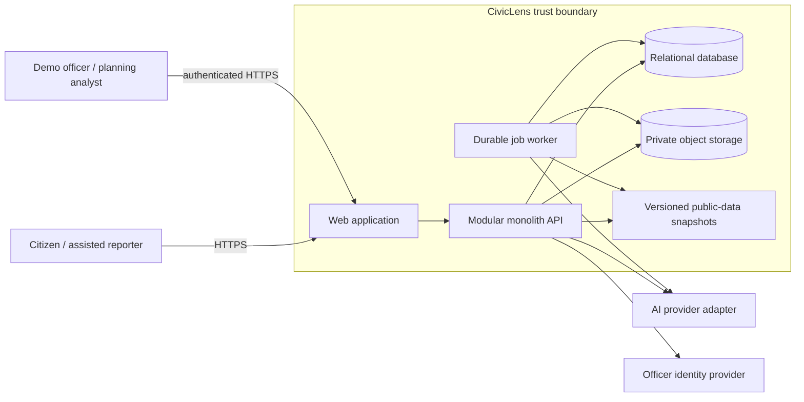
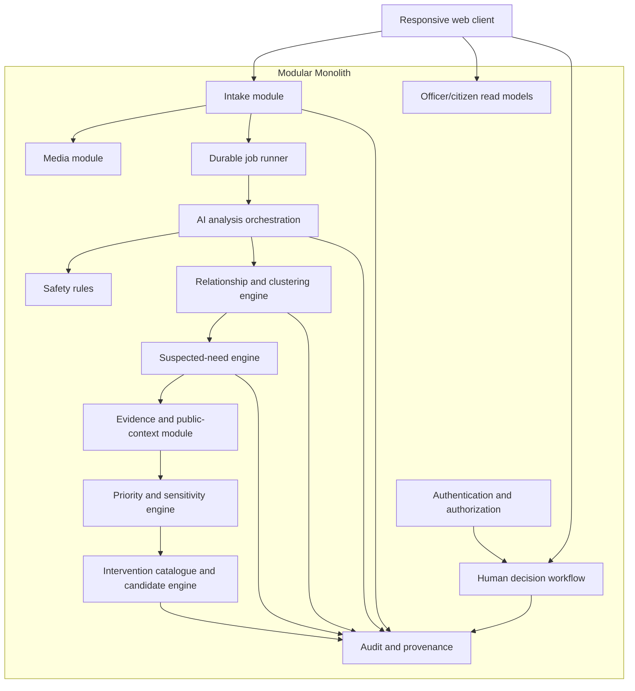
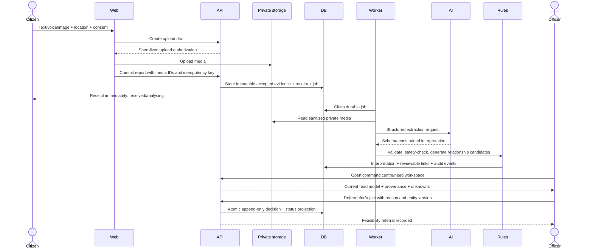

# CivicLens AI — Stage 3 System Design

**Status:** Planning complete; implementation approved on 12 September 2026  
**Date:** 12 September 2026  
**Approved pilot convention:** Bengaluru; BWSSB/JICA 110-village project area; Mahadevapura 23-village project zone as the demo slice  
**Scope:** Architecture, data contracts, AI and deterministic boundaries, storage, APIs, decision logic, security, privacy and failure handling

> **Stage 4 deployment refinement:** The database-backed `processing_job` table remains the canonical job state. Cloud Tasks is selected only as an authenticated wake-up and retry transport to the same Cloud Run modular monolith, with a scheduled database recovery sweep. This supersedes the provisional continuously polling worker/no-queue deployment shape below; it does not change the domain architecture or AI authority boundaries.

> **Final-scope note:** Stage 6 preserves these system invariants but consolidates modules/tables and narrows the hackathon v1 to text plus short voice, no Maps/images/embeddings, and immutable shared seed data with session-scoped action overlays. See [Stage 6 Final Design Review](./STAGE_6_FINAL_DESIGN_REVIEW.md).

## 1. Stage 3 decision summary

CivicLens should be a **modular monolith** with four external dependencies: a relational database, private object storage, a Gemini-compatible AI provider adapter, and an identity provider for officer access. It requires no microservices, message broker, live government-data API, streaming platform, or data warehouse for the hackathon MVP.

The system has two user-facing lanes:

1. **Operational Safety Review** — urgent or uncertain safety signals are immediately flagged for human verification. They are never numerically traded against planning needs.
2. **Planning Decision Intelligence** — distinct incidents may form a Suspected Civic Need, pass an evidence-sufficiency gate, receive transparent component ratings, match a constrained intervention catalogue, and end in a recorded human disposition.

The architecture enforces these product truths:

- A report is a citizen claim, not a verified fact.
- An Incident Cluster is a reviewable relationship, not an AI fact.
- A Suspected Civic Need is a hypothesis supported by patterns and context, not an established root cause.
- Public context is used only at its documented date and geography.
- Missing, stale or incompatible evidence remains unknown; it never becomes zero.
- Existing work changes the review question but does not automatically lower priority.
- A Project Candidate is an assessment or intervention class, not an approved project.
- Only a human can refer, defer/monitor, or reject/out-of-scope.

## 2. System context and trust boundaries



### Trust boundaries

| Boundary | Untrusted input | Required protection |
|---|---|---|
| Public browser → API | Text, filenames, coordinates, language, media, request headers | Strict schema/size validation, rate limits, idempotency, no HTML trust, abuse checks |
| Media → storage/AI | Crafted files, EXIF/metadata, prompt-injection text inside images/audio | MIME signature checks, decode/re-encode, private storage, metadata stripping, AI prompt isolation |
| AI provider → application | Malformed JSON, hallucinated fields, unsafe text, overconfident relationships | JSON-schema validation, allowlists, retries, unknown state, deterministic gates, provenance |
| Public snapshots → application | Stale, incompatible, ambiguous or transformed data | Snapshot manifests, field semantics, geographic unit/vintage, transformations, review status |
| Officer browser → decisions | Unauthorized actions, replay, tampered entity version | Authentication, role checks, CSRF/session controls, optimistic concurrency, append-only decisions |

## 3. Recommended logical architecture



### Component responsibilities

| Module | Owns | Explicitly does not own |
|---|---|---|
| Intake | Report validation, consent, receipt identity, idempotent submission, processing state | Category truth, clustering or priority |
| Media | Upload authorization, file validation, sanitization, hashes, private object references | Public media URLs or AI decisions |
| AI analysis orchestration | Versioned prompts, model calls, schema validation, retries, interpretation versions | Database relationships, score, authorization or final safety disposition |
| Safety rules | Deterministic safety-signal routing from extracted assertions and uncertainty | Emergency dispatch or confirmation that danger exists |
| Relationship engine | Candidate duplicate/incident links and reason codes under versioned rules | Deleting duplicates or asserting root cause |
| Suspected-need engine | Recurrence linking, alternative-hypothesis checklist, evidence gate | Engineering diagnosis |
| Evidence/public context | Dataset manifests, observations, works, compatible joins, supported/unsupported inference | Scraping live systems during the demo |
| Priority engine | Eligibility, four component ratings, policy profile, ranking and sensitivity | Opaque AI scoring or acute urgency |
| Catalogue/candidate engine | Allowed intervention classes, prerequisites, overlap-aware candidate shaping | Free-form projects, cost estimates or approval |
| Decision workflow | Refer, defer/monitor, reject/out-of-scope; reasons and next review date | Procurement, work orders, budgets or official government action |
| Audit/provenance | Append-only events and exact input/version references | Raw secrets or unnecessary complaint content in logs |
| Durable job runner | Recoverable processing jobs, attempts, backoff and dead-letter state | A separate queue service for the MVP |
| Read models | Purpose-built citizen receipt and officer workspace responses | Independent sources of truth |

## 4. End-to-end data flow



### Processing stages

1. **Accept:** Validate fields, consent and media references; commit the report and a processing job atomically.
2. **Sanitize:** Verify/decode media, remove unnecessary metadata and create the accepted private evidence object.
3. **Interpret:** Ask AI for structured assertions; validate them; preserve original and derived data separately.
4. **Safety route:** Apply deterministic triggers and uncertainty rules; create a human-verification flag where needed.
5. **Relate:** Generate suspected duplicate and same-incident candidates using explicit gates and similarity evidence.
6. **Aggregate:** Link separate incidents into a recurrence pattern only under the versioned suspected-need rules.
7. **Enrich:** Attach only geographically and semantically compatible snapshot evidence and works assessments.
8. **Assess:** Determine comparison eligibility, component ratings, priority band and sensitivity status.
9. **Constrain:** Select only catalogue candidates whose prerequisites are satisfied; otherwise abstain or propose an assessment.
10. **Decide:** Record the officer's disposition against an immutable assessment snapshot.

## 5. Synchronous versus asynchronous work

| Operation | Mode | User-visible behavior | Why |
|---|---|---|---|
| Form validation, consent and location confirmation | Synchronous | Immediate field feedback | Required before accepting evidence |
| Small text report commit | Synchronous | Receipt returned in a target of under 1 second excluding network | Data must not be lost if AI is slow |
| Media upload | Direct upload before commit, with progress | Retryable; abandoned drafts expire | Avoid passing binary payloads repeatedly through application logic |
| Media sanitation and AI analysis | Asynchronous | `Analysing`; refresh/poll status | External latency/failure must not block report acceptance |
| Safety rule application after interpretation | Same durable job, immediately after valid analysis | Safety Review flag appears as soon as processing completes | Deterministic and cheap |
| Relationship candidate generation | Asynchronous | `Processed`, `Needs review`, or linked-to-incident explanation | More expensive and must be retryable |
| Need/priority recomputation | Asynchronous after relationship/public-data changes | Last computed version remains visible with “recomputing” badge | Prevent half-written assessments |
| Officer decision | Synchronous database transaction | Confirmation only after durable decision record | High-integrity action |
| Public snapshot import | Offline/admin planning step | Never blocks the live demo | Reproducibility and no live dependency |

### Worker choice

For the MVP, use a database-backed `processing_job` table. Jobs are claimed with database locking, have attempt counts and leases, and become `dead_letter` after the configured retry limit. Stage 4 selected Cloud Tasks as a thin authenticated wake-up/retry transport to an internal handler in the same Cloud Run service, plus a scheduled recovery sweep; it did not introduce a second business service, Redis, Pub/Sub or a queue framework.

The primary demo report may have a **Stored Sample Analysis** path for reliability. A separate **Fresh Analysis** path must show honest pending, success and failure states. Stored results can never be labelled as a live model response.

## 6. AI boundary and contract

### AI responsibilities

AI may:

- detect Kannada, Hindi, English and code-switching;
- transcribe short voice input;
- translate into a normalized working-language field while preserving the original;
- extract issue category/subtype, time assertions, place assertions, service symptoms and safety cues;
- describe visible image evidence conservatively;
- produce a concise, attribution-safe summary;
- generate a multilingual semantic embedding or similarity feature if Stage 4 validates its value; and
- explain which source phrases support each extracted assertion.

AI may not:

- verify that a citizen statement is true;
- invent missing coordinates, dates, population, asset identity or works status;
- create database relationships directly;
- determine final duplicate/incident/recurrence membership;
- calculate urgency or planning priority;
- decide evidence compatibility;
- create arbitrary projects, costs or budgets;
- approve, route as an official authority, or make a human disposition; or
- silently change an original report.

### Structured response contract

Each `analysis_run` returns a versioned object equivalent to:

```text
schema_version
prompt_version
provider_model
detected_languages[]
transcript { text, confidence_or_unknown }
translation { text, target_language, confidence_or_unknown }
category { code, confidence, supporting_spans[] }
subtype { code_or_unknown, confidence, supporting_spans[] }
time_assertions[] { value_or_text, precision, supporting_span }
place_assertions[] { text, type, confidence, supporting_span }
service_assertions[] { controlled_code, polarity, supporting_span }
safety_signals[] { controlled_code, present|absent|uncertain, supporting_span }
image_observations[] { conservative_text, confidence_or_unknown }
summary
uncertainties[]
```

Every controlled code is validated against an allowlist. Unknown is a first-class value. Confidence is never translated directly into policy priority.

### Prompt and output controls

- System instructions state that report/media content is untrusted evidence, not instructions.
- The model receives only the minimum report content required for interpretation.
- Tool use and web access are disabled for interpretation calls.
- Output must validate against a strict JSON schema; extra policy fields are rejected.
- One repair attempt may follow malformed output; persistent failure becomes `needs_review`.
- Prompt, schema, provider/model and safety-rule versions are stored with the result.
- A corrected interpretation creates a new version; it does not overwrite the previous one.
- Summaries use “reporter states,” “image may show,” and “unknown,” never authoritative declarations.

### Embeddings decision

Embeddings are **optional but justified only for multilingual candidate retrieval**. With approximately 120 reports, the system can compare within a category/time/location candidate set without a vector database. Stage 4 should benchmark simple multilingual embeddings against token/keyword similarity on the frozen tuning set. Add `pgvector` only if it materially improves same-incident retrieval without unacceptable false merges. If embeddings fail, location/time/category rules continue and uncertain cases remain separate or await review.

## 7. Deterministic decision boundaries

The following are application rules, never open-ended model reasoning:

- accepted MIME types, file limits, consent and retention;
- stable identifiers, idempotency and authorization;
- geographic compatibility and public-data joins;
- safety triggers and “uncertain means review” behavior;
- duplicate/incident candidate gates and thresholds;
- recurrence qualification;
- evidence sufficiency and abstention reason codes;
- component rating tables, policy weights, priority bands and tie handling;
- works-overlap interpretation categories;
- intervention prerequisites and candidate eligibility;
- officer role permissions and allowed transitions; and
- audit-record contents.

Rules live as versioned configuration plus tested domain code. A rule change generates a new assessment version; historical decisions continue to reference the old version.

## 8. Conceptual data model

```mermaid
erDiagram
    REPORT ||--o{ REPORT_MEDIA : contains
    REPORT ||--o{ ANALYSIS_RUN : interpreted_by
    ANALYSIS_RUN ||--|| REPORT_INTERPRETATION : produces
    REPORT ||--o{ SAFETY_REVIEW : may_trigger
    REPORT ||--o{ INCIDENT_REPORT_LINK : supports
    INCIDENT ||--o{ INCIDENT_REPORT_LINK : groups
    INCIDENT ||--o{ INCIDENT_RELATIONSHIP : source
    INCIDENT ||--o{ INCIDENT_RELATIONSHIP : target
    SUSPECTED_NEED ||--o{ NEED_INCIDENT_LINK : supported_by
    INCIDENT ||--o{ NEED_INCIDENT_LINK : contributes
    SUSPECTED_NEED ||--o{ EVIDENCE_ASSERTION : contextualized_by
    DATASET_SNAPSHOT ||--o{ PUBLIC_OBSERVATION : contains
    PUBLIC_OBSERVATION ||--o{ EVIDENCE_ASSERTION : cited_by
    GEOGRAPHY_REFERENCE ||--o{ PUBLIC_OBSERVATION : locates
    SUSPECTED_NEED ||--o{ WORKS_OVERLAP_ASSESSMENT : checks
    PUBLIC_WORK ||--o{ WORKS_OVERLAP_ASSESSMENT : compared_with
    SUSPECTED_NEED ||--o{ PRIORITY_ASSESSMENT : assessed_by
    PRIORITY_ASSESSMENT ||--o{ PRIORITY_COMPONENT : contains
    PRIORITY_ASSESSMENT ||--o{ SENSITIVITY_RESULT : tested_by
    SUSPECTED_NEED ||--o{ PROJECT_CANDIDATE : may_generate
    INTERVENTION_CATALOGUE_ITEM ||--o{ PROJECT_CANDIDATE : constrains
    PROJECT_CANDIDATE ||--o{ CANDIDATE_PREREQUISITE : requires
    SUSPECTED_NEED ||--o{ HUMAN_DECISION : decided_with
    PROJECT_CANDIDATE ||--o{ HUMAN_DECISION : considers
    EVIDENCE_SNAPSHOT ||--o{ HUMAN_DECISION : freezes
    RULESET ||--o{ PRIORITY_ASSESSMENT : versions
    PROCESSING_JOB }o--|| REPORT : processes
    AUDIT_EVENT }o--|| REPORT : traces
```



### Core records

| Record | Purpose and important fields | Mutability |
|---|---|---|
| `report` | Public receipt ID; source channel; original text; accepted timestamp; consent version; approximate/precise location references; processing state; pseudonymous contact reference | Evidence fields immutable after acceptance; state projected from events |
| `report_media` | Media type; private object key; sanitized-object hash; bytes; validation state; retention date | Immutable metadata after acceptance; object lifecycle controlled |
| `analysis_run` | Provider/model; prompt/schema version; start/end; outcome; retry number; error class; token/cost metadata without content | Append-only attempt record |
| `report_interpretation` | Structured AI assertions, confidence/unknown, supporting spans, reviewer correction and supersedes link | Versioned, never overwritten |
| `safety_review` | Signal code; source assertion; rule version; `pending/verified/referred/dismissed`; reviewer reason | Append-only transitions/history |
| `incident` | Category; bounded time window; representative approximate location; lifecycle; rule version | Versioned through events |
| `incident_report_link` | Report/incident IDs; relation type; feature evidence; confidence band; proposed/confirmed/rejected; reviewer | Reviewable and versioned |
| `incident_relationship` | Recurrence/same-series proposal between distinct incidents; reasons; status | Reviewable and versioned |
| `suspected_need` | Controlled category; declared project geography; hypothesis statement; alternative-hypothesis state; lifecycle | Versioned hypothesis |
| `need_incident_link` | Supporting incident; relationship reason; active/superseded | Versioned |
| `geography_reference` | Stable internal ID; label; type; source; source ID; vintage; geometry status; parent; caveat | Snapshot-versioned |
| `dataset_snapshot` | Publisher; source URL; reference/publication/retrieval dates; hash; format; licence; review status | Immutable manifest |
| `public_observation` | Indicator code; value; unit; geography; period; observed/projected/plan semantics; snapshot | Immutable per snapshot |
| `evidence_assertion` | Need; evidence class; source record; claim; supports/does-not-support; compatibility; freshness; reviewer | Append-only/versioned |
| `public_work` | Name/scope; geography; intervention; status; responsible body; dates; source; confidence | Snapshot-versioned |
| `works_overlap_assessment` | Match dimensions; `none/possible/partial/apparent-full/completed-symptoms-recur`; uncertainty; human review | Versioned; no automatic score penalty |
| `priority_assessment` | Need; eligibility; rule/profile versions; priority band; completeness; confidence; abstention codes | Immutable assessment version |
| `priority_component` | Component code; 0–3 or unknown; input assertions; rationale | Immutable child of assessment |
| `sensitivity_result` | Weight profile; order/rank; `stable/sensitive/not-comparable` | Immutable |
| `intervention_catalogue_item` | Controlled intervention; applicable categories; minimum evidence; exclusions; mandatory checks; catalogue version | Versioned configuration |
| `project_candidate` | Need; catalogue item; conditional wording; overlap adaptation; uncertainty; lifecycle | Versioned draft/review record |
| `candidate_prerequisite` | Check; state `unknown/required/satisfied/not-applicable`; evidence | Versioned |
| `evidence_snapshot` | Exact IDs/versions viewed when deciding, plus digest | Immutable |
| `human_decision` | Refer/defer/reject; officer role/subject; reason code/text; next step/date; evidence snapshot; entity version | Append-only; no destructive edit |
| `processing_job` | Type; entity; state; available time; lease; attempts; dedupe key; safe error code | Mutable operational record |
| `audit_event` | Actor type/ID; event; entity/version; timestamp; correlation ID; safe metadata | Append-only |

### Deliberately omitted records

- No mandatory citizen account or social profile.
- No budget, tender, contractor, payment, work-order or procurement model.
- No free-form chatbot conversation history.
- No separate “AI priority score.”
- No authoritative current ward record for the pilot.
- No generic notification platform; a receipt status is sufficient for the MVP.

## 9. Lifecycle and invariants

### Report

`draft → received → sanitizing → analysing → processed | needs_review | quarantined`

- A committed report always produces a receipt before AI processing.
- AI failure cannot delete or reject a safely accepted report.
- `quarantined` means unsafe/unreadable input or abuse review, not an adverse civic judgment.

### Incident relationship

`proposed → confirmed | rejected | superseded`

- A report may support one active same-incident cluster per category/time interpretation, but all prior proposals remain auditable.
- “Suspected duplicate” never removes the submission or its media evidence.

### Suspected Civic Need

`emerging → monitoring → evidence_review → comparison_ready | insufficient_evidence → candidate_review → referred | deferred | rejected`

- `comparison_ready` requires a declared decision scope, compatible evidence and no unresolved core contradiction.
- The record retains the word “suspected” until an external verified finding supports promotion; the MVP need not implement a promoted state.

### Project Candidate

`draft → review_ready → referred | deferred | rejected | superseded`

- Unknown cause permits only diagnostic/assessment candidates.
- A construction/expansion candidate requires compatible authoritative or verified evidence satisfying catalogue prerequisites.

### Human Decision

There is no update/delete transition. A correction is a new decision that supersedes the previous disposition and states why.

## 10. Duplicate, incident and recurrence design

### Three relationships kept separate

| Relationship | Meaning | Example |
|---|---|---|
| Suspected duplicate submission | Substantially the same reporter/evidence was resubmitted | Same image and text submitted twice within minutes |
| Same incident | Different reports likely describe one bounded event | Several reports about one outage episode across nearby streets |
| Recurring incident | Separate bounded events may support one persistent need | Similar outages in the project zone in June, July and August |

### Candidate generation

To avoid all-pairs comparison, a new report is compared only with incidents that pass hard gates:

1. category/subtype is compatible;
2. event or submission time overlaps the category rule window;
3. location is known at sufficient precision; and
4. distance/locality falls within the category rule window.

For the water demo, initial **tuning assumptions**, not policy facts, are:

- same-incident candidate window: within 72 hours;
- spatial candidate window: within 1.5 km or the same declared micro-locality;
- recurrence review window: distinct non-overlapping incidents within 90 days; and
- suspected-need minimum: at least two separately bounded incidents plus evidence review.

These parameters are versioned and must be tested against the frozen tuning set. The selected project-zone label is too broad to establish same-incident membership by itself.

### Relationship evidence

The engine records, rather than hides:

- exact media/content hash match;
- stable pseudonymous-source match when consent permits;
- category/subtype agreement;
- time distance;
- geographic distance/precision;
- controlled service-assertion overlap;
- multilingual semantic similarity, if enabled; and
- contradictions such as different dates, different assets or incompatible symptoms.

Suggested decision bands are configuration, not universal truth:

- **Strong candidate:** passes all hard gates and has no material contradiction; may appear preselected for review.
- **Ambiguous:** passes hard gates but lacks or conflicts on semantic/subtype evidence; requires review or remains separate.
- **Not a candidate:** fails a hard gate; the checked non-match may be retained for evaluation/audit.

No weighted “AI similarity score” is shown as fact. False merges are treated as more harmful than extra clusters, so uncertainty favors separation.

### Recurrence to suspected need

A recurrence proposal requires distinct incidents, coherent category/geography, persistence/spread and an alternative-hypothesis review. For water, the checklist explicitly covers planned shutdown, pump/electricity interruption, source shortage, contamination, isolated pipe failure, distribution/capacity constraint, maintenance backlog, seasonal pattern and coordinated/duplicate reporting. Unknown explanations remain visible.

## 11. Evidence compatibility and Bengaluru geography

### Compatibility contract

Every public observation declares:

- publisher and source URL;
- publication/reference/retrieval date;
- indicator definition and unit;
- geographic type, source ID and vintage;
- observed, projected, plan or administrative-status semantics;
- transformation, if derived;
- licence/reuse status;
- supported inference;
- prohibited inference; and
- freshness/compatibility review.

An observation may attach to a need only if its geographic and semantic relationship is explicit. Attachment does not mean it can contribute to a priority component.

### Pilot rules

- `Mahadevapura 23-village project zone` is a JICA/BWSSB water-project grouping, not a current municipal ward.
- Seeded reports carry a declared project-zone label. Precise point-in-zone inference remains unverified until valid geometry exists.
- The 2017-published 2024 population value is stored as `projected`, never `observed/current`.
- The 154 MLD value is a plan-demand value for the documented zone, not measured consumption or reliability.
- Stage V's program-level commissioning is a possible works-overlap fact, not proof of household service.
- Census 2011 ward observations are excluded from project-zone scoring until a validated crosswalk exists.
- City/utility-wide BCAP or World Bank figures may be displayed as broader context but cannot distinguish local needs.

## 12. Evidence sufficiency and abstention

The engine evaluates named gates before ranking or candidate generation:

| Gate | Pass condition | Failure result |
|---|---|---|
| Interpretation | Category, material assertions and time/location have adequate support or human correction | `INTERPRETATION_UNCERTAIN` |
| Relationship | Core incident memberships are confirmed or sufficiently reviewable under the demo rules | `GROUPING_UNRESOLVED` |
| Recurrence | At least two distinct incidents and coherent pattern | Remain operational/monitoring, no need promotion |
| Geography | Decision geography is declared and contextual joins are compatible | `GEOGRAPHY_INCOMPATIBLE` |
| Context | Required evidence is present, dated and semantically suitable | `REQUIRED_CONTEXT_MISSING` |
| Contradiction | No unresolved evidence explains away or materially contradicts the pattern | `CONTRADICTORY_EVIDENCE` |
| Candidate | Catalogue item applies and all minimum prerequisites are satisfied | `NO_APPLICABLE_CANDIDATE` |

The interface says **Insufficient evidence for comparison — verification requested** and lists missing checks. It never fabricates a zero score or a low-priority rank.

## 13. Planning-priority design

### Scope

Only comparison-ready Suspected Civic Needs in the same policy scope and review period are ordered. Operational incidents and Safety Review items remain in separate sections. The demo must not claim that a water need “beats” a pothole through one universal formula; it may show that the pothole is a one-off operational incident while recurring water evidence enters planning review.

### Components

| Component | Rating 0–3 meaning | Required evidence | Prohibited shortcut |
|---|---|---|---|
| Scale/exposure | 0 confirmed limited; 1 localized; 2 multiple localities/material verified exposure; 3 broad zone/corridor or high verified exposure | Compatible geographic population/exposure or verified local finding | Reporter count as affected population; full-zone population when only one street is implicated |
| Persistence/spread | 0 bounded/non-recurring; 1 minimum recurrence; 2 repeated across time or multiple coherent localities; 3 sustained recurrence plus material spread | Confirmed distinct incident links and time/geography evidence | Raw report count or duplicate amplification |
| Service disadvantage | 0 compatible evidence shows no meaningful disadvantage; 1 mild; 2 material; 3 severe | Compatible service indicator or a verified/synthetic-demo finding explicitly labelled | Census tap access as current reliability; citywide values as local measurement |
| Consequence if unaddressed | 0 limited enduring consequence; 1 moderate; 2 material public-outcome consequence; 3 severe enduring consequence | Controlled consequence rubric and supported assertions | Acute safety urgency or free-form AI opinion |

Missing required evidence yields `unknown`, not 0, and prevents comparison. For the hackathon demo, any synthetic “verified finding” used to complete a component must carry a visible **Synthetic Demo** label.

### Policy profiles and ordering

The default declared weights are:

- scale/exposure: 30;
- persistence/spread: 25;
- service disadvantage: 25; and
- consequence: 20.

The engine may calculate a weighted value internally for stable sorting, but the primary interface displays four 0–3 ratings, evidence, and a broad band—not a pseudo-precise `87/100` headline. Proposed bands are configurable policy assumptions:

- **High planning attention:** weighted mean at least 2.25;
- **Moderate:** at least 1.50 and below 2.25;
- **Lower within eligible queue:** below 1.50; and
- **Not comparable:** any required component unknown or a gate failed.

Tie handling is deterministic: older comparison-ready timestamp, then stable need ID. It does not imply substantive superiority.

### Sensitivity

Each eligible queue is recomputed under:

1. balanced `30/25/25/20`;
2. exposure-emphasis `45/20/20/15`; and
3. persistence-emphasis `20/45/20/15`.

Display `stable` when relative order is unchanged, `sensitive` when an adjacent order reverses, and `not comparable` when a gate fails. These profiles are prototype assumptions and require user/policy-owner approval before any real deployment.

AI confidence and evidence completeness are displayed separately and never multiplied into priority.

## 14. Works overlap and candidate generation

Works matching uses independently visible dimensions:

- intervention/scope compatibility;
- geography match and its method;
- responsible body;
- status and its source date;
- start/update/completion dates;
- source authority; and
- uncertainty.

The match outcome is `none`, `possible`, `partial`, `apparent_full`, or `completed_symptoms_recur`. It does not subtract score automatically.

For the Bengaluru water story:

- Program evidence shows Stage V/Phase 3 context.
- It does not establish service outcomes in the seeded report localities.
- Because technical cause is unknown, the allowed candidate is: **pressure/flow/leakage and continuity assessment; verify active-program scope and downstream commissioning; then determine whether operational correction or capital feasibility is warranted.**
- Storage expansion, new pipeline construction, cost and budget are withheld unless verified evidence later satisfies catalogue prerequisites.

## 15. API design

The API is versioned under `/api/v1`. Exact framework syntax belongs to Stage 4; these are capability contracts.

### Citizen and media endpoints

| Method and path | Purpose | Key safeguards |
|---|---|---|
| `POST /report-drafts` | Create an expiring draft and short-lived media upload authorizations | Rate limit, allowed media declarations, no committed civic record yet |
| `POST /report-drafts/{id}/media/complete` | Verify uploaded object metadata and mark ready for sanitation | Draft capability token, object ownership, size/hash checks |
| `POST /reports` | Commit text/location/consent/media IDs atomically | Idempotency key; strict schema; draft ownership; transaction |
| `GET /receipts/{public_id}` | Citizen-safe status and generalized area/category | High-entropy receipt capability; no PII, precise coordinates or internal notes |
| `POST /receipts/{public_id}/correction` | Submit a correction to AI-derived interpretation | Capability check; creates version/review event, never overwrites evidence |

### Officer endpoints

| Method and path | Purpose |
|---|---|
| `GET /officer/overview` | Separate Safety Review, operational incidents and planning queue counts |
| `GET /officer/needs` | Filtered comparison-ready/unranked suspected needs with bands and evidence status |
| `GET /officer/needs/{id}` | Composed Need workspace: overview, incidents, evidence, context, overlap, candidate, history |
| `GET /officer/incidents/{id}` | Underlying reports and relationship explanations |
| `POST /officer/relationships/{id}/decision` | Confirm/reject a proposed incident or recurrence relationship |
| `POST /officer/safety-reviews/{id}/decision` | Record verification/referral/dismissal outcome |
| `POST /officer/needs/{id}/reassess` | Queue a recomputation after reviewed evidence changes |
| `POST /officer/needs/{id}/decisions` | Atomically record refer/defer/reject against evidence snapshot and expected version |
| `GET /officer/decisions/{id}` | Render the immutable decision record and provenance |

### Demo/support endpoints

- A demo reset must be server-side protected and unavailable in ordinary public mode.
- Health endpoints expose dependency state without secrets or data.
- No endpoint permits arbitrary prompt submission, arbitrary SQL/filter expressions, raw object keys or unrestricted public-data import.

### API correctness rules

- Mutating endpoints accept an idempotency key where retries are plausible.
- Officer decisions require `expected_entity_version`; stale writes return a conflict with the new state.
- Pagination is cursor-based for reports/events.
- Error responses use safe codes and correlation IDs, never stack traces or model payloads.
- Read responses include provenance and version IDs required to render uncertainty honestly.

## 16. Storage design

### Relational database

The relational database is the system of record for domain entities, relationships, versions, jobs and audit events. Use foreign keys, check constraints and transactions for invariants. JSON is appropriate for validated AI assertion payloads and snapshot metadata, but core query fields—status, category, geography, version, dates and rating values—remain typed columns.

### Object storage

- Buckets/containers are private.
- Clients receive short-lived, object-specific upload authorization.
- Accepted objects use random IDs, never citizen filenames.
- Images/audio are decoded and re-encoded where practical; unnecessary metadata is removed.
- The temporary raw upload is deleted after sanitation or quarantine review according to retention policy.
- Stored evidence has a content hash; public pages never expose storage URLs.
- Synthetic demo media is separately tagged and can have indefinite project retention; real-user prototype submissions have short retention.

### Public-data snapshots

Store the smallest offline extract required for the demo plus a manifest containing source URLs, hashes, dates, fields, units, geography, semantics, transformation and licence status. Do not make the runtime depend on original websites.

### Cache and search

- No Redis is required.
- Officer overview/read models may be cached in-process briefly but must be invalidated by version keys.
- PostgreSQL text search is sufficient for the MVP.
- Vector storage remains conditional on the Stage 4 embedding benchmark.

## 17. Security and privacy model

### Identity and access

- Citizens do not need accounts. A high-entropy receipt capability gives access only to a privacy-safe status view.
- Optional contact information is separated from report content, encrypted at rest and never shown in the planning workspace by default.
- Officer/demo access uses an external identity provider and server-side role checks. Hiding controls in the UI is not authorization.
- MVP roles: `demo_officer`, `reviewer`, and `system_admin`; the public deployment may expose only a constrained demo officer.
- All decisions record the authenticated subject and role.

### Location privacy

- Precise coordinates are restricted to authorized evidence review when necessary.
- Planning views use approximate points or declared localities; citizen receipt pages never expose precise coordinates.
- Public/demo maps use synthetic points and a visible label.
- The Mahadevapura project-zone label is declared/seeded until geometry is validated; it is not presented as an automated authoritative spatial join.

### Data minimization

- Do not collect Aadhaar, government IDs, demographics, household records, electoral details or exact identity.
- Contact is optional and purpose-limited.
- EXIF is not used for silent geolocation; the reporter confirms map location.
- AI prompts exclude contact details and internal officer notes.
- Analytics and logs use synthetic or aggregated identifiers.

### Upload safety

- Allow only the exact image/audio formats chosen in Stage 4; no documents, archives or video.
- Enforce byte and duration/dimension limits before AI processing.
- Check extension, declared MIME, magic bytes and successful decode.
- Never render user HTML/SVG or execute embedded content.
- Serve any reviewed media from an authenticated proxy with safe content headers.

### Abuse controls

- Apply configurable per-IP/draft/receipt submission limits; store only a rotating salted IP hash where feasible.
- Use progressive challenge/CAPTCHA only after suspicious behavior so normal reporting stays accessible.
- Content-hash and rapid-repeat signals flag suspected duplicates/spam but do not silently delete civic evidence.
- Cap AI calls per report and per client; the worker refuses recursive/replayed jobs via dedupe keys.

### Never log

- raw report text, audio, images or AI prompts/responses;
- optional contact data;
- precise coordinates;
- receipt capabilities, access tokens, cookies, API keys or signed URLs;
- full database rows or stack traces in client responses.

Logs may contain correlation ID, entity ID, safe state transition, latency, model/version, token count, error class and rule version.

## 18. Threat model

| Threat | Likely impact | MVP control |
|---|---|---|
| Prompt injection inside report/media | AI emits policy-changing or malicious content | Treat content as quoted evidence; schema/allowlist; no tools; deterministic decisions |
| Crafted/malicious upload | Parser exploit, content exposure or cost abuse | Narrow formats, size limits, decode/re-encode, private storage, quarantine |
| Spam/coordinated reporting | Artificial report volume or poisoned clusters | Rate limits, duplicate signals, reporter count separate, capped volume effect, human review |
| False merge | Distinct incidents become misleading evidence | Hard gates, contradictions, reviewable links, uncertainty favors separation, held-out tests |
| Missed safety cue | Delayed human verification | Controlled taxonomy, uncertain→review, high-cost evaluation, manual report access |
| Broken object-level authorization | Citizen or officer data leakage | Server-side ownership/role checks on every object, opaque IDs, access tests |
| Receipt guessing | Public status disclosure | High-entropy capability token, rate limit, minimal receipt content |
| Precise-location exposure | Re-identification or physical risk | Restricted coordinates, approximate planning/public views, no location in logs |
| Data/provenance tampering | Misleading public-context claims | Immutable snapshot manifests/hashes, reviewer status, versioned evidence assertions |
| Decision overwrite | Loss of accountability | Append-only decisions, evidence digest, optimistic concurrency |
| AI/API cost exhaustion | Demo outage/cost | Call caps, stored sample path, retry budget, circuit breaker, no public arbitrary prompts |

## 19. Failure handling and graceful degradation

| Failure | System behavior | User/officer message |
|---|---|---|
| Upload interrupted | Draft remains retryable until expiry; no report committed | “Upload interrupted—retry without re-entering the report.” |
| Invalid/unsafe media | Preserve text report when possible; quarantine/reject media only | “Report received; this attachment needs review/could not be used.” |
| AI timeout/provider unavailable | Report remains `analysing`; bounded retries; then `needs_review` | “Report safely received. Automated interpretation is delayed.” |
| Malformed AI output | Reject output; one repair attempt; no partial policy action | “Automated interpretation needs review.” |
| Low-confidence/contradictory interpretation | Keep unknown values; do not force a category/link | Officer sees exact uncertainty and correction control |
| Embedding unavailable | Use rule-only candidate retrieval or keep separate | No failed submission and no false “no match” claim |
| Worker crash | Lease expires; another worker retries idempotently | Processing remains pending; no duplicate interpretation version |
| Public snapshot unavailable at runtime | Use frozen local snapshot; if missing/corrupt, fail evidence gate | “Public context unavailable—need is not comparison-ready.” |
| Incompatible geography/date | Store as broader context only or reject attachment | “Not used for ranking: incompatible geography/reference period.” |
| Priority computation error | Retain previous assessment with stale badge; queue retry | No partial/new rank shown |
| Stale officer decision | Reject atomic write and show newer evidence/version | “Evidence changed; review before deciding.” |
| Database unavailable | Fail closed on commits/decisions; client preserves draft locally without sensitive media if safe | “Service temporarily unavailable; no submission/decision was recorded.” |
| Map unavailable | List/locality view remains functional | Map failure never blocks reporting or decision review |

## 20. Observability required by the design

Stage 4 will choose tools, but the architecture emits:

- report acceptance and processing latency by stage;
- job queue age, retry and dead-letter counts;
- AI success, schema-repair, timeout and cost/token metrics;
- interpretation unknown/low-confidence frequency;
- safety flags and review outcomes without report content;
- proposed/confirmed/rejected relationship counts and false-merge evaluation results;
- evidence-gate abstention reason frequencies;
- ranking/sensitivity computation success;
- decision-write conflicts and outcome counts; and
- public snapshot version loaded at deployment.

All telemetry uses safe IDs and synthetic demo data where possible.

## 21. MVP capacity and performance assumptions

This is a hackathon prototype, not a government-scale deployment claim.

- Seed: approximately 120 synthetic reports, 8–10 incidents, three Suspected Civic Needs and a 6–8 item catalogue.
- Public demo: low concurrent traffic; rate-limited intake.
- Read target: officer overview/need workspace feels interactive after initial load.
- Submission target: receipt returned without waiting for AI.
- Fresh AI target: progress state tolerates tens of seconds; stored sample path protects the scripted demo.
- Recompute: process one affected report/incident/need graph, not the entire dataset.
- Scale path: add managed queue/workers, read replicas and partitioning only after measured need; no such infrastructure in the MVP.

## 22. Stage 3 acceptance criteria

The system design is acceptable only if Stage 4 and implementation can demonstrate all of the following:

1. A report is durably accepted before AI processing and survives provider failure.
2. Original evidence and every AI interpretation version remain distinguishable.
3. Safety Review is independent of planning priority.
4. Duplicate, same-incident and recurrence relationships are stored separately and reviewably.
5. Unknown/incompatible evidence prevents comparison instead of producing zero.
6. Every displayed public value carries source, date, geography, unit and semantics.
7. Census ward evidence is not joined to the selected project zone without a validated crosswalk.
8. Works overlap is contextual and never an automatic rank penalty.
9. The four 0–3 ratings, policy profile, completeness and sensitivity status are reproducible.
10. AI cannot write a score, candidate, relationship confirmation or human decision.
11. An unknown root cause produces only an assessment-oriented candidate.
12. An officer decision atomically freezes the evidence and version reviewed.
13. Citizen status cannot expose contact information, precise location or internal analysis.
14. The complete scripted demo runs with no live public-data service.
15. Gemini failure, map failure and stored-sample/fresh-analysis states have testable fallbacks.

## 23. Decisions fixed for Stage 4

- Modular monolith plus durable job handlers in the same codebase and Cloud Run service.
- Relational database as source of truth and private object storage for media.
- Database-backed jobs remain canonical; Cloud Tasks supplies authenticated wake-up and delivery retries.
- Versioned AI adapter with strict structured output; no AI authority over policy or relationships.
- Reviewable report→incident and incident→need links.
- Four-component 0–3 priority model with separate eligibility, confidence, completeness and sensitivity.
- No current ward dependency; declared JICA/BWSSB project-zone geography with geographic abstention.
- Frozen offline public-data snapshot; no live government API dependency.
- Constrained assessment candidate and append-only human decision.
- Anonymous citizen intake plus authenticated demo-officer access.
- No budgets, procurement, work orders, chatbot, microservices or real citizen grievance data.

## 24. Items deliberately deferred to Stage 4

Stage 4 must select and justify:

- frontend/backend frameworks and exact versions;
- database host and whether `pgvector` earns inclusion;
- identity provider and demo-access pattern;
- media formats/limits and storage provider;
- Gemini model(s), transcription approach, quotas and cost controls;
- map provider and whether the MVP needs any geographic polygon;
- worker deployment shape;
- repository/module structure;
- environment and secrets contract;
- CI/CD and public hosting topology;
- concrete test frameworks and held-out fixture organization; and
- local development and demo reset workflow.

These choices must preserve this design rather than adding product scope.

## 25. Readiness and next gate

Stage 3 is complete at the system-design level. It is ready to proceed to **Stage 4 — Implementation Design**, still without writing application code.

Implementation remains blocked until the user provides the exact phrase:

**PLANNING APPROVED — START IMPLEMENTATION**
