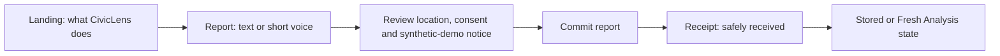
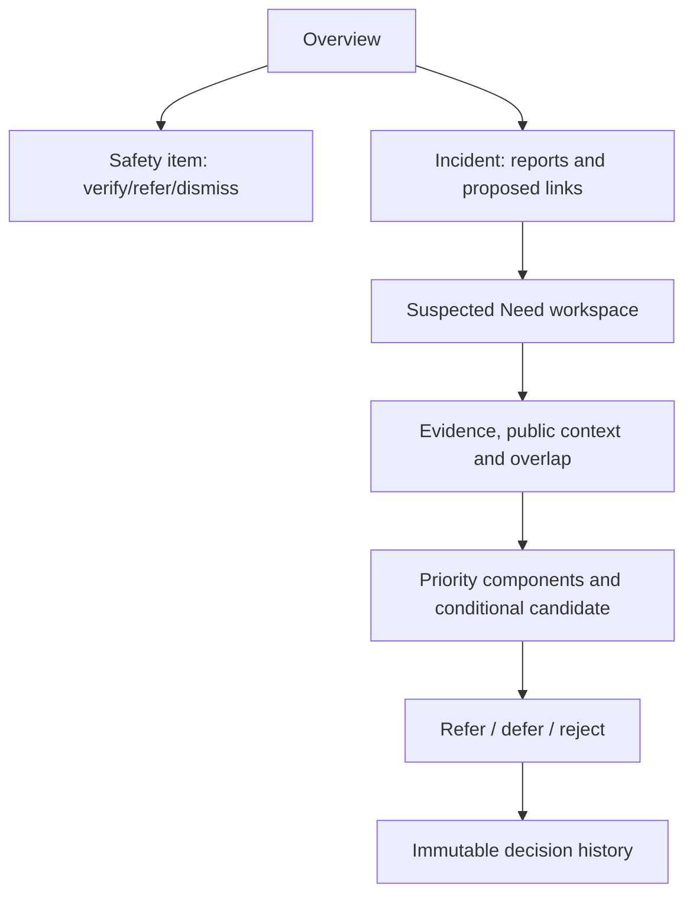
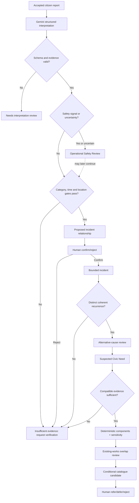
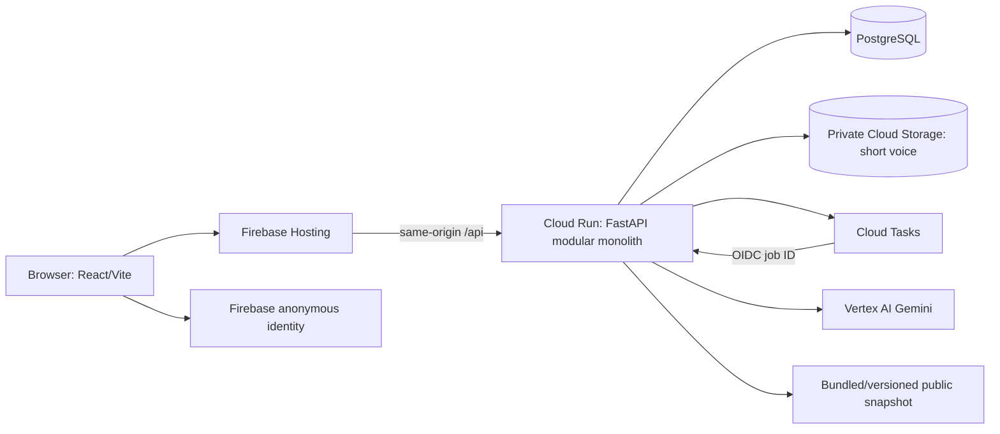

# CivicLens AI — Stage 6 Final Design Review

**Status:** Final planning stage complete; implementation approved on 12 September 2026  
**Date:** 12 September 2026  
**Review posture:** Principal Engineer, security reviewer, product designer, AI engineer and hackathon judge  
**Output:** Adversarial review, scope corrections, **FINAL RECOMMENDED DESIGN v1**, and decisions requiring Suhas's approval

## 1. Executive judgment

CivicLens has a strong, differentiated core:

> It does not prioritize complaint tickets. It turns multilingual citizen signals into reviewable incident patterns, tests whether those patterns support a suspected civic need, combines them with honestly scoped context, proposes only a conditional assessment/intervention, and records a human feasibility decision.

The product logic is ready. The Stage 4/5 implementation shape, however, is too large for a hackathon build if executed literally. The design accumulates a full multimodal upload pipeline, 20-plus conceptual records, direct signed uploads, maps, optional embeddings, two authentication modes, per-session cloned demo data, automated CI/CD, numerous provenance/version tables and a 120-report corpus. Each item is defensible alone; together they create excessive integration surface for the judging value delivered.

The final design therefore makes seven material simplifications:

1. **P0 citizen input becomes text plus one short voice attachment.** Image intake is deferred.
2. **Google Maps is removed from the submission critical path.** Honest locality text and coordinate summaries are sufficient because authoritative project-zone geometry is unverified.
3. **Embeddings are permanently disabled for v1.** Controlled AI normalization plus deterministic category/time/distance gates are sufficient for the small pilot.
4. **Synthetic data is reduced from 120 to 60 carefully curated reports.** Quality, multilingual coverage and edge cases matter more than volume.
5. **Demo sessions use immutable shared seed data plus small session-scoped action overlays.** They do not clone an entire domain graph.
6. **The persistence model is collapsed to the minimum auditable records.** Component, sensitivity, prerequisite and frozen-evidence details live as validated/versioned JSON inside their owning immutable records rather than separate tables.
7. **Continuous deployment automation is deferred.** GitHub Actions verifies the build; a documented, approval-gated manual deployment creates the prototype. Workload Identity Federation/CD may follow only after the public path works.

The selected React/FastAPI/PostgreSQL/Cloud Run/Firebase/Gemini architecture remains sound. Cloud Tasks remains justified because accepting a report before AI while supporting Cloud Run scale-to-zero requires a durable wake-up mechanism.

**Candid go/no-go assessment:** **GO after Suhas approves the short decision list in Section 17 and sends the exact implementation phrase.** The design is credible and buildable as a hackathon MVP. It is not production government software, and it must never be presented as such.

## 2. Adversarial review table

| Attack | Existing design | Final change | Reason |
|---|---|---|---|
| Is this still just a complaint portal? | Strongly addressed through Report → Incident → Suspected Need → Candidate → Human Decision | Preserve unchanged; make the Need workspace the demo centre | This is the actual differentiation and judging story |
| Is the decision-maker fictional or too broad? | Pilot comparison defines a fictionalized planning/asset-management analyst supporting BWSSB's 110-village review | Freeze this exact persona and authority boundary | Avoid inventing an official job title while keeping a credible decision job |
| Do repeated reports prove infrastructure failure? | Alternative hypotheses, sufficiency gates and abstention exist | Preserve; candidate remains distribution-performance/field assessment until verified cause exists | Recurrence is evidence of a pattern, not causality |
| Could a single dangerous report be hidden by low volume? | Separate Safety Review lane exists | Preserve as one flag/queue, not a second product | Operational urgency cannot be traded against planning priority |
| Are scoring weights objectively correct? | Four transparent components, three sensitivity profiles and versioned rules | Preserve, but call every weight/threshold a prototype policy assumption | Reproducibility does not make a policy choice authoritative |
| Does real public data prove current local reliability? | Correctly says no | Preserve; public project facts remain dated context and Synthetic Demo findings complete the local story | The biggest credibility risk is overstating data meaning |
| Is a Project Candidate really an AI hallucinated project? | Constrained catalogue and prerequisites already prevent this | Reduce v1 catalogue to three templates and freeze wording | A small catalogue is more defensible and easier to test |
| Are 120 synthetic reports necessary? | Stage 4/5 proposes 120 | Reduce to 60 curated reports with ground truth | More records add little value but increase writing, translation and validation work |
| Are text, voice and image all necessary? | All were marked Must Have | Keep text + one short voice; defer images | Voice proves multilingual/multimodal Gemini. Image adds storage/parser/UI risks without strengthening the main decision story |
| Is a map honest or valuable without verified polygons? | Map was Should Have with list fallback | Remove it from v1; retain approximate locality/coordinate text | It risks suggesting geographic authority that the data does not support |
| Do embeddings improve a 60-report pilot? | Conditional benchmark planned | Disable for v1, with no benchmark work before submission | AI normalization and hard gates suffice; embeddings add model/version/evaluation surface |
| Is direct signed upload worth the complexity? | Stage 4 specifies draft + signed URL + completion | Use a bounded API-mediated voice upload attached to report commit | One small audio file does not justify browser/GCS CORS, signing and draft-state complexity |
| Is Cloud Tasks overengineering? | DB jobs + Tasks + recovery sweep | Keep | It protects “receipt before AI,” retries and scale-to-zero without a continuously running worker |
| Is Cloud SQL excessive for a prototype? | Selected primary with Neon fallback | Keep Cloud SQL if Stage 5 M0 connectivity succeeds quickly; otherwise switch once to Neon | Relational integrity is useful, but cloud setup must not consume the project |
| Are more than 20 tables necessary? | Conceptual model has many separately versioned child records | Collapse to 16 core tables and versioned JSON substructures | Preserve auditability while reducing migrations, repositories, joins and UI contracts |
| Is demo-session cloning safe and simple? | Clone/namespaced template data per session | Use immutable seed + session-scoped decisions/reviews/fresh reports | Prevent cross-user corruption without copying the full graph |
| Is Google sign-in necessary? | Google sign-in for team, anonymous auth for judges | P0 uses anonymous Firebase identity for isolated demo; team allowlist is P1 | Judge access must be frictionless; real officer tenancy is outside the prototype |
| Is generated OpenAPI drift enforcement useful immediately? | Planned from Milestone 1 | Add after the first stable endpoint slice, before Milestone 3 | Avoid tooling work before contracts exist while retaining type safety |
| Is full keyless automated deployment needed? | WIF plus GitHub deployment pipeline | Keep CI; deploy manually with authenticated developer tooling for v1 | Fewer IAM/debug surfaces. No service-account JSON is still allowed |
| Are the planned tests too broad? | Strong multi-layer test plan | Preserve critical invariants; narrow browser matrix and visual tests | Domain/security failures matter more than exhaustive UI snapshot coverage |
| Can the primary demo survive AI or public-site failure? | Stored Sample Analysis and offline public snapshot exist | Preserve as mandatory | Demo reliability is stronger than pretending every dependency is live |

## 3. What a hackathon judge is likely to challenge

### “Your data is synthetic, so what have you proved?”

Answer: CivicLens proves the **transformation and governance mechanism**, not that Bengaluru currently has the demonstrated failure. Citizen symptoms and local verification are Synthetic Demo; the JICA/BWSSB project-zone and works context is Real/Derived Public with dates and semantics. The prototype shows how evidence would be handled without fabricating a live operational dataset.

The UI and pitch must state this proactively rather than wait for the judge to discover it.

### “Why should your weights decide government spending?”

They do not. The 30/25/25/20 profile is a visible prototype assumption used to organize comparison-ready needs. The interface exposes all four component ratings and a sensitivity result. A human may refer, defer or reject. Real deployment requires policy-owner validation.

### “Repeated complaints might be one broken pump, not a capital need.”

Correct. CivicLens creates a **Suspected Civic Need**, enumerates alternative explanations and proposes a field/distribution-performance assessment. It does not recommend a new pipeline or approve a project without verified cause and feasibility evidence.

### “Where is the meaningful AI?”

Gemini performs multilingual voice/text understanding: transcription, language detection, translation, controlled category/subtype extraction, time/place/service assertions and uncertainty. That is difficult, visible and testable. Deterministic rules then perform safety routing, relationship gates, evidence compatibility, priority and candidate matching. Keeping policy out of the LLM is a technical strength.

### “Why not use an existing grievance portal?”

Existing portals primarily accept, classify, route and track complaints. CivicLens begins after/alongside intake: it separates repeated submissions from bounded incidents, detects recurrence, tests evidence sufficiency, adds public-plan context, creates a constrained feasibility candidate and records an explainable planning decision.

### “Can this scale across India?”

The prototype demonstrates replaceable language prompts, category rules, geography references, evidence snapshots and intervention catalogue versions. It does not claim production national scale. The architecture can be extended, but organizational governance, dataset agreements and policy calibration remain future work.

## 4. Final product scope

### Primary persona

**Planning and Asset-Management Analyst supporting BWSSB's 110-village service review**—an explicitly fictionalized prototype persona, not a claimed official title.

The analyst:

- reviews suspected recurring service gaps inside the declared pilot scope;
- checks citizen-pattern evidence, compatible context and existing works;
- decides whether a need deserves field/feasibility assessment; and
- records refer, defer/monitor or reject/out-of-scope with a reason.

The analyst cannot:

- verify technical cause from the dashboard;
- certify a service failure;
- approve construction, funding, tendering or procurement;
- promise a citizen resolution date; or
- replace the relevant BWSSB operational/engineering function.

### Downstream referral

Use the label **Relevant BWSSB operational/engineering function** until an authoritative unit/title is verified. Do not invent a department name for visual polish.

### P0 capabilities

1. Anonymous text report with confirmed location/locality.
2. One short voice attachment path demonstrating Gemini transcription/translation.
3. Receipt returned before AI and privacy-safe status.
4. Stored Sample Analysis plus visibly separate Fresh Analysis.
5. Deterministic Safety Review routing.
6. Reviewable report-to-incident and incident-recurrence proposals.
7. Suspected Need workspace with alternatives and evidence sufficiency.
8. Dated public context and works-overlap review.
9. Four component ratings, broad band, completeness and sensitivity.
10. Three-item constrained assessment catalogue.
11. Append-only refer/defer/reject decision with frozen evidence digest.
12. Anonymous, isolated Demo Officer session and reset.
13. Public deployment and test-backed demo fallback.

### Deferred from v1

- Image upload/vision.
- Google Maps and authoritative polygons.
- Embeddings/vector search.
- Full Kannada/Hindi interface localization; retain critical citizen copy and multilingual content.
- Citizen correction endpoint and notifications.
- Team Google sign-in unless time remains after release candidate.
- Automated deployment/CD and Terraform.
- Advanced charts; retain one small incident timeline and a compact sensitivity comparison only if useful.
- Current live public-data feeds.

## 5. Final user journeys and screens

### Citizen journey

One responsive route may implement report entry and review steps; separate pages are not required.

### Officer journey

### Final route set

| Route | Purpose |
|---|---|
| `/` | Product distinction, pilot/data disclosure and citizen/officer entry |
| `/report` | Text/voice report, location confirmation, consent and review |
| `/receipt/:publicId` | Safe receipt and analysis state |
| `/demo` | Anonymous Demo Officer session creation/reset |
| `/officer` | Overview with separate Safety, Operational and Planning lanes |
| `/officer/incidents/:id` | Report evidence and relationship explanations/review |
| `/officer/needs/:id` | Single composed need workspace, candidate, disposition and history |

Do not create separate pages for priority, evidence, candidate and decision. They are sections/tabs inside the Need workspace.

## 6. Final decision flow

At no point does Gemini confirm a relationship, assign a priority component, select policy weights or record the final disposition.

## 7. Final data and evidence contract

### Pilot geography

- Pilot frame: BWSSB/JICA 110-village project area.
- Demo slice: Mahadevapura 23-village project zone.
- This is a project grouping, not a current ward, constituency or verified polygon.
- Synthetic reports carry the project-zone label as declared seed metadata.
- Coordinates/locality text may show relative proximity but do not prove authoritative zone membership.

### Evidence classes

| Class | Final use |
|---|---|
| Real Public | Exact dated facts from inspected official sources; context only within supported inference |
| Derived Public | Normalized extract with source hash, transformation and semantics |
| Synthetic Demo | All reports, local symptoms, local field verification, people, coordinates, current outcomes and decisions |
| AI Derived | Transcript, translation, controlled assertions, summaries and relationship suggestions |

### Real public snapshot retained

Retain only the minimal inspected facts needed for the story:

- documented 110-village program and five project-zone grouping;
- Mahadevapura 23-village grouping;
- the 2017-published 2024 population projection, explicitly `projected`;
- the 154 MLD plan-demand figure, explicitly `plan demand`;
- named GLR/project context; and
- Stage V/Phase 3 program status/works context with source date.

These values cannot establish current local reliability, affected population, pressure, daily continuity, water quality or root cause.

### Synthetic evidence retained

Use a labelled Synthetic Demo field-verification record to make the primary need comparison-ready. It may state that a simulated field review observed intermittent/low-pressure service at specified synthetic localities and dates. It must never be described as a BWSSB measurement.

### Existing-works treatment

Program overlap never subtracts a score automatically. It produces one of:

- possible overlap—verify scope;
- partial/apparent coverage—adapt assessment to gaps/outcomes;
- completed but symptoms recur—request outcome verification; or
- no compatible overlap—candidate unchanged.

The primary candidate remains:

> **Refer for pressure, flow, leakage and continuity assessment; verify active-program scope and downstream commissioning; determine whether operational correction or capital feasibility analysis is warranted.**

## 8. Final synthetic corpus

Create **60 curated synthetic reports**, not 120:

| Story | Reports | Expected result |
|---|---:|---|
| Mahadevapura recurring water symptoms | 24 | Three confirmed bounded incidents across eight weeks → one suspected need |
| Comparable water need in another documented project zone | 12 | Two weaker/less complete incidents; used for like-for-like priority/sensitivity comparison |
| High-volume localized pothole | 18 | One operational incident with supporting/suspected-repeat reports; no planning need |
| Hospital water-quality signal | 1 | Immediate Safety Review independent of count |
| Ambiguous/noise/adversarial reports | 5 | Separate, abstain, review or quarantine |

Language target:

- 40% Kannada;
- 35% English;
- 20% Hindi; and
- 5% code-switched.

This is a test-design mix, not a population claim. Every record has ground-truth interpretation, duplicate/same-incident/recurrence labels and expected rule outcome.

The held-out set is a frozen subset or additional compact set never used to tune prompts/thresholds. It must include:

- same meaning across different languages;
- similar words describing geographically separate incidents;
- recurrence explained by a planned/temporary interruption;
- missing/contradictory context;
- a dangerous single report;
- a comparison where the primary water need does not rank first; and
- prompt injection inside citizen text.

## 9. Final architecture

### Fixed stack

- React 19 + TypeScript + Vite static SPA.
- React Router, TanStack Query, React Hook Form and Zod.
- Tailwind plus a small project-owned accessible component layer.
- Python 3.12, FastAPI, Pydantic 2, SQLAlchemy 2, Alembic and Psycopg 3.
- PostgreSQL 17: Cloud SQL primary, Neon fallback only if the M0 cloud gate fails.
- Official `google-genai` SDK with one explicitly configured stable Gemini Flash model through Vertex AI.
- Firebase Hosting and Firebase anonymous authentication.
- Cloud Run, Cloud Tasks and private Cloud Storage.
- GitHub Actions for checks; manual documented deployment for v1.

### Explicit exclusions

- No Next.js/SSR.
- No microservices.
- No Redis/Celery/pub-sub framework.
- No LangChain/LlamaIndex/agent framework.
- No embeddings/vector database/PostGIS.
- No Maps dependency.
- No live public-data API.
- No service-account JSON keys.
- No Terraform/Kubernetes.
- No analytics tracker or third-party observability SDK.

## 10. Simplified backend modules

Use seven cohesive modules rather than one package per conceptual noun:

| Module | Owns |
|---|---|
| `intake` | report validation/commit, receipt capability, short voice metadata and citizen status |
| `interpretation` | AI provider port, analysis orchestration, immutable interpretations and corrections/review state |
| `incidents` | safety evaluation, duplicate/same-incident/recurrence proposals and review actions |
| `planning` | suspected needs, alternative hypotheses, evidence compatibility, priority and sensitivity |
| `candidates` | three-item catalogue, works overlap and conditional candidate |
| `decisions` | evidence digest, refer/defer/reject, append-only history and concurrency |
| `demo` | anonymous session, immutable seed projections, action overlays, reset and expiry |

Infrastructure packages remain narrow: `db`, `ai`, `auth`, `storage`, `tasks`, `telemetry`.

Rules:

- HTTP routes only authenticate, validate, call a service and serialize.
- Pure policy functions receive typed inputs and return typed results.
- SQLAlchemy objects do not cross the persistence/service boundary.
- External SDKs appear only in infrastructure adapters.
- Create a repository protocol only when there is a real alternative/test seam; do not generate boilerplate mechanically.
- No generic `utils.py` or service locator.

## 11. Simplified persistence model

Use at most these 16 core tables for v1:

| Table | Purpose |
|---|---|
| `demo_session` | Anonymous identity binding, created/expiry state |
| `report` | Immutable citizen claim, location/locality, consent, state and receipt hash |
| `report_media` | Optional short voice object metadata, validation and retention |
| `report_interpretation` | Versioned AI output plus run/model/prompt/error metadata |
| `safety_review` | Signal, deterministic rule version and human status/reason |
| `incident` | Bounded event and lifecycle/version |
| `incident_report_link` | Proposed/confirmed/rejected link with feature evidence |
| `incident_relationship` | Proposed/confirmed/rejected recurrence between incidents |
| `suspected_need` | Hypothesis, alternative-cause state, geography and lifecycle |
| `need_incident_link` | Versioned supporting incidents |
| `dataset_snapshot` | Public source manifest, hash, dates, licence and semantics |
| `public_evidence` | Observation/work/context record with geography/unit/inference limits |
| `priority_assessment` | Eligibility, four components, evidence refs, band, completeness and sensitivity JSON |
| `project_candidate` | Catalogue key, conditional wording, overlap and prerequisites JSON |
| `human_decision` | Session/actor, disposition, reason, next step, evidence-version digest and supersession |
| `processing_job` | Canonical async state, lease, attempts, dedupe key and safe error |

Audit requirements are satisfied by immutable/versioned interpretation, link, assessment, candidate and decision records plus structured state-transition logs. A generic `audit_event` table is deferred unless implementation shows a specific missing accountability event.

Versioned policy, prompt and three-item catalogue definitions live in validated repository files; their version/hash is stored on produced records. Separate component, sensitivity, prerequisite, geography-reference and evidence-snapshot tables are not required for 60 synthetic reports.

### Demo isolation

- Seed entities are global and immutable.
- `human_decision`, `safety_review` decision state and optional relationship-review actions carry `demo_session_id` when created by a judge.
- Reads compose immutable seed state with only the caller's overlay.
- Fresh reports and their derived records are session-scoped and do not mutate the shared Golden Demo graph.
- Reset deletes/replaces only the session overlay and session-scoped fresh records.
- Database constraints and queries require the session ID; UI filtering is not a security boundary.

## 12. Final intake, jobs and AI design

### Intake

- `POST /api/v1/reports` accepts multipart form fields and at most one short voice file.
- Text remains required for the default path; the bundled voice demo may allow the transcript to supply the description after processing.
- Hard audio limit: 30 seconds and 6 MB; freeze one or two browser-safe formats after implementation testing.
- The API streams/validates the upload, stores it privately, commits report/media/job atomically within the database and returns the receipt only after the database commit.
- If object upload succeeds but database commit fails, best-effort delete plus a lifecycle rule cleans the orphan.
- No direct signed upload, report-draft API or citizen media playback is required in v1.

### Jobs

1. Insert report and canonical `processing_job` in one database transaction.
2. After commit, enqueue only the job ID to Cloud Tasks.
3. OIDC-protected internal handler claims the job idempotently.
4. Process interpretation → safety → relationship proposals as resumable stages.
5. Scheduled recovery or a guarded admin recovery action re-enqueues old queued jobs.
6. Duplicate delivery cannot create duplicate active interpretation versions.

### AI

One Gemini call may receive original text and/or sanitized short voice. It returns only:

- detected language;
- transcript/translation;
- controlled category and subtype;
- time, place and service assertions with support/unknown;
- controlled safety cues;
- concise normalized summary; and
- contradictions/uncertainty.

Controls:

- stable configured model ID, low temperature, one candidate and bounded output;
- schema-constrained JSON plus independent Pydantic validation;
- no tools, browsing, code execution or arbitrary URLs;
- one transient retry and one schema-repair attempt;
- no contact details, receipt token or officer notes in prompts;
- daily and per-session fresh-call caps;
- stored sample used for the scripted demo, visibly labelled; and
- no AI-generated score, merge, candidate or human decision.

## 13. Final priority and candidate policy

### Eligibility gates

A need is comparable only when:

1. material interpretation is supported or human-reviewed;
2. incident/recurrence relationships are confirmed for the demonstrated assessment;
3. at least two distinct coherent incidents exist;
4. geography is declared and evidence joins are compatible;
5. required local evidence is present; and
6. no unresolved alternative explanation defeats the planning hypothesis.

Otherwise display a named abstention and requested verification.

### Components

| Component | Rating | Key rule |
|---|---|---|
| Scale/exposure | 0–3 or unknown | Never infer population from report count or full-zone population from one street |
| Persistence/spread | 0–3 or unknown | Use confirmed distinct incidents across time/place, not duplicate volume |
| Service disadvantage | 0–3 or unknown | Requires compatible service evidence or visibly Synthetic Demo field finding |
| Consequence if unaddressed | 0–3 or unknown | Enduring outcome only; acute safety stays outside ranking |

Default prototype profile: `30/25/25/20`. Sensitivity runs balanced, exposure-emphasis and persistence-emphasis profiles. The UI leads with component evidence and broad High/Moderate/Lower/Not Comparable band, never an `87/100` headline.

### v1 catalogue

Keep only three candidate templates:

1. **Field/service verification assessment** — for recurring symptoms with unknown cause.
2. **Operational coordination/maintenance review** — when evidence suggests a bounded operational cause.
3. **Capital feasibility referral** — locked unless verified evidence and catalogue prerequisites support it; it need not be generated in the primary demo.

Candidate output always includes conditions, unknowns, existing-work overlap and required next checks.

## 14. Final security and privacy review

### Highest risks

| Risk | Required v1 control |
|---|---|
| Anonymous AI cost abuse | Session/IP rate limit, daily global cap, one call/report, stored demo remains usable |
| Cross-session data access | Backend session scope on every demo mutation/query plus integration tests |
| Receipt guessing/IDOR | High-entropy capability, hashed storage, minimal response and rate limit |
| Malicious voice upload | Strict bytes/duration/MIME/magic/decode, private bucket, no user filename, short retention |
| Prompt injection | Treat content as quoted evidence, schema allowlist, no tools and deterministic policy |
| False incident merge | Hard gates, contradiction evidence, human confirmation and uncertainty favors separation |
| Missed safety cue | Conservative taxonomy, uncertain-to-review and release-blocking held-out case |
| Sensitive logs | No raw reports/audio/prompts/coordinates/tokens/signed URLs; automated redaction tests |
| Decision overwrite | Expected version, immutable decision, superseding correction and evidence digest |
| Misleading public evidence | Typed semantics, prohibited-inference metadata and UI classification labels |

### Public-prototype data policy

- No real citizen grievance content.
- No name, phone, email, Aadhaar, account or demographic collection.
- Approximate/synthetic locations only for the published demo.
- Short voice uploaded by evaluators expires automatically.
- No third-party analytics.
- No public storage object URLs.
- Privacy/data-use notice before submission.

### Authentication

Firebase anonymous identity identifies and isolates a demo browser session; it is not proof of an officer's real-world authority. The UI must say **Demo Officer — Synthetic Environment**. Real officer RBAC/tenancy is explicitly future work.

## 15. Final build and verification plan

Keep the Stage 5 walking-skeleton/Golden-Demo order, with these binding revisions:

| Stage 5 milestone | Stage 6 revision |
|---|---|
| M0 scope/risk | Verify Cloud SQL/Vertex quickly; choose fallback once, no parallel provider support |
| M1 walking skeleton | CI plus manual deploy; defer WIF/CD automation |
| M2 data foundation | 16 tables maximum; 60 curated reports; file-based policy/catalogue |
| M3 Golden Demo | Keep; it is the earliest product-value gate |
| M4 intake/media | Text + one short API-mediated voice file; no draft/signed upload/image |
| M5 AI/safety | Keep one narrow Gemini call and separate safety lane |
| M6 decision engine | No embedding experiment before submission |
| M7 decisions/demo | Immutable seed + session action overlays; no graph cloning; team auth P1 |
| M8 hardening | No map; focus on security, accessibility, failure drills and timing |
| M9 submission | Preserve truthful evaluation and claim audit |

### Minimum release test set

#### Domain/unit

- All 20 Stage 4 essential scenarios, adapted to text/voice-only input.
- Eligibility/unknown-not-zero invariants.
- Priority and sensitivity golden cases.
- Candidate prerequisite and works-overlap cases.
- Prompt/schema fixture validation and safety rules.

#### PostgreSQL integration

- Migration from empty database.
- Report/job atomicity and idempotency.
- Duplicate task delivery/lease recovery.
- Active-version/link constraints.
- Cross-session isolation.
- Append-only decision and stale-version conflict.

#### API/security

- Receipt capability/IDOR/rate limit.
- Anonymous session authorization.
- Multipart size/type/decode limits.
- OIDC-only internal task handler.
- Safe errors and log redaction.

#### End-to-end

Only four mandatory Playwright paths:

1. Golden Demo: overview → incident → need → candidate → recorded referral.
2. Citizen text report → immediate receipt → stored/fresh status.
3. Hospital safety signal → Safety Review outside planning queue.
4. Two browser contexts → isolated decisions/reset.

Run Chromium continuously. Do a final Firefox/WebKit smoke and manual mobile/keyboard/accessibility pass; do not maintain a large visual-snapshot suite.

### Release blockers

- Primary demo exceeds five minutes or cannot be understood by a new viewer.
- Any false claim about current water reliability, geography or project completion.
- A missed scripted safety signal.
- A known false merge in the Golden Demo.
- Unknown evidence becomes zero or contributes silently.
- A session/receipt authorization failure.
- A decision can be overwritten or detached from its reviewed evidence.
- Primary path requires fresh Gemini, Google Maps or a live government/public-data website.
- Clean database migration/seed fails.

## 16. Demo script frozen for implementation

Target duration: **3 minutes 30 seconds**, leaving recovery/question margin.

| Time | Demonstration | Point proved |
|---:|---|---|
| 0:00–0:20 | Landing and one-sentence distinction | Not another complaint tracker |
| 0:20–0:45 | Submit bundled Kannada voice report; receipt appears before analysis | Multilingual input and durable intake |
| 0:45–1:05 | Show Stored Sample vs Fresh Analysis labels | Honest AI/demo reliability |
| 1:05–1:30 | Officer overview separates safety, operational pothole and planning needs | Urgency ≠ planning priority; volume ≠ need |
| 1:30–2:00 | Open the three water incidents and reviewable relationships | Reports become bounded incidents; recurrence is not causality |
| 2:00–2:35 | Inspect Suspected Need, public context, Synthetic Demo verification and evidence gaps | Evidence meaning/provenance is explicit |
| 2:35–3:05 | Show four ratings, sensitivity and Stage V overlap | Explainable policy and existing-work handling |
| 3:05–3:30 | Record “Refer for field/feasibility assessment” and show immutable history | Conditional project intelligence plus human accountability |

Optional after the scripted path: open the single hospital case or wait for the Fresh Analysis result. Do not risk the core narrative by waiting for a live model.

## 17. Decisions requiring Suhas's approval

Approve or change these five decisions before implementation:

1. **Final P0 media scope — recommended:** text plus one short voice attachment; image upload deferred.
2. **Final visual scope — recommended:** no Google Map in v1; use honest locality/coordinate summaries.
3. **Final demo corpus — recommended:** 60 curated synthetic reports instead of 120.
4. **Final demo access — recommended:** anonymous Firebase Demo Officer with immutable shared seed plus session-scoped action overlays; team Google sign-in deferred.
5. **Prototype priority assumptions — recommended:** retain four components and `30/25/25/20`, visibly labelled as unvalidated prototype policy with sensitivity and abstention.

The following do not need another choice unless the Milestone 0 gate fails:

- Bengaluru/BWSSB 110-village frame with Mahadevapura demo slice.
- React/Vite + FastAPI modular monolith.
- Cloud SQL PostgreSQL primary and Neon one-time fallback.
- Cloud Run + Cloud Tasks + Firebase Hosting/Auth + Vertex Gemini.
- No budget, procurement, automated approval, live public-data API or real citizen data.

## 18. Final Recommended Design v1

### One-sentence product

**CivicLens is an explainable planning decision-support prototype that converts multilingual citizen signals into reviewable incident recurrence, tests whether it supports a suspected civic need, adds honestly scoped public context, proposes a conditional assessment and records a human feasibility disposition.**

### One-sentence technical design

**A React/Vite SPA on Firebase Hosting calls one FastAPI modular monolith on Cloud Run, backed by PostgreSQL, Cloud Tasks, private short-voice storage, Firebase anonymous demo identity, a frozen public snapshot and one schema-constrained Vertex Gemini interpretation call.**

### Non-negotiable correctness boundaries

- AI interprets; rules evaluate; humans decide.
- Safety is separate from planning priority.
- Recurrence is not causality.
- Report count is not affected population.
- Missing/incompatible evidence is unknown and may force abstention.
- Public context never claims more than its geography/date/semantics support.
- Existing works trigger review/adaptation, not automatic de-prioritization.
- Candidate means conditional assessment/feasibility referral, not project approval.
- Decisions and their reviewed evidence are immutable/versioned.
- Synthetic Demo and Stored Sample Analysis remain visibly labelled.

### Success definition

The MVP succeeds when a judge can use the public URL, understand the distinction within 30 seconds, complete the Golden Demo in under five minutes, inspect why the suspected need is comparison-ready, see what remains unknown, record a human feasibility referral and observe that the system still works when live AI is unavailable.

### What remains unproven

- Real current locality-level water reliability in the pilot geography.
- Authoritative machine-readable project-zone polygons/crosswalks.
- The prototype weights/thresholds as legitimate public policy.
- Root cause or engineering feasibility of the demonstrated need.
- Accuracy outside the small synthetic multilingual evaluation set.
- Production privacy, abuse resistance, accessibility, availability and national scale.
- Adoption or impact within any government organization.

These limitations are acceptable for a hackathon prototype only when disclosed.

## 19. Final gate and stop instruction

Planning is now complete through Stage 6.

Do not scaffold the application, install dependencies, provision cloud services or write application code until Suhas:

1. approves or changes the five decisions in Section 17; and
2. sends the exact phrase:

**PLANNING APPROVED — START IMPLEMENTATION**

After approval, implementation begins with Stage 5 Milestone 0 and proceeds through the revised milestone gates in Section 15. No “build everything in one prompt” execution is authorized or recommended.
