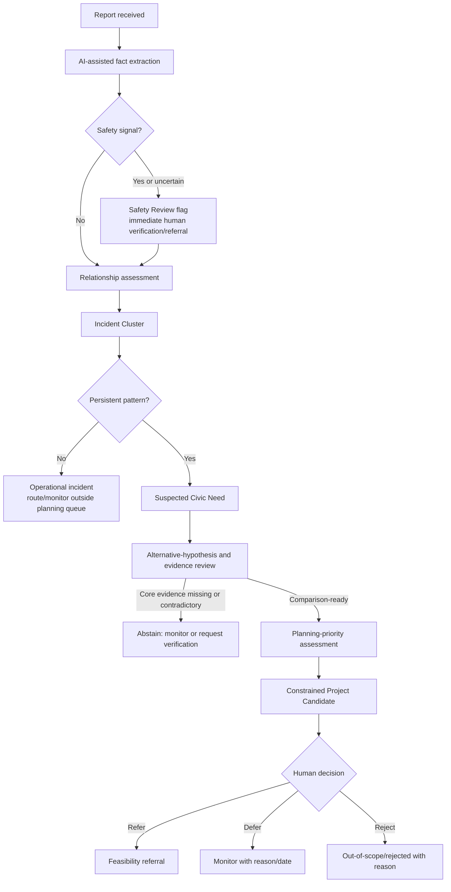

> # ⚠️ ARCHIVED — DO NOT IMPLEMENT FROM THIS DOCUMENT
> Superseded 15 September 2026 by `docs/REBUILD_00` … `REBUILD_05`. Kept as a historical record only.
> **Keep:** §B's two-lane split — the ancestor of the three-lane model in `REBUILD_04 §3`.
> **Reject:** the `30/25/25/20` ordinal components and the three sensitivity profiles. Removing acute urgency from ranking was the wrong call; see `REBUILD_04 §5`.
> See `docs/archive/README.md`.

# CivicLens — Independent Review and Focused Stage 2 Revision

**Status:** Planning only  
**Date:** 11 September 2026  
**Scope:** Challenges and revises Stage 2 without repeating unchanged product design. No Stage 3 document exists yet.

> **Pilot-choice supersession note:** The provisional Mysuru recommendation in this document was later replaced by the final Bengaluru convention: BWSSB/JICA's documented 110-village project geography, with Mahadevapura as the demo slice. Stage 3 and the final Stage 6 design use that convention. The safety, causality, scoring and human-review safeguards in this document remain applicable.

## Executive judgment

The needs-to-project positioning is sound and should be retained. Stage 2 already separates reports, incidents, needs, candidates, and human decisions; preserves provenance; excludes budgets; and constrains project suggestions. The review nevertheless identifies four material gaps before system design:

1. recurrence is treated as stronger evidence of a structural need than it should be;
2. operational danger and planning priority are conceptually distinguished but not represented as separate decision lanes;
3. the priority components are named, but comparability, missing-data rules, and sensitivity testing are not yet defined; and
4. pilot geography and indicator semantics remain unresolved.

The product should rank **suspected service gaps for feasibility referral**, not complaints and not asserted infrastructure deficiencies. A planning officer decides what deserves investigation; a receiving technical department determines cause and feasibility.

---

## A. Review table

| Concern | Existing coverage | Recommended change | Reason |
|---|---|---|---|
| Actual decision-maker | **Needs modification.** Stage 2 names a constituency or district planning officer, then uses “Constituency Planning Officer.” The authority and referral destination remain vague. | Use one MVP persona: **Planning Analyst, Mysuru City Corporation planning/development function**. They decide which suspected cross-ward service gap deserves a documented feasibility referral. For water, the referral goes to the corporation’s responsible water-supply/engineering function; the exact official unit name must be verified before UI copy is frozen. | A narrow job and handoff make the product credible without inventing approval authority. |
| Recurrence versus causality | **Partially addressed.** Stage 2 says one report is not proof and requires feasibility checks, but recurrence can still directly create a Civic Need and candidate. | Rename the object in its pre-verification states to **Suspected Civic Need**. Add alternative-hypothesis review, evidence sufficiency gates, and abstention. Default water intervention should be diagnosis/assessment until causal evidence exists. | Repeated outages can result from maintenance, power, source shortage, distribution capacity, planned shutdowns, or reporting artefacts. |
| Operational urgency versus planning priority | **Conceptually addressed, workflow incomplete.** One-off incidents may remain operational, but “urgency” is also a proposed planning-score component. | Add a small, separate **Safety Review flag** at intake/cluster level. It triggers immediate human verification/referral and never boosts the planning rank. Remove acute incident urgency from the planning score; use enduring harm/exposure only. | A contaminated-water report may need immediate action but still provide insufficient evidence for a capital project. |
| Priority rules | **Needs modification.** Components, versioning, confidence separation, and missing-as-unknown are present; weights and comparison eligibility are deferred. | Use a minimum-evidence comparison gate, four ordinal components, fixed prototype weights, no silent zero/imputation/reweighting, and a three-profile sensitivity check. Permit **Insufficient evidence for comparison**. | Reproducibility alone does not make policy choices legitimate. |
| Data meaning and geography | **Needs modification.** Stage 2 proposes a two-geography audit but does not complete it or define inference limits per indicator. | Provisionally choose **Mysuru City Corporation** over Bengaluru. Add an indicator contract recording source/date/unit/granularity/join/meaning/supported and unsupported inference. Treat water-source/access data as context, never evidence of daily reliability. | Bengaluru’s 2025 boundary reorganization makes historical ward joins especially risky. Mysuru has official Census 2011 ward-level population, but compatible current geometry and ward-level reliability data still require verification. |
| Existing works | **Needs modification.** Overlap is visible and may change a recommendation, but the rule is underspecified. | Classify overlap by scope, geography, status, coverage, update date, and confidence. It can trigger review, reshape the candidate, or leave it unchanged; it must not automatically reduce rank. | Announced, partial, stalled, or stale work does not establish that a need is addressed. |
| Counting semantics | **Mostly addressed.** Raw reports, likely unique reports, suspected duplicates, incident clusters, and affected population are mentioned separately. | Replace “likely unique reports” with **non-duplicate submissions** unless identity independence is actually supported. Add explicit fields for raw reports, suspected duplicate submissions, incident clusters, recurring incidents, reporters with verified/pseudonymous identifiers, and estimated affected population. | Anonymous reports cannot establish unique citizens; independent corroboration should not be collapsed as duplication. |
| Meaningful human review | **Mostly addressed.** Decisions require reasons and record evidence/score versions. | Reduce MVP decisions to **Refer for feasibility**, **Defer/monitor**, and **Reject/out of scope**. Treat merge as evidence-management, not a planning disposition. Record assessment version, evidence snapshot, rule version, officer role, reason, and next review date. | These are meaningful, demonstrable decisions without implying project approval, funding, or engineering feasibility. |
| Honest, testable demo | **Needs modification.** Seed labels, pending AI path, failure states, and a ground-truth file exist, but held-out design and measures are missing. | Maintain one stored golden path visibly labelled “Stored Sample Analysis”; run one fresh submission through the real processor with pending/failure states. Add a frozen held-out set covering all five review cases and evaluate grouping, extraction, safety routing, abstention, and ranking stability. | This prevents a scripted demo from being mistaken for live intelligence and tests failure modes rather than only the happy path. |
| Claims and scope | **Mostly addressed.** Stage 1 distinguishes primary and secondary claims and constrains scope. | Re-verify event requirements immediately before submission. Keep previous-winner identities explicitly secondary-source only. Do not claim official adoption, DPG status, calibrated confidence, real-time public data, or ward-level water reliability. | These are the claims most likely to undermine judge trust if overstated. |

---

## B. Revised core decision flow

### Primary persona and decision boundary

**Primary MVP user:** Planning Analyst in the Mysuru City Corporation planning/development function.

**Responsibility:** Review evidence across local areas, compare suspected persistent service gaps, and prepare defensible referrals to the responsible technical function.

**Decision CivicLens supports:** “Which suspected service gap has enough evidence and planning relevance to send for feasibility assessment now?”

**Water referral:** The corporation’s responsible water-supply/engineering function. The exact formal unit title is deliberately not asserted until confirmed from an official organization source.

**The prototype cannot:** verify the complaint as fact; determine root cause; establish engineering feasibility; approve a project, scheme eligibility, procurement, funding, or expenditure; dispatch an emergency response; or represent an official government decision.

### Two narrow lanes, one product

The Safety Review flag is not a second dashboard or ticketing product. It is a visible flag and referral status attached to a report/incident. It never competes numerically with the planning queue.

### Evidence ladder and causal restraint

Every assessment separates four evidence classes:

| Evidence class | Example | What it supports | What it does not establish |
|---|---|---|---|
| Citizen claim | “Water has not arrived for three days.” | A reported observation requiring interpretation/verification. | That the statement is true, representative, or caused by deficient infrastructure. |
| Observed platform pattern | Three spatially coherent outage clusters in eight weeks. | Recurrence/spread in submitted signals. | Root cause or affected population. |
| Public context | Census households; household tap-water-source share; mapped asset/work snapshot. | Population context, historical access/source context, or possible overlap. | Current daily supply reliability, pressure, quality, or project need. |
| Verified finding | Utility outage log, water-quality test, field inspection, engineering note. | A confirmed condition or cause within the verifier’s scope. | Funding approval or final project feasibility unless the responsible authority states it. |

### Forming a Suspected Civic Need

A pattern may enter `suspected_need` when all are true:

1. at least two separately bounded incidents, or one direct development request with corroborating non-report evidence;
2. category and geography are coherent under versioned rules;
3. the pattern persists, recurs, or spans an area beyond a single repair event; and
4. no known explanation already accounts for the entire pattern with adequate confidence.

These are prototype assumptions, not universal policy. The rule version must be displayed.

For water, the system must explicitly consider: planned shutdown, pump/electricity interruption, source shortage, contamination, isolated pipe failure, distribution/capacity constraint, maintenance backlog, seasonal pattern, and duplicate/coordinated reporting. “Unknown” remains valid.

### Candidate and abstention gate

The system may propose only an **assessment-oriented intervention** when cause is unknown—for example, “distribution reliability diagnostic and capacity assessment.” A construction/expansion candidate requires a verified finding or compatible authoritative evidence supporting that intervention class.

It must abstain from comparative ranking or project suggestion when:

- category or geography is materially uncertain;
- reports could describe the same event but grouping is unresolved;
- core context is missing, stale beyond its declared validity, or geographically incompatible;
- credible evidence materially contradicts the suspected pattern;
- plausible operational explanations have not been checked; or
- the candidate catalogue has no applicable intervention.

The user-facing state is **Insufficient evidence for comparison — verification requested**, never a score of zero.

### Planning-priority rule

Only comparison-ready suspected needs within the same decision scope and review period are ranked. Use four auditable 0–3 component ratings:

1. **Scale/exposure** — sourced population/exposure, never report count as population.
2. **Persistence/spread** — distinct incidents over time and coherent geographic spread.
3. **Service disadvantage** — a compatible indicator or verified local finding.
4. **Consequence if unaddressed** — enduring public-outcome consequence, not acute emergency urgency.

Prototype policy weights are declared, versioned assumptions: `30 / 25 / 25 / 20`. Report volume may strengthen pattern confidence but is capped and does not become a fifth policy component.

Rules for incomplete evidence:

- missing required input → not comparison-ready;
- missing optional input → component shown as unknown and candidate remains outside numeric ranking unless the rule version explicitly permits like-for-like comparison;
- never convert missing to zero;
- never redistribute missing weight;
- stale or incompatible data cannot contribute a component rating;
- confidence and evidence completeness are displayed separately from priority.

For the demo, run a sensitivity check under three declared weight profiles: balanced, exposure-emphasis, and persistence-emphasis. Show **stable** if order is unchanged, **sensitive** if adjacent candidates reverse, and **not comparable** if evidence gates fail. No invented performance result should appear before the held-out data is run.

### Existing-works treatment

An overlap record contains scope/intervention, location coverage, status, responsible body, start/update/completion dates, source, and confidence.

| Finding | Effect |
|---|---|
| Proposed/announced, stale, or low-confidence match | Review flag only; no rank reduction. |
| Active and partial geographic/service coverage | Keep need priority; adapt candidate to uncovered area or monitoring/coordination assessment. |
| Active and apparently full coverage, fresh authoritative evidence | Flag for officer review; defer candidate only through a reasoned human decision. |
| Completed but symptoms recur | Do not lower priority automatically; raise outcome-verification/maintenance hypothesis. |
| Similar name but different scope or geography | No change; retain the checked non-match in the audit trail. |

### Counting contract

The interface and model keep these values independent:

- **raw reports:** all submissions retained;
- **suspected duplicate submissions:** probable resubmissions of substantially the same evidence, not deleted;
- **incident clusters:** bounded events supported by reports;
- **recurring incidents:** distinct incident clusters linked across time;
- **people reporting:** counted only where a privacy-safe stable identifier supports it; otherwise “unknown”;
- **estimated affected population:** derived only from a documented geographic/public-data method, never from reporter count.

### Human decision record

The officer can refer, defer/monitor, or reject/out-of-scope, always with a reason. The append-only record contains the evidence snapshot ID, AI assessment version, grouping-rule version, priority-rule version, catalogue version, officer role, timestamp, disposition, reason, and next step/date. The success message says **Feasibility referral recorded**, never “Project approved.”

---

## C. Data-audit recommendation

### Provisional selection: Mysuru City Corporation

Mysuru is a more defensible MVP pilot than Bengaluru, but the evidence gate is not fully passed.

| Proposed input | Source/date/unit/granularity | Join and compatibility | Meaning and supported inference | Unsupported inference | MVP decision |
|---|---|---|---|---|---|
| Mysuru ward population/households | Census of India 2011, PCA TV for District Mysore; counts; town/ward records; reference `PC11_PCA-TV-2923` | Join by 2011 Census town/ward codes to a verified 2011-compatible boundary/crosswalk. Current ward number alone is insufficient. | Historical population/household context for a compatible 2011 ward. | Current population, current affected population, or current service coverage. | **Real public**, usable only after geometry/crosswalk verification. |
| Drinking-water source/access | Census of India 2011 HL-14/household amenities; household percentage; published at stated Census geography | Use only at the exact published geography. Do not disaggregate district/town figures to wards. | Historical household main water source or source location/access. | Daily reliability, continuity, pressure, quality, outage frequency, or cause. | **Context only**; cannot drive ward ranking unless exact compatible granularity is verified. |
| Administrative geometry | A current authoritative MCC/ Karnataka boundary source is still required | Must include effective date and a crosswalk to the demographic unit; visual PDFs alone are not analysis-ready geometry. | Area assignment and map display for its effective period. | Historical continuity without a crosswalk. | **Missing evidence.** Obtain authoritative GeoJSON/shapefile or use explicitly synthetic demo zones. |
| Water reliability | No compatible official ward-level dataset verified in this audit | No honest join currently available. | None yet. | Any factual claim that a ward has unreliable daily service. | Use **Synthetic Demo** zone indicator, or omit it from the real-data claim. |
| Existing/planned works | No sufficiently complete, compatible MCC works extract verified in this audit | Requires spatial scope, status, freshness, and responsible body—not title matching alone. | Possible overlap when those fields exist. | Resolution of the need or completed coverage. | Use a small **Synthetic Demo** works snapshot unless a verified extract is acquired. |

Primary source evidence confirms Census 2011 ward-level PCA records for Mysore/Mysuru and Bengaluru. It also confirms household water-source/access fields, but not a compatible current ward-level reliability measure. Bengaluru additionally has official 2025 delimitation material, which makes a direct join from 2011 ward statistics to current boundaries unsafe without a crosswalk.

**Why Mysuru wins provisionally:** smaller pilot, directly enumerated Census ward records, and less demonstrated boundary churn than the Bengaluru evidence inspected. This is a feasibility judgment, not proof that all joins are ready.

**Exact evidence still missing before Stage 3 data-model lock:**

1. authoritative, machine-readable Mysuru pilot boundaries with effective date;
2. a documented crosswalk proving compatibility with the chosen 2011 ward rows, or a decision to use synthetic zones;
3. confirmation of the receiving water-supply/engineering unit’s formal name and mandate;
4. licence/usage terms for every imported geometry/table;
5. an official works extract with scope/status/freshness, if real overlap is claimed.

If items 1–2 cannot be obtained quickly, retain Mysuru as the narrative setting but label all local zones, reliability indicators, reports, incidents, and works as Synthetic Demo. Use Census values only as city-level historical context, not as ward facts.

Primary references:

- Hack2Skill, [Build with AI: Code for Communities — Second Edition](https://hack2skill.com/event/codeforcommunities2).
- Census of India, [Mysore ward-level Primary Census Abstract, 2011](https://censusindia.gov.in/nada/index.php/catalog/6768/study-description).
- Census of India, [Bangalore ward-level Primary Census Abstract, 2011](https://censusindia.gov.in/nada/index.php/catalog/6763/study-description).
- Census of India, [Karnataka household drinking-water source/location table, 2011](https://censusindia.gov.in/nada/index.php/catalog/8956).
- BBMP, [2025 city-corporation ward maps](https://www.bbmp.gov.in/maps/).

### Claim-verification status

- Current event date, Track 1 framing, submission package, judging weights, and Google-AI requirement were attributed in Stage 1 to the official Hack2Skill event page. They should be captured again from that page immediately before submission because the page is dynamic.
- The first-edition winner roster remains unverified by an organizer-hosted primary results page. Keep it as secondary context; do not build the pitch’s novelty claim on exact podium identities.
- No production adoption, completed pilot, official government endorsement, DPG certification, or measured CivicLens impact has been established.

---

## D. Necessary Stage 2 changes and Stage 3 consequences

### Stage 2 changes only

1. Replace “Civic Need” with **Suspected Civic Need** until verified findings justify promotion.
2. Replace the broad constituency/district persona with the Mysuru planning analyst persona and explicit referral boundary.
3. Add the separate Safety Review flag; remove acute urgency from planning ranking.
4. Add evidence classes, alternative hypotheses, sufficiency gate, and abstention language to the lifecycle and Need workspace.
5. Replace provisional six-component `87/100` presentation with four 0–3 auditable ratings plus separate confidence/completeness. Avoid pseudo-precise headline scores unless the policy owner approves that display.
6. Add comparison eligibility, missing/stale/incompatible-data rules, and three-profile sensitivity status.
7. Change works overlap from an automatic recommendation modifier to a contextual assessment with human disposition.
8. Replace “likely unique supporting reports” with the counting contract above.
9. Reduce officer dispositions to refer, defer/monitor, and reject/out-of-scope for the demo.
10. Label the precomputed route **Stored Sample Analysis** and make the fresh path visibly asynchronous with pending/failure states.
11. Add the held-out evaluation specification below; report measured results only after execution.
12. Keep the existing screen count. These changes are states/sections within the Need workspace and intake pipeline, not new applications or dashboards.

### Held-out evaluation specification

Freeze a small set after rules/prompts are locked. It must contain:

- similar wording describing different incidents;
- different languages/code-switching describing the same incident;
- recurrence with insufficient structural evidence;
- missing or contradictory public context;
- a case in which water should not rank first;
- an acute safety signal that routes to Safety Review without entering planning rank; and
- a works overlap that is partial/stale rather than treated as resolution.

Realistic measures:

- structured extraction: field-level accuracy/F1 for category, location mention, time, and safety signal;
- incident grouping: pairwise precision/recall/F1, with false merges reported separately;
- recurrence linking: correct/incorrect/abstained cases;
- safety routing: recall on safety-critical examples and false-positive count;
- evidence gating: proportion of insufficient cases correctly abstained;
- priority behavior: expected pairwise order for eligible cases plus stability across three weight profiles;
- provenance: percentage of displayed material values with source/type/date/granularity metadata; and
- workflow: successful preservation of report and pending state during forced Gemini failure.

No target result is claimed in advance. False merges and missed safety signals should be treated as higher-cost errors than extra human review.

### Consequences for Stage 3

Stage 3 may begin as **system-design planning**, but it must not begin implementation. It must model:

- immutable report evidence and versioned AI interpretations;
- `safety_review` independently from `planning_priority`;
- incident links, recurrence links, and suspected-need status as reviewable/versioned relationships;
- evidence assertions with type, provenance, geographic unit, reference period, freshness, compatibility, and supported/unsupported inference;
- comparison eligibility and explicit unknown values;
- versioned rule sets and sensitivity-run results;
- project-candidate prerequisites and abstention reason codes;
- works-overlap assessments, not a boolean overlap penalty;
- append-only decision records tied to exact evidence and assessment versions; and
- frozen tuning and held-out evaluation datasets.

The modular monolith remains the right architecture. No microservice, new external service, new standalone interface, or budget subsystem follows from this review.

---

## E. Decisions requiring user input

1. **Pilot convention:** approve Mysuru City Corporation as the provisional setting, with permission to use explicitly synthetic local zones if compatible official geometry cannot be verified quickly.
2. **Persona wording:** approve “Planning Analyst, Mysuru City Corporation planning/development function” until the official unit title is verified.
3. **Score display:** choose the recommended component profile (`0–3` ratings plus priority band) or retain a headline `/100` score despite its greater false-precision risk.
4. **MVP capacity:** confirm team size and available implementation days only if these constraints would force removal of voice, image, or the fresh-processing demo path.

---

## Candid readiness assessment

**Ready:** product differentiation; lifecycle boundaries; constrained project catalogue; provenance labels; synthetic citizen data; no budgets; human feasibility referral; compact three-story demo; modular-monolith direction.

**Still unproven:** causal validity of any structural-need inference; usable current Mysuru boundary crosswalk; ward-level water-reliability evidence; complete works data; formal receiving-unit name; grouping quality; safety recall; ranking stability; and any real-world impact.

**Can we proceed to system design?** Yes, to Stage 3 planning, provided the architecture treats geography and external datasets as replaceable adapters and preserves abstention/unknown states. The data model must not encode unverified Mysuru joins as facts. Implementation should remain blocked until the user gives the exact approval phrase: **PLANNING APPROVED — START IMPLEMENTATION**.
