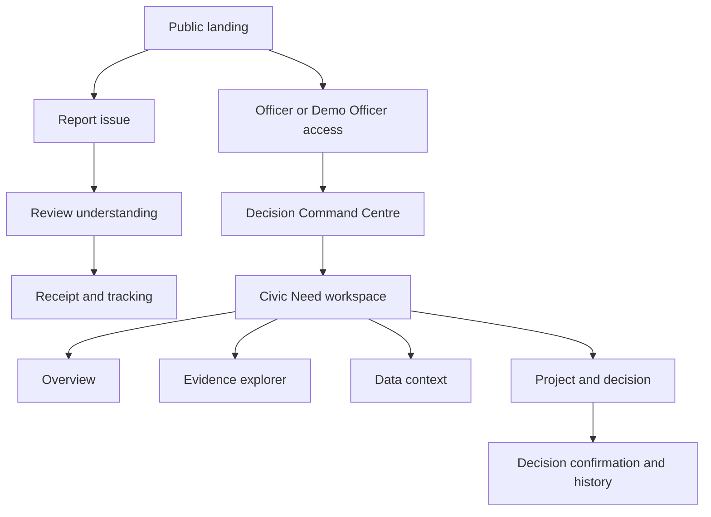

> # ⚠️ ARCHIVED — DO NOT IMPLEMENT FROM THIS DOCUMENT
> Superseded 15 September 2026 by `docs/REBUILD_00` … `REBUILD_05`. Kept as a historical record only.
> **Keep:** §5 citizen journey, §7 Screen 3 "Review understanding", the Citizen UX decisions list, the failure-paths table, the five provenance labels, the fourteen acceptance criteria.
> **Reject:** §13's "not primarily a grievance tracker."
> **Note:** §7 Screen 2 (photo upload) and §8 (map pin) were *correct*. Stage 6 removed them. `REBUILD_03` and `REBUILD_05 §1` restore them.
> See `docs/archive/README.md`.

# CivicLens AI — Stage 2 Product Design

> **Final-scope note:** Stage 6 preserves this product lifecycle but narrows the hackathon implementation to text plus one short voice attachment, removes maps/images from v1, and consolidates officer evidence/candidate/decision sections into one Need workspace. See [Stage 6 Final Design Review](./STAGE_6_FINAL_DESIGN_REVIEW.md).

## 1. Product definition

### Positioning

**CivicLens is an explainable needs-to-project decision-intelligence system for constituency and district planning teams.** It converts multilingual citizen signals into incident clusters, identifies persistent civic needs, enriches those needs with area and infrastructure evidence, generates constrained project candidates, and records an accountable human decision.

Citizen reporting is an input layer. The main product is the officer's decision workspace.

### Product promise

> Show decision-makers which systemic community need should be investigated first, what project response may fit, and exactly which evidence and rules produced that recommendation.

### The question each layer answers

| Layer | Question |
|---|---|
| Report | What did one citizen observe or request? |
| Incident Cluster | Which reports likely describe the same bounded event? |
| Civic Need | What persistent service gap is evidenced across incidents, places, or time? |
| Project Candidate | What constrained intervention could address that need? |
| Human Decision | What will the responsible official do next, and why? |

### Primary operating context

For the MVP, the primary authority persona is a **constituency or district planning officer working on behalf of a public representative**. This is closer to the hackathon brief than a generic municipal administrator. Municipal departments remain downstream owners of operational incidents and potential delivery partners.

The MVP is not presented as an official government system. It is a pilot decision-support environment using clearly labelled public and synthetic data.

---

## 2. Product principles

1. **Needs, not tickets, lead the product.** The officer lands on a ranked queue of civic needs.
2. **One report is a signal, not proof.** Reports retain their original evidence and uncertainty.
3. **Related is not duplicate.** Exact duplicate, same incident, recurring incident, and same civic need are separate relationships.
4. **Volume is not democracy.** Raw report count is capped or normalized and never stands in for affected population.
5. **Missing data is unknown, not zero.** A missing service-gap value lowers data completeness, not the estimated need itself.
6. **Confidence and priority are separate.** A serious low-confidence signal may need rapid verification; it should not silently disappear.
7. **AI interprets; rules rank; people decide.** Gemini does not approve, fund, merge, or close consequential records.
8. **Every recommendation is inspectable.** Evidence, source dates, transformations, score version, and decision history stay visible.
9. **No false precision.** Project cost, beneficiary count, feasibility, and scheme eligibility appear only when sourced; otherwise they are marked for validation.
10. **The citizen gets closure.** Even when a report joins an aggregate need, the citizen can see what it supports and what stage the need has reached.

---

## 3. Users and jobs to be done

### 3.1 Primary: planning officer

**Representative MVP title:** Constituency Planning Officer

**Job:** “When many requests compete for limited attention, help me identify systemic needs that deserve project investigation, understand the evidence quickly, and record a defensible next step.”

The officer needs to:

- know what changed since the last review;
- distinguish operational incidents from structural needs;
- see why rank 1 is above rank 2;
- inspect underlying citizen evidence without exposing unnecessary PII;
- understand which data is real, synthetic, derived, stale, or missing;
- check for overlapping existing work;
- review a constrained intervention rather than a free-form AI proposal; and
- leave an attributable decision and reason.

### 3.2 Secondary: citizen or assisted reporter

**Job:** “When I encounter a civic problem or development need, let me describe it naturally, confirm that the system understood me, and show what my evidence now supports.”

The citizen should not need to understand departments, scheme names, issue taxonomies, or the difference between an incident and a capital project.

### 3.3 Supporting system actor: data steward

For a real deployment, a data steward would approve datasets, boundaries, taxonomies, scoring versions, and intervention catalogues. This is **not a separate MVP interface**. The demo ships with reviewed configuration and read-only provenance. Data-management screens are post-hackathon.

### 3.4 Explicit non-users

- CivicLens is not an emergency dispatcher.
- It is not a procurement or fund-disbursement system.
- It is not a replacement for CPGRAMS, Janaspandana, Sahaaya, or municipal work-order software.
- It does not let citizens vote projects into approval.

---

## 4. Exact domain lifecycle

The named records form a governed transformation, not a forced straight line. A one-off pothole can remain an operational incident; it need not become a Civic Need or Project Candidate.

```mermaid
flowchart LR
    A[Report<br/>one citizen signal] --> B{Intake checks}
    B -->|spam, unsafe, out of scope| B1[Quarantine or human review]
    B -->|usable| C[Structured report<br/>original plus AI-derived fields]
    C --> D{Relationship gate}
    D -->|same bounded event| E[Incident Cluster]
    D -->|new event| E2[New Incident Cluster]
    D -->|direct development request| F[Candidate Civic Need]
    E --> G{Systemic pattern?}
    E2 --> G
    G -->|one-off operational issue| H[Route or monitor incident]
    G -->|recurring, spreading, or structural| F
    F --> I[Enrich with area data,<br/>service gaps, and existing works]
    I --> J[Active Civic Need<br/>priority plus separate confidence]
    J --> K{Review-ready?}
    K -->|not enough evidence| L[Monitor or request verification]
    K -->|yes| M[Project Candidate<br/>from constrained catalogue]
    M --> N[Human Decision]
    N -->|investigate| O[Feasibility assessment requested]
    N -->|monitor or defer| P[Return to watch queue]
    N -->|merge or reject| Q[Reasoned disposition and audit trail]
    O --> R[Privacy-safe citizen status update]
    P --> R
    Q --> R
```

### 4.1 Report

**Definition:** One submitted observation, request, or piece of supporting evidence from a citizen or assisted channel.

**Contains:** original text/audio/image, approximate location, submission time, optional contact channel, consent record, source channel, AI-derived interpretation, and processing state.

**Lifecycle:** `received → analysing → processed | needs review | quarantined`

**Rules:**

- Original evidence is immutable; corrections create a new interpretation version.
- A report is never deleted merely because it is a duplicate; it can support the same incident.
- The public reference does not expose precise location or identity.

### 4.2 Incident Cluster

**Definition:** A group of reports likely describing the same bounded event within a meaningful category-specific place and time window.

Examples:

- the same pothole at one junction reported five ways over three days;
- the same water outage across adjacent streets during one outage period; or
- the same broken streetlight reported by multiple households.

**Lifecycle:** `emerging → confirmed → operationally routed | monitoring | closed`; a closed cluster may later be marked `recurrent` when a similar incident reappears.

**Key distinction:** Reports in the same category five kilometres apart are not automatically the same incident. Separate water outages over multiple months may be different incidents that support the same Civic Need.

### 4.3 Civic Need

**Definition:** A persistent or material gap in a public outcome, evidenced by one or more incident clusters, direct development requests, and area-level context.

Examples:

- unreliable water service across a service zone;
- recurring school-access flooding along a route; or
- insufficient street lighting around a transit corridor.

**Lifecycle:** `candidate → monitoring → active → review-ready → action initiated | deferred | resolved`

**Contains:** supporting incident clusters, affected geography, trend, estimated exposure when sourced, service-gap indicators, existing/planned work overlap, deterministic priority breakdown, evidence confidence, data completeness, and history.

### 4.4 Project Candidate

**Definition:** A reviewable intervention class selected from a curated catalogue because it plausibly addresses one Civic Need.

It is not an approved project, tender, engineering design, budget, or promise.

Example for unreliable water service:

- intervention: distribution-network audit and capacity assessment;
- possible follow-on: storage or pipe-capacity improvement;
- required checks: utility outage log, engineering survey, land/asset ownership, scheme eligibility, and cost estimate.

**Lifecycle:** `draft → officer review → feasibility requested | monitoring | deferred | rejected`

### 4.5 Human Decision

**Definition:** An append-only record of an authorized person's disposition, reason, timestamp, and the evidence/score version reviewed.

**MVP decision actions:**

1. **Send for feasibility assessment** — the strongest positive action; it does not approve funding.
2. **Monitor for more evidence** — retain in the watch queue with a review date.
3. **Defer** — record a reason such as active overlapping work or unavailable mandate.
4. **Merge with another need** — preserve both histories.
5. **Reject / out of scope** — require a reason and preserve auditability.

---

## 5. Citizen journey

### Happy path

1. The citizen opens CivicLens from a public link or QR code.
2. They choose **Report a local issue**; login is not required.
3. They speak or type naturally, optionally attach one image, and choose Kannada, Hindi, or English. Language detection can be automatic, with manual override.
4. They share current location, drop a pin, or enter a landmark. Precise location is explained and is not shown publicly.
5. CivicLens returns an editable understanding card: “No water for three days near Jayanagar 4th Block,” suggested type, location, and media attached.
6. The citizen corrects anything wrong and submits.
7. The receipt explains one of three outcomes without overclaiming:
   - “Your report supports an existing local incident.”
   - “Your report has started a new incident signal.”
   - “We need a human to review how this report should be grouped.”
8. The citizen receives a reference code. Adding a phone/email for updates is optional.
9. On the tracking view, they see privacy-safe stages: received, grouped, supporting a monitored need, under official review, or action initiated.

### Citizen UX decisions

- Do not ask the citizen to select the responsible department.
- Do not force a category before they describe the problem.
- Do not show an AI severity score to the citizen.
- Do not claim a specific number of “affected people” from report count.
- Do not say “resolved” merely because an officer reviewed the need.
- Show “23 related reports nearby” only when the relationship is established; otherwise say “possible related reports.”
- The full flow should take roughly 60–90 seconds on mobile.

### Failure paths

| Failure | Citizen experience |
|---|---|
| Gemini unavailable | Accept and securely store the report; show “Received—analysis pending.” |
| Low-confidence interpretation | Require confirmation of the short summary and offer “None of these” for category. |
| GPS denied | Offer map pin, landmark, or locality; explain that grouping may take longer. |
| Image/audio upload fails | Preserve typed text and let the user retry or submit without media. |
| Possible emergency | Show a clear emergency-service instruction and do not imply CivicLens dispatches responders. |
| Suspected spam or unsafe media | Accept no public claim; place it into review/quarantine and provide a neutral receipt where appropriate. |

---

## 6. Officer journey

### Happy path

1. The officer enters the **Decision Command Centre** through authenticated access. Judges can use a clearly labelled sandboxed Demo Officer account.
2. The default queue shows **review-ready Civic Needs**, not incoming reports. The officer immediately sees rank, change, reason for movement, affected geography, confidence, and data completeness.
3. The officer notices that “Recurring water-service gap” ranks above a higher-volume pothole cluster because it spans several incidents, is growing, affects a larger service area, and is supported by a public service-gap indicator.
4. They open the Civic Need workspace.
5. The overview shows the one-sentence need, priority breakdown, separate confidence, affected map area, supporting incident clusters, and overlap with existing work.
6. They inspect the Evidence view to verify representative reports, language/source diversity, duplicate handling, and contradictory evidence.
7. They inspect Data Context to see source name, vintage, granularity, licence, transformations, and any mismatch with the pilot geography.
8. They review the Project Candidate, its constrained intervention type, why it fits, known overlaps, and the validation checklist.
9. They choose **Send for feasibility assessment**, enter a short reason, and confirm.
10. CivicLens records the decision against the exact evidence and score version. The need moves to Action Initiated and its privacy-safe citizen status updates.

### Officer decision safeguards

- The officer can inspect representative and all supporting evidence, but aggregate views obscure citizen identity and precise coordinates.
- The score does not change when the officer opens or comments on a need.
- Any override of the ranked recommendation requires a reason.
- Synthetic data remains visually labelled throughout the officer workflow.
- If a data source is stale or geographically mismatched, the warning appears beside the affected score component, not only in a hidden source page.

---

## 7. Information architecture and exact screens

### Screen 1 — Public landing

**Purpose:** Explain the product in under 15 seconds and route users by job.

**Hierarchy:**

1. “Turn community signals into better public investment decisions.”
2. One-sentence explanation of citizen reporting and officer decision intelligence.
3. Primary action: **Report a local issue**.
4. Secondary action: **Explore the demo dashboard**.
5. Persistent disclosure: “Demonstration platform using synthetic reports and labelled public data. Not an emergency service.”

**States:** no data dependency; if the demo API is unavailable, reporting remains accessible and the demo dashboard shows a service message.

**Mobile:** actions stack vertically; no dashboard preview carousel or decorative map.

### Screen 2 — Report issue

**Purpose:** Capture enough evidence for later grouping without making citizens complete an administrative form.

**Structure:** one mobile-first stepper, rendered as a single compact page on desktop.

- **Describe:** text area; record short voice; attach one image; detected language with override.
- **Locate:** use current location, drop a pin, or enter locality/landmark.
- **Optional updates:** phone/email only if the citizen wants notifications.
- **Privacy:** plain-language note beside location and contact fields.

**Primary action:** **Review report**.

**States:**

- Empty: example prompts in three languages, not prefilled content.
- Recording/uploading: visible progress and cancel.
- Location denied: manual methods immediately available.
- Validation: ask only for a description and usable approximate location; image/contact optional.
- Error: preserve all entered fields.

**Mobile:** each input method has a large labelled control; camera and microphone are optional; map opens only when needed.

### Screen 3 — Review understanding

**Purpose:** Let the citizen correct AI interpretation before submission.

**Hierarchy:**

1. concise normalized summary;
2. original-language transcript/text;
3. suggested issue type and whether it appears operational or developmental;
4. approximate location preview;
5. attached media; and
6. low-confidence or text/image contradiction prompt when applicable.

**Primary action:** **Submit report**. Secondary: **Edit**.

**Success:** transition to receipt. **AI failure:** allow submission with “Analysis pending.”

**Important language:** “This is how CivicLens understood your report,” never “AI verified your complaint.”

### Screen 4 — Receipt and tracking

**Purpose:** Close the citizen interaction and preserve trust.

**Hierarchy:**

1. received status and reference code;
2. current grouping outcome;
3. privacy-safe related-incident/need summary when available;
4. what happens next; and
5. track-link copy action.

**Possible success messages:** supports existing incident; new incident signal; grouping under review.

**Empty/error:** an unknown reference shows recovery guidance without revealing whether another person's record exists.

**Mobile:** timeline is a simple vertical sequence; no officer-only score or precise map.

### Screen 5 — Officer access

**Purpose:** Separate real authority access from judging access.

**Modes:** authenticated Officer and clearly labelled **Demo Officer**. Demo mode uses sandbox data and resets decisions; it does not imply government endorsement.

**MVP:** no registration, password reset, user administration, or complex organization setup.

### Screen 6 — Decision Command Centre

**Purpose:** Answer “What needs my attention, what changed, and why?”

**Default view:** list-first ranked Civic Needs with an adjacent contextual map on desktop. The map shows spatial extent and report coverage; it is not the primary navigation.

**Header summary:** review-ready needs, newly emerging needs, action initiated, and data-refresh status. Avoid unrelated vanity metrics.

**Each need row shows:**

- rank and priority band;
- plain-language need;
- affected geography;
- score with separate confidence and data completeness;
- strongest two ranking reasons;
- change since prior scoring run;
- incident clusters and likely unique report count; and
- overlap flag for an existing/planned work.

**Filters:** status, category, geography, and time window only. Default sort is deterministic priority.

**Primary action:** open a Civic Need.

**States:**

- Loading: stable list skeleton; map loads independently.
- Empty: “No needs are review-ready,” followed by emerging needs—not fake zero metrics.
- Map failure: list and decisions remain fully usable.
- Stale data: timestamp and affected components are visible.
- Error: last successful snapshot may be shown with a prominent stale warning.

**Mobile:** ranked list only; map is a collapsible secondary section. Officer decisions remain possible, but desktop/tablet is the expected working context.

### Screen 7 — Civic Need workspace

**Purpose:** Provide one place to validate the need and make a decision. This is the signature screen.

**Persistent header:**

- need statement and affected geography;
- review priority and rank;
- confidence and data completeness as separate labels;
- current lifecycle state; and
- primary action: **Review project candidate**.

**Tabs/sections:** Overview, Evidence, Data Context, Project & Decision.

#### 7A — Overview

- why this is a Civic Need rather than one incident;
- score-component breakdown with plain-language contribution;
- time trend and recurrence timeline;
- affected-area map;
- supporting incident clusters;
- existing/planned-work overlap; and
- “What could change this assessment?” showing missing verification.

The provisional score components shown to users are impact/exposure, recurrence and trend, geographic spread, service gap, urgency, and plan gap. Stage 3 will finalize weights and rules. Confidence is never buried inside the score.

#### 7B — Evidence explorer

- incident clusters grouped by place/time;
- raw reports, likely unique reports, and suspected duplicates shown separately;
- source/language/media distribution;
- representative evidence cards with original and normalized text;
- privacy-obscured location and media; and
- low-confidence and contradiction flags.

**MVP interactions:** expand cluster, inspect reports, mark “needs grouping review.” Manual merge/split execution can be deferred if the seeded grouping is pre-reviewed.

#### 7C — Data context

- area profile values used in the assessment;
- existing and planned works considered;
- provenance label: Real Public, Derived Public, Synthetic Demo, User Submitted, or AI Derived;
- source, snapshot date, reference period, licence, granularity, and transformation note; and
- explicit warnings for stale or mismatched data.

#### 7D — Project & decision

- one recommended intervention class and up to two alternatives from the curated catalogue;
- why the intervention matches the need;
- overlapping work and potential duplication;
- required feasibility checks;
- cost shown only as “not estimated” unless a source-backed band exists;
- decision actions; and
- mandatory reason field.

**Success:** append decision, show confirmation, update status. **Save failure:** keep the unsaved reason and do not change state optimistically.

**Mobile:** sections become a vertical sequence; sticky actions avoid covering evidence; charts simplify to labelled values.

### Screen 8 — Decision confirmation and history

**Purpose:** Make human accountability visible.

**Confirmation:** action, reason, officer role, evidence/score version, and next review/validation step.

**History:** append-only timeline. Corrections add a new record; they do not rewrite the prior decision.

This may be a confirmation panel within the Civic Need workspace rather than a separate route.

---

## 8. Map experience

The map has three legitimate jobs:

1. show whether reports describe one bounded incident or multiple incidents;
2. show the geographic spread of a Civic Need and reporting-coverage gaps; and
3. show overlap with known assets or existing/planned work.

**MVP map layers:** affected Civic Need boundary/area, supporting incident centroids, and existing/planned work markers or areas. Category heatmaps, 3D, routes, street view, satellite imagery, drawing tools, and live traffic are removed.

Clicking a need or cluster on the map synchronizes the list/evidence selection. No decision depends solely on colour.

---

## 9. Exact smallest MVP

### 9.1 The minimum proof

The MVP succeeds only if a judge can observe this transformation:

1. a Kannada/Hindi/English report enters with voice or text, optional image, and location;
2. Gemini converts it into validated structured fields while preserving the original;
3. the report joins the correct Incident Cluster;
4. multiple incidents across time/area support a Civic Need;
5. one real public area indicator and a labelled works snapshot enrich that need;
6. deterministic rules rank the need and explain every score component;
7. a constrained Project Candidate appears with uncertainties and required checks; and
8. an officer records “Send for feasibility assessment,” creating an audit entry and citizen-safe status.

Anything not needed to prove those eight steps is secondary.

### 9.2 MVP feature boundary

| Include | Exclude |
|---|---|
| Anonymous/pseudonymous report intake | Citizen account system and social profiles |
| Text plus one short voice and one image | Video, WhatsApp, IVR, SMS, social-media ingestion |
| Kannada, Hindi, English intake | Every scheduled Indian language in the UI |
| Map pin/current location/manual locality | Address-quality platform and complex geocoding fallbacks |
| AI extraction with correction | Open-ended citizen or officer chatbot |
| Precomputed, testable incident/need grouping | Fully autonomous merge/split decisions |
| Ranked Civic Need queue | Generic admin analytics dashboard |
| One signature Need workspace | Separate report, cluster, map, analytics, and project applications |
| One curated intervention catalogue | Free-form AI project generation |
| Five officer dispositions | Work orders, procurement, fund allocation, contractor management |
| Demo officer sandbox | Organization/user administration |
| Imported dataset snapshots | Demo-time dependence on live government APIs |
| Audit timeline | Blockchain or cryptographic ledger |

### 9.3 Minimum dataset shape

- **120 synthetic reports** across three languages and 5–6 local areas;
- **8–10 incident clusters** across 3–4 categories;
- **3 active Civic Needs**;
- **3–5 project candidates** from a 6–8 item intervention catalogue;
- **one operational issue** that never becomes a project;
- **one systemic need** that becomes the top recommendation;
- **one need with an overlapping active work** that is deferred or changed; and
- a hidden ground-truth file for matching and ranking tests.

### 9.4 Demo narrative dataset

| Story | Reports | Transformation | Purpose |
|---|---:|---|---|
| Localized pothole | 45–55 | One incident; route operationally, no project candidate | Proves CivicLens does not promote the loudest complaint automatically. |
| Recurring water unreliability | 30–40 | Three incidents across time/adjacent areas → one Civic Need → project assessment candidate | Proves the full needs-to-project transformation. |
| Streetlight gap | 20–30 | Civic Need, but existing-work overlap found → defer/monitor | Proves plan-awareness avoids duplicated investment. |
| Background/noise | remainder | unrelated, low-confidence, duplicate, or spam reports | Proves realistic triage and uncertainty. |

---

## 10. External-data strategy

### 10.1 Core rule

The MVP needs **credible data provenance**, not a national data lake. No live government API is required during the demo. All public data should be imported as versioned snapshots so the product remains reliable and reproducible.

### 10.2 Data truly needed for the MVP

| Dataset | Why it is needed | Real or seeded? | MVP treatment |
|---|---|---|---|
| Pilot administrative/service-area geometry | Assign reports to areas and show spatial spread. | **Prefer real public geometry.** | Import one official/openly licensed GeoJSON snapshot. Record source and date. If no geometry aligns with the chosen planning unit, change the pilot geography rather than draw a misleading “official” boundary. |
| Area population or households | Prevent report count from masquerading as affected population; give exposure context. | **Real public snapshot required for credibility.** | Use one compatible-granularity Census/data.gov.in table. Prominently label the reference year, especially Census 2011. Do not interpolate to smaller areas without a defensible method. |
| One issue-relevant service-gap indicator | Demonstrate that CivicLens enriches demand with infrastructure context. | **Real public snapshot strongly preferred.** | For the water demo, use a compatible public household water-source/service indicator. If exact local data is unavailable, choose another issue or geography with matching data. |
| Existing/planned works snapshot | Demonstrate overlap detection and plan gap. | **May be realistic seeded data for MVP.** | First attempt a small official MPLADS/local-works extract. If unavailable or geographically incompatible, use 5–10 clearly labelled Synthetic Demo works. Never mix them invisibly with real works. |
| Intervention catalogue | Keep project suggestions constrained and auditable. | **Curated sample configuration.** | Create 6–8 intervention classes with source/mandate notes. They are templates, not government-approved cost estimates. |

### 10.3 Data that should be synthetic/sample

| Dataset | Decision |
|---|---|
| Citizen reports, identities, contact details | 100% synthetic. Never use scraped or real grievance PII. |
| Voice and images | Team-created, consented, public-domain, or appropriately licensed demo assets. No claim that they are real government complaints. |
| Duplicate/cluster labels | Synthetic ground truth authored specifically for testing. |
| Incident history and status events | Synthetic, constructed to demonstrate recurrence. |
| Officer accounts and decisions | Synthetic Demo records. |
| Project feasibility checks | Curated sample checklist; do not mark as completed unless the demo story explicitly says synthetic. |
| Costs and budgets | Omit. If ever shown, use a clearly sourced indicative band; the MVP does not need it. |
| Vulnerability score | Do not invent a composite score. Prefer one or two transparent public area indicators; otherwise show “data unavailable.” |

### 10.4 Data not needed for the MVP

- real-time national demographic feeds;
- BigQuery or a national data warehouse;
- satellite imagery or Earth Engine;
- weather forecasting unless the selected need specifically requires it;
- social-media scraping;
- Aadhaar, electoral roll, household, property, or individual socioeconomic data;
- live CPGRAMS/Janaspandana/Sahaaya integration;
- procurement and contractor datasets;
- full national infrastructure indices; and
- exact engineering cost models.

### 10.5 Provenance visible in the product

Every material value carries one of five labels:

- **Real Public** — copied from a named public source without semantic change;
- **Derived Public** — calculated from public source fields, with transformation described;
- **Synthetic Demo** — intentionally fabricated for the prototype;
- **User Submitted** — original citizen evidence; or
- **AI Derived** — interpretation produced by Gemini and subject to validation.

This distinction should be visible in the Need workspace and deck, not relegated to a README.

### 10.6 Pilot-geography selection gate

Before Stage 3 locks the data model, perform a two-hour data audit for two candidate geographies. Select the pilot where the following align at the same or defensibly joinable granularity:

1. boundary geometry;
2. population/households;
3. one service-gap indicator; and
4. preferably a works snapshot.

If a Lok Sabha constituency lacks compatible public data, use a district or urban local body as the demonstration operating unit and describe the constituency roll-up as the scalable design—not as a completed integration.

---

## 11. The 3–5 minute hackathon demo

### Target duration: 4 minutes 20 seconds

| Time | Action | What it proves |
|---:|---|---|
| 0:00–0:20 | State the problem: complaint portals manage tickets; planners still cannot see which structural need deserves investigation. | Differentiation and problem fit. |
| 0:20–0:55 | Submit a short Kannada voice/text water report with a location and optional image. Confirm the structured interpretation. | Meaningful Gemini multimodal/language work and citizen simplicity. |
| 0:55–1:20 | Show the receipt: the report supports an existing outage Incident Cluster; original and derived fields remain separate. | Safe matching, no “Gemini answered and done.” |
| 1:20–1:55 | Switch to Demo Officer Command Centre. Show that water ranks above the higher-volume pothole issue. | Needs, not raw ticket count, lead the product. |
| 1:55–2:50 | Open the water Civic Need. Trace three incidents into one systemic pattern; show trend, area spread, one real service-gap indicator, confidence, completeness, and score breakdown. | Full evidence-to-priority chain and explainability. |
| 2:50–3:25 | Open Data Context and existing works. Contrast the water need with the streetlight need that has an overlapping active work. | Public-data enrichment, plan awareness, and avoided duplication. |
| 3:25–3:55 | Review the constrained water intervention and its mandatory feasibility checks. | Project intelligence without hallucinated approval/cost. |
| 3:55–4:15 | Choose “Send for feasibility assessment,” enter a reason, and show the audit entry. | Human authority and deployable workflow. |
| 4:15–4:20 | Return to citizen-safe status: “Need under official review.” | Closed trust loop. |

### Demo safeguards

- Preload and warm the application.
- Use a prerecorded voice sample as backup to live microphone input.
- Ship deterministic stored results for the primary demo report, while still allowing a fresh test path.
- Never rely on a live public-data API during the presentation.
- Keep a second pre-seeded need ready if map or media permissions fail.
- Reset Demo Officer decisions between judging sessions.
- Display the Synthetic Demo label continuously on seeded evidence.

---

## 12. MVP acceptance criteria

The Stage 2 design is proven when the implemented MVP can satisfy all of these:

1. A citizen can submit without creating an account and can recover a tracking view.
2. A Kannada, Hindi, or English report preserves the original and shows a correctable normalized interpretation.
3. AI failure does not lose or block the report.
4. The same incident can contain several reports without deleting any evidence.
5. Separate recurring incidents can support one Civic Need.
6. A high-volume operational incident can remain below a lower-volume systemic need for inspectable reasons.
7. At least one score component traces to a real, dated public-data snapshot.
8. Missing or stale data is visibly identified and is not silently treated as zero.
9. A works overlap changes the displayed recommendation or required review.
10. Every score component is deterministic and versioned; confidence is shown separately.
11. A Project Candidate comes only from the curated catalogue and carries a validation checklist.
12. An officer action requires a reason and records the evidence/score version reviewed.
13. Citizen-facing status reveals no private report or exact coordinate.
14. The entire golden path can be demonstrated comfortably in under five minutes.

---

## 13. Decisions fixed by this Stage 2 design

- CivicLens is a planning decision-support product, not primarily a grievance tracker.
- The hero object is the Civic Need; the hero screen is its evidence and decision workspace.
- Citizen reporting remains fast, optional-contact, and account-free.
- Operational incidents and structural needs are explicitly different.
- Project Candidates are constrained, conditional recommendations.
- The strongest MVP action is referral for feasibility assessment—not project approval or funding.
- The budget simulator is excluded.
- The map is contextual, not the main product.
- The demo uses synthetic citizen data and imported public-data snapshots with visible provenance.
- No live government integration is required to prove the MVP.

## 14. Decision still required before Stage 3

**Choose the pilot operating geography after a short data-compatibility audit.** The preferred order is:

1. one real Lok Sabha constituency, if compatible boundary, population/service-gap, and works data can be joined honestly;
2. one real district or urban local body, if that provides stronger data alignment; or
3. an explicitly synthetic demonstration geography only if neither real option is viable within the schedule.

All other core product decisions are sufficiently constrained for Stage 3 system design.
