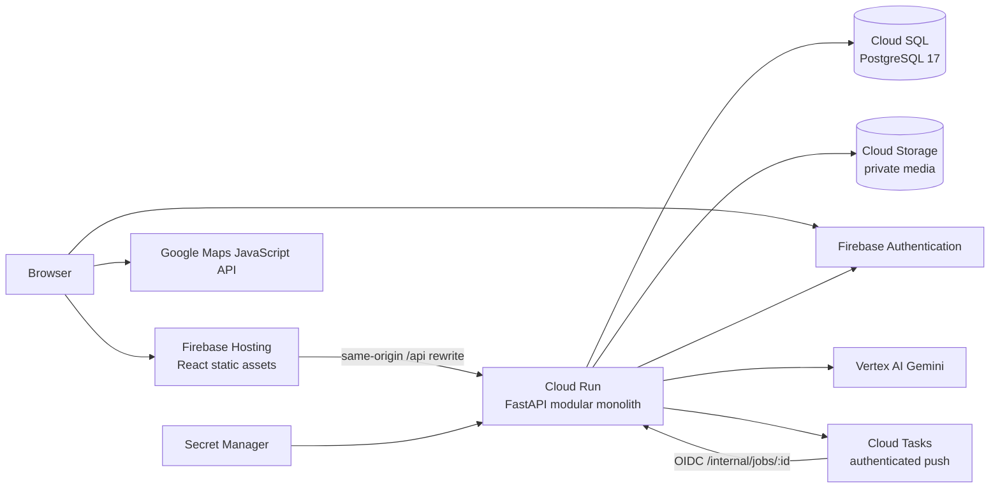
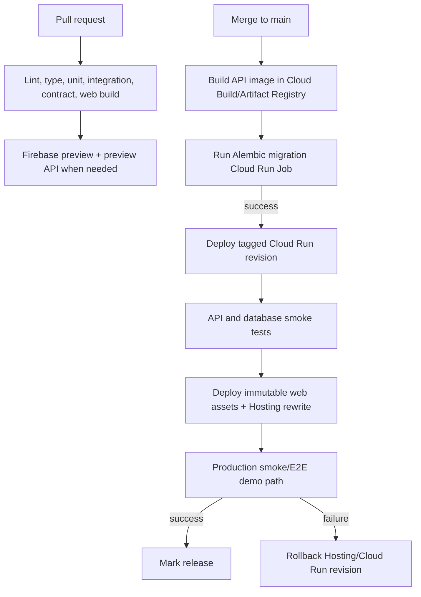

> # ⚠️ ARCHIVED — DO NOT IMPLEMENT FROM THIS DOCUMENT
> Superseded 15 September 2026 by `docs/REBUILD_00` … `REBUILD_05`. Kept as a historical record only.
> **Keep:** §3 stack, §4 repo structure, §5 module template and the eight ports, **§8 media handling (re-activated for images)**, §11 config/secrets, §12 deployment, §13 cost, §14 testing pyramid, §16 observability, §17 local dev, §19 risk review, §20 evidence table.
> **Reject:** §1's Google Maps JavaScript API → MapLibre GL + self-hosted `.pmtiles` (`REBUILD_05 §1.3`). §45's "No PostGIS" → PostGIS is mandatory (`REBUILD_05 §2.1`).
> **Worth knowing:** §18 classified "one short voice and one image" as **Must Have**. Images were designed in here and removed later by Stage 6.
> See `docs/archive/README.md`.

# CivicLens AI — Stage 4 Implementation Design

**Status:** Planning complete; implementation approved on 12 September 2026  
**Date:** 12 September 2026  
**Input:** Approved Stage 2 Bengaluru pilot and Stage 3 system design  
**Objective:** Select one buildable, deployable, research-backed implementation architecture for the hackathon MVP

> **Stage 6 supersession note:** The core stack remains selected, but the final review narrows v1 to text plus short voice, removes Maps/images/embeddings and automated CD from the critical path, replaces signed uploads with bounded API-mediated voice upload, reduces the persistence model, and replaces demo-graph cloning with immutable seed plus session overlays. [Stage 6](./STAGE_6_FINAL_DESIGN_REVIEW.md) is authoritative for implementation scope.

## 1. Executive recommendation

Build CivicLens as a **two-application monorepo** containing:

1. a static React/TypeScript web client deployed to Firebase Hosting; and
2. one Python/FastAPI modular-monolith container deployed to Cloud Run.

Use Cloud SQL for PostgreSQL as the relational source of truth, private Cloud Storage for media, Firebase Authentication for officer/demo identity, Vertex AI Gemini through the official Google Gen AI SDK for deployed AI processing, Google Maps JavaScript API only where a map materially helps, and Cloud Tasks as a thin authenticated trigger for durable database jobs.



This design intentionally rejects Next.js SSR, multiple backend services, Redis, Celery, Kafka, GraphQL, LangChain, a vector database, PostGIS, live public-data APIs and Kubernetes for the MVP.

## 2. Why this is the best fit

### Evaluation criteria

| Criterion | Weight | Meaning for CivicLens |
|---|---:|---|
| Demo reliability | 25% | The primary 3–5 minute path must survive cold starts and AI/public-source failures |
| Implementation simplicity | 20% | A small team using AI-assisted coding must understand and test the whole system |
| Product/data-model fit | 20% | Versioned relationships, provenance and decisions need strong relational integrity |
| Google ecosystem relevance | 15% | Google technology should do meaningful work, not decorate the deck |
| Cost control | 10% | Low predictable spend and hard quota controls |
| Scale path | 10% | The MVP should expand without being rewritten, but not prebuild enterprise infrastructure |

### Frontend comparison

| Option | Strength | Cost/complexity | Decision |
|---|---|---|---|
| Next.js on Firebase App Hosting | SSR, server components, integrated managed deployment | Adds a Node server runtime, server/client boundaries and another cold-start/debug surface. App Hosting requires billing/Blaze. CivicLens has little SEO or SSR need. | Reject for MVP |
| React SPA with Vite on Firebase Hosting | Fast local iteration, static immutable deployment, CDN/HTTPS, preview channels, one authoritative backend | No SSR; landing-page metadata is static | **Select** |
| React/Vite on Vercel | Simple static deployment | Adds a non-Google control plane without improving this use case | Reject |

[Firebase Hosting](https://firebase.google.com/docs/hosting) is optimized for static and single-page applications, provides CDN delivery and HTTPS, and supports rewrites to Cloud Run. [Firebase preview channels](https://firebase.google.com/docs/hosting/test-preview-deploy) provide shareable review URLs. Vite produces optimized static assets and provides a fast typed React development loop; its current guide documents React/TypeScript templates and modern Node requirements. These capabilities fit CivicLens better than a server-rendered frontend.

### Backend comparison

| Option | Strength | Cost/complexity | Decision |
|---|---|---|---|
| FastAPI modular monolith on Cloud Run | Python fits AI/data logic; generated OpenAPI; typed Pydantic schemas; container portability; scales to zero | Separate language from frontend; container setup | **Select** |
| Next.js full-stack only | One language and deployment | Domain/rules/data tooling becomes mixed with UI; durable processing and Python AI evaluation are less natural | Reject |
| Multiple Python microservices | Independent scaling | Deployment, auth, tracing and transaction complexity add no MVP value | Reject |

The FastAPI release stream is active and Pydantic-native; the official release notes list 0.141.1 as current on the research date. Cloud Run runs arbitrary containers, scales to zero, and supports request-based pricing. The same container image can serve public APIs, authenticated task handlers and one-off migration/seed commands.

### Database comparison

| Option | Fit | Demo risk | Decision |
|---|---|---|---|
| Cloud SQL PostgreSQL | Best relational integrity; native Cloud Run connection; one Google project/IAM/billing boundary | Always-on database cost; shared-core tier has no SLA | **Select primary** |
| Supabase PostgreSQL Free | Easy and initially free | Official documentation says inactive free projects may pause after about one week; risky for a judge opening the link later | Fallback only |
| Neon PostgreSQL Free | PostgreSQL and automatic scale-to-zero/resume | External vendor/control plane and database wake-up latency | Fallback if Cloud billing is unavailable |
| Firestore | Strong Firebase integration | Poor fit for graph-like versioned relationships, transactional evidence snapshots and analytic joins | Reject |

Use **Cloud SQL PostgreSQL 17, Enterprise edition, shared-core `db-f1-micro`** for the hackathon. PostgreSQL 17 remains in regular Cloud SQL support until 2030. The shared-core tier is explicitly a low-cost development/test tier and is not covered by the Cloud SQL SLA; that limitation is acceptable for a hackathon prototype and must not be represented as production-grade availability.

Cloud SQL's published base instance price for `db-f1-micro` is currently USD $0.0105/hour before storage/network/region adjustments—roughly USD $7.67 for a 730-hour month. Keep automatic backups on during the submission period, set a small storage cap/alert, and delete or stop nonessential environments after judging.

### Asynchronous processing refinement

Stage 3 selected a database-backed job table and no queue framework. Keep the job table as the source of truth, but add **Cloud Tasks as a wake-up transport**:

1. the report and `processing_job` are committed atomically;
2. after commit, the API enqueues a small task containing only the job ID;
3. Cloud Tasks calls an OIDC-protected handler on the same Cloud Run service;
4. the handler claims the database job idempotently and performs it;
5. a scheduled recovery sweep re-enqueues database jobs that were committed but not dispatched.

This is not a second business service or a Celery-style framework. It solves a real serverless constraint: Cloud Run instances at zero can only wake on a request. Cloud Tasks supports authenticated HTTP targets, retries and a free first million monthly operations. The payload must never contain report text, coordinates or media.

## 3. Selected technology baseline

Pin exact patch versions in lockfiles when implementation starts. Use supported stable releases, never `latest` aliases in production containers or AI model configuration.

| Layer | Selection | Version policy | Why |
|---|---|---|---|
| Browser runtime | Modern evergreen browsers; responsive PWA-like web experience without install requirement | Chrome/Edge/Firefox current; Safari/WebKit sanity coverage | Hackathon judges need a link, not an app-store install |
| Node.js | Node 24 LTS | Pin 24.x in `.nvmrc`/tool config and CI | Node's official schedule lists v24 as LTS; avoid current/non-LTS v26 |
| Web framework | React 19.3 + TypeScript | Pin 19.3.x and strict TypeScript | Current stable React; strong ecosystem and predictable component model |
| Web build | Vite 8 | Pin current compatible 8.x | Fast development and optimized static output; no frontend server |
| Routing | React Router 7, data-router mode | Pin compatible 7.x | Nested citizen/officer layouts and error boundaries without a full-stack framework |
| Server-state | TanStack Query 5 | Pin compatible 5.x | Explicit pending/error/success and controlled polling for async analysis |
| Forms | React Hook Form + Zod | Pin compatible majors | Accessible performant forms plus client validation; server remains authoritative |
| Styling | Tailwind CSS 4 + small local component layer based on Radix primitives | Pin compatible majors; copy only used components | Fast polished UI without a huge design-system dependency |
| Icons | Lucide React | Pin compatible major | Consistent accessible SVG icons |
| Charts | Recharts, only for trend/sensitivity views | Pin compatible major | Small number of simple, explainable charts |
| Map | Google Maps JavaScript API loaded through the official JS loader | Pin loader package; API channel stable | Location pin and synthetic incident markers; no geospatial inference |
| Python | Python 3.12 | Pin in `.python-version` and container base digest | Mature support across AI/database/media libraries; avoid newest-runtime churn |
| Python manager | uv | Commit `uv.lock`; CI uses `uv sync --locked` | Official uv docs describe a cross-platform exact lockfile and frozen installs |
| API | FastAPI 0.141.x + Pydantic 2 | Pin exact resolved versions in `uv.lock` | Typed schemas, dependency injection, OpenAPI and async support |
| ORM/migrations | SQLAlchemy 2.0 + Alembic | Pin 2.0.x and compatible Alembic | Explicit transactions and migration history |
| PostgreSQL driver | Psycopg 3 | Binary package for build simplicity; async interface | SQLAlchemy supports modern Psycopg sync/async APIs |
| Database | Cloud SQL PostgreSQL 17 | Minor patches managed by Cloud SQL | Relational integrity and supported lifecycle |
| AI SDK | `google-genai` | Pin exact SDK version; stable API surface | Google's current GA SDK; legacy `google-generativeai` is not actively maintained |
| Primary AI model | Stable `gemini-3.6-flash` via Vertex AI | Exact stable model ID in configuration; no `latest` alias | Multimodal, lower-latency extraction; 3.8's long-horizon agent strengths add little here |
| Embeddings | Disabled initially; evaluate stable `gemini-embedding-001`, 768 dimensions | Feature flag after benchmark | Normalized text is enough; 120 reports do not justify a vector database |
| Authentication | Firebase Authentication + Admin SDK verification | Google sign-in for team; anonymous auth for isolated demo sessions | No custom password storage; backend still owns authorization |
| Media | Cloud Storage Standard, regional private bucket | Lifecycle-managed | Signed uploads, private objects, Vertex-compatible GCS references |
| Job trigger | Cloud Tasks HTTP target with OIDC | One regional queue | Reliable push into scale-to-zero Cloud Run |
| Secrets | Secret Manager + runtime service account | No static service-account key | Least privilege and auditable access |
| Hosting | Firebase Hosting | Immutable hashed assets; `/api/**` rewrite to Cloud Run | One public origin, CDN/SSL and preview channels |
| Compute | Cloud Run, request-based billing | One service, min instances 0 normally; optionally 1 only during live judging | Cost control with temporary warm-up option |
| Container registry | Artifact Registry | Regional repository and cleanup policy | Native Cloud Run image source |

### Dependencies explicitly excluded

- **No LangChain, LlamaIndex or agent framework:** one structured extraction call and optional embedding call do not need orchestration abstraction.
- **No Celery/Redis:** Cloud Tasks plus database job state is enough.
- **No pgvector initially:** brute-force cosine comparison over a gated set of roughly 120 reports is trivial.
- **No PostGIS:** exact authoritative polygons are not available; lat/lon plus Haversine calculations are sufficient.
- **No GraphQL:** a small REST API with generated OpenAPI types is simpler.
- **No Redux/Zustand initially:** URL state, component state and TanStack Query cover the client.
- **No server-side rendering:** the product's value is an interactive workflow, not search-engine rendering.
- **No Google Analytics:** avoid unnecessary tracking; product/demo telemetry comes from privacy-safe server events.
- **No Kubernetes, Terraform or service mesh:** too much operational surface for one Cloud Run service.

## 4. Repository structure

```text
civiclens/
├── apps/
│   ├── web/
│   │   ├── src/
│   │   │   ├── app/                 # router, providers, layouts, error boundary
│   │   │   ├── features/
│   │   │   │   ├── report-intake/
│   │   │   │   ├── report-receipt/
│   │   │   │   ├── officer-overview/
│   │   │   │   ├── safety-review/
│   │   │   │   ├── incident-review/
│   │   │   │   ├── need-workspace/
│   │   │   │   └── human-decision/
│   │   │   ├── components/          # project-owned reusable UI
│   │   │   ├── api/                 # generated types + thin fetch client
│   │   │   ├── maps/                # map boundary; no domain decisions
│   │   │   ├── i18n/                # UI copy dictionaries
│   │   │   ├── styles/
│   │   │   └── test/
│   │   ├── public/
│   │   ├── package.json
│   │   ├── package-lock.json
│   │   └── vite.config.ts
│   └── api/
│       ├── src/civiclens/
│       │   ├── main.py              # app assembly only
│       │   ├── bootstrap/           # settings, lifecycle, dependency wiring
│       │   ├── modules/
│       │   │   ├── intake/
│       │   │   ├── media/
│       │   │   ├── analysis/
│       │   │   ├── safety/
│       │   │   ├── relationships/
│       │   │   ├── needs/
│       │   │   ├── evidence/
│       │   │   ├── priority/
│       │   │   ├── catalogue/
│       │   │   ├── decisions/
│       │   │   ├── demo_sessions/
│       │   │   ├── jobs/
│       │   │   └── audit/
│       │   ├── infrastructure/
│       │   │   ├── db/
│       │   │   ├── ai/
│       │   │   ├── auth/
│       │   │   ├── storage/
│       │   │   ├── task_dispatch/
│       │   │   └── telemetry/
│       │   └── shared/              # IDs, clock, errors; no business dumping ground
│       ├── migrations/
│       ├── tests/
│       │   ├── unit/
│       │   ├── integration/
│       │   ├── contract/
│       │   └── fixtures/
│       ├── pyproject.toml
│       ├── uv.lock
│       └── Dockerfile
├── contracts/
│   ├── openapi.json                 # generated from FastAPI, reviewed in Git
│   └── README.md
├── data/
│   ├── public/bengaluru-water-v1/   # small normalized snapshot + manifest
│   ├── demo/v1/                     # synthetic seed records/assets manifest
│   ├── tuning/v1/                   # prompt/rule development labels
│   └── held-out/v1/                 # frozen evaluation; not used for tuning
├── config/
│   ├── rules/                       # safety, grouping, priority profiles
│   ├── catalogue/                   # constrained intervention definitions
│   └── prompts/                     # prompt text and schema versions
├── infra/
│   ├── firebase.json
│   ├── cloudrun/                    # checked-in service/job configuration
│   ├── cloudsql/
│   ├── tasks/
│   └── README.md                    # reproducible commands and teardown
├── scripts/                         # thin orchestration only; no domain logic
├── .github/workflows/
├── docs/
├── Makefile
├── .env.example
└── README.md
```

### Structure rules for AI-assisted implementation

1. A feature module owns its domain objects, service, repository interface, API schemas and tests.
2. HTTP route files contain parsing/auth/serialization only; no scoring or clustering logic.
3. ORM models never leave the repository layer. Services exchange domain objects/IDs.
4. Google/Firebase SDK imports appear only under `infrastructure/`.
5. Cross-module work goes through an application service or explicit port, never a circular import.
6. `shared/` may contain IDs, clock, pagination, errors and transaction primitives—not generic business helpers.
7. Each rule/prompt/catalogue change increments a version and adds tests/fixtures.
8. Generated OpenAPI types are committed and CI fails when they drift.
9. Files should remain narrow; if a module approaches several hundred lines, split by responsibility rather than create `utils.py`.
10. Every TODO must name an owner/milestone or be removed before submission.

## 5. Backend module template and interfaces

Each domain module follows a consistent shape:

```text
module_name/
├── api.py          # FastAPI routes/dependencies
├── schemas.py      # request/response Pydantic models
├── domain.py       # entities, value objects, invariants
├── service.py      # use cases and transaction boundary
├── repository.py   # Protocol/interface
├── persistence.py  # SQLAlchemy implementation
├── events.py       # domain/application event definitions when needed
└── tests/
```

Do not mechanically create every file for every module. A small module may combine `domain.py` and `service.py`; consistency should reduce confusion, not create empty boilerplate.

### Infrastructure ports

| Port | Required operations | Implementation |
|---|---|---|
| `AIInterpreter` | `interpret_report`, optional `embed_text`, health/model metadata | Google Gen AI adapter; fake fixture adapter for tests/demo fallback |
| `MediaStore` | create upload authorization, verify object, open private object, delete/quarantine | Cloud Storage; local filesystem adapter in development |
| `TaskDispatcher` | enqueue job ID with dedupe name, report dispatch result | Cloud Tasks; inline/local dispatcher in development |
| `OfficerIdentityVerifier` | verify Firebase token, return subject/provider | Firebase Admin SDK; emulator adapter locally |
| `RoleAuthorizer` | map verified subject/session to allowed CivicLens actions | Database-backed allowlist and demo policy |
| `Clock` | UTC now | System clock; fixed clock in tests |
| `IdGenerator` | UUIDv7/opaque receipt capability | Cryptographically secure implementation; deterministic test version |
| `PublicSnapshotReader` | resolve reviewed snapshot observations/works | PostgreSQL records loaded from versioned files |

### Important service interfaces

- `ReportIntakeService.commit_report(command, idempotency_key)` returns a receipt without invoking AI.
- `JobService.claim(job_id, lease_owner)` enforces idempotent processing and retry state.
- `ReportAnalysisService.analyse(report_id, prompt_version)` writes a new interpretation version only after schema validation.
- `SafetyService.evaluate(interpretation_id, ruleset)` creates/revises review flags deterministically.
- `RelationshipService.propose_report_links(report_id, ruleset)` stores feature evidence, not a bare score.
- `NeedService.evaluate_recurrence(incident_ids, ruleset)` creates a suspected-need proposal or abstention.
- `EvidenceService.attach_context(need_id, snapshot_id)` validates semantics/geography before attachment.
- `PriorityService.assess(need_id, policy_version)` emits eligibility, components, band and sensitivity versions.
- `CandidateService.propose(need_id, catalogue_version)` chooses only permitted templates and prerequisites.
- `DecisionService.record(command, expected_version)` freezes evidence and writes an append-only disposition atomically.

## 6. Frontend architecture

### Route map

```text
/
/report
/report/review
/receipt/:publicId
/demo/officer
/officer
/officer/safety/:id
/officer/incidents/:id
/officer/needs/:id
/officer/decisions/:id
```

The demo route signs in anonymously through Firebase, creates an expiring isolated demo session, and then enters the same officer UI. Team/reviewer access uses Google sign-in plus a backend allowlist. There is no open officer registration.

### State ownership

| State | Owner |
|---|---|
| API data and async job polling | TanStack Query |
| Route filters, active tab, selected need | URL/search parameters |
| Multi-step report draft | React Hook Form context; minimal session storage for text only |
| Authentication token/session | Firebase SDK; token passed to backend over HTTPS |
| Map viewport and temporary pin | Local component state |
| Server decisions, links and status | Server only; never optimistic for consequential decisions |

Do not persist voice, image, contact, receipt capability or precise coordinates in browser local storage. A page refresh before commit may require reselecting media; that is safer than silently retaining sensitive files.

### API types

FastAPI generates `contracts/openapi.json`. CI runs `openapi-typescript` to produce web types and fails if the generated output differs. Use a small typed `fetch` wrapper; do not introduce a large generated SDK or duplicate Pydantic interfaces manually in TypeScript.

### UI implementation rules

- Build route-level loading/error/empty states before visual polish.
- Use semantic HTML and native controls first; Radix only for complex interactions.
- Keep the map lazy-loaded and non-blocking. Every map view has an equivalent list/text view.
- Use restrained charts: one incident timeline and one priority/sensitivity comparison. No decorative dashboard charts.
- Every evidence value renders its classification, date, geography, unit and source affordance.
- Synthetic Demo is a persistent badge, not a one-time disclaimer.
- Never use color alone for priority, confidence, evidence class or safety.
- Kannada/Hindi report content must preserve Unicode and correct language attributes; the complete UI may remain English for the MVP, with critical citizen instructions/consent available in Kannada and Hindi.
- Support keyboard submission, visible focus, reduced motion and screen-reader labels.

## 7. AI implementation design

### Provider strategy

Use the GA `google-genai` Python SDK behind `AIInterpreter`:

- **Deployed public prototype:** Vertex AI with Cloud Run service-account credentials—no API key in the container.
- **Local development:** Gemini Developer API key from a developer-only environment file or Secret Manager; use only synthetic data.
- **Tests and scripted fallback:** fixture adapter returning frozen, schema-valid responses.

Google's official SDK supports both Developer API and Vertex AI backends, which keeps the application contract stable. Do not use the legacy `google-generativeai` package.

### One-call report interpretation

Use one multimodal call per fresh report containing the minimum necessary original text, sanitized image and short audio. Ask the model to return the Stage 3 structured schema in one response:

- detected language;
- transcript and translation;
- controlled category/subtype;
- time/place/service assertions with source spans;
- safety-signal candidates;
- conservative image observations;
- uncertainties; and
- concise attribution-safe summary.

One call is cheaper and avoids disagreement between separate transcription, vision and classification calls. Deterministic safety and relationship logic runs afterward.

### Model configuration

- Stable explicit model: `gemini-3.6-flash` initially.
- Response MIME: `application/json` with supported response schema.
- Temperature: 0 or the lowest supported deterministic setting.
- Candidate count: 1.
- Tight maximum output length based on the schema.
- No tools, Search grounding, Maps grounding, function calling or code execution.
- Default safety filters remain enabled.
- Timeout and one bounded retry; a malformed response may receive one schema-repair attempt.
- Record model version returned by the API, configured model ID, prompt/schema version, latency and usage metadata.

Gemini structured output supports a subset of JSON Schema. Keep the schema flat enough for provider support and validate it again with Pydantic. Do not assume structured generation makes claims truthful.

### Prompt files

```text
config/prompts/report-interpretation/v1/
├── system.md
├── task.md
├── response-schema.json
├── controlled-vocabulary.json
├── examples.json
└── manifest.json
```

The manifest records version, compatible model family, checksum and evaluation set version. Prompts never contain secrets or policy weights.

### Embedding experiment

Start with embeddings off. The benchmark compares:

1. category/time/location gates plus controlled-assertion token similarity; and
2. the same gates plus a 768-dimension embedding of normalized text.

Evaluate pairwise precision/recall, especially false merges across languages and nearby-but-distinct incidents. If embeddings materially improve retrieval, call stable `gemini-embedding-001`, store the vector as a PostgreSQL `real[]`, and calculate cosine similarity in Python only across gated candidates. At MVP scale, neither pgvector nor a vector service is justified.

### Cost and quota controls

- Maximum one interpretation call and, when enabled, one embedding call per accepted report version.
- Per-demo-session and per-project daily fresh-analysis caps.
- Reject oversized media before AI calls.
- Circuit-break after repeated 429/5xx responses and surface Stored Sample Analysis/failure state.
- Store usage metadata and alert on abnormal call rate.
- Never expose an arbitrary-prompt endpoint.

The Gemini Developer API has a free tier with model-specific limits, but Google's pricing page states that free-tier content can be used to improve products while paid-tier content is not. Therefore free-tier use is limited to synthetic local development; the public deployment uses Vertex AI or a paid configuration and still avoids personal data.

## 8. Media implementation design

### MVP formats and limits

| Media | Accepted input | Limit | Canonical private form |
|---|---|---:|---|
| Image | JPEG, PNG, WebP | 8 MB; max 12 megapixels | Re-encoded JPEG/WebP with metadata removed |
| Voice | WebM/Opus and M4A/AAC | 30 seconds; 6 MB | Validated original container or re-encoded Opus where tooling is reliable |

Do not accept SVG, GIF, PDF, archives, video or arbitrary documents.

### Upload flow

1. API creates an expiring report draft and random object names.
2. Browser uploads directly with a short-lived V4 signed URL.
3. Browser marks the upload complete with size/hash/MIME metadata.
4. On report commit, a media-sanitize job validates magic bytes and successful decode.
5. Image processing uses Pillow. Audio validation uses a narrowly configured `ffprobe`; include a pinned FFmpeg package in the container only because voice is a Must Have feature.
6. Accepted canonical media is immutable and private; temporary raw uploads expire automatically.
7. Vertex AI receives GCS references or controlled bytes through the backend—never a public object URL.

Cloud Storage signed URLs grant time-limited access to a specific object. Bucket lifecycle rules delete abandoned drafts and expired public-demo media. Lifecycle actions are asynchronous, so application authorization must not depend on deletion happening at an exact minute.

## 9. Authentication and demo-access design

### Citizens

- No account and no mandatory contact field.
- Submission receipt uses a random high-entropy capability separate from the public receipt ID.
- Public demo warns users not to enter personal information and automatically expires prototype media/report content.
- Citizen status is generalized and never exposes exact coordinates, internal evidence, other reporters or officer identity.

### Team/reviewer officers

- Firebase Google sign-in.
- Client sends Firebase ID token as bearer token.
- FastAPI verifies the token with Firebase Admin SDK and looks up the UID in a CivicLens `authority_account` allowlist.
- Role/permissions come from CivicLens data, not email-domain guesses or UI state.

### Judge-friendly Demo Officer

- One click performs Firebase anonymous authentication.
- Backend verifies the token and creates a `demo_session` with a two-hour TTL and strict `demo_officer` capabilities.
- A small template dataset is cloned or namespace-scoped for that session so one judge cannot corrupt another judge's demo.
- Demo decisions are explicitly Synthetic Demo and disappear with the session.
- Demo sessions cannot access arbitrary media, public-data import, administration or team records.
- Rate and concurrent-session caps prevent abuse.

This provides no-account testing without publishing shared credentials or weakening real officer authorization.

## 10. Data and migration implementation

### PostgreSQL conventions

- UUID primary keys; separate human-safe public IDs.
- UTC `timestamptz` for all events.
- Database enums only for highly stable infrastructure states; business vocabularies use constrained reference tables/versioned configuration.
- Foreign keys and unique constraints enforce active relationship/version invariants.
- Append-only decision/audit tables deny ordinary update/delete through repository APIs.
- JSONB stores validated assertion payloads and source metadata; frequently filtered fields remain typed columns.
- Numeric units are explicit columns or indicator definitions; never encode `154 MLD` as an unparsed string.
- Every user-visible versioned entity has `version`, `created_at`, `supersedes_id` where applicable and a stable logical ID.
- Every session-scoped synthetic record has `demo_session_id` or immutable template ownership.

### Connection policy

Cloud Run can scale horizontally while Cloud SQL has finite connections. Configure a small per-instance SQLAlchemy pool—initially 5 connections with at most 2 overflow—and cap Cloud Run maximum instances. Use short transaction scopes and always return sessions. Connect through the Cloud SQL connector/socket with IAM/service-account permissions; do not expose a broad public database allowlist.

### Migrations

- Alembic is the only schema-change path.
- Every migration has an upgrade and a tested rollback when technically safe; destructive data migration requires a backup/export and explicit approval.
- CI creates an empty PostgreSQL database, upgrades from zero to head, checks for model/schema drift and runs integration tests.
- Deployment runs migrations as a one-off Cloud Run Job before new API traffic.
- Seed commands are separate from migrations and idempotent.

### Public-data snapshot

`data/public/bengaluru-water-v1/manifest.json` records:

- the exact JICA/BWSSB and related source URLs;
- source publication/reference and retrieval dates;
- file hashes;
- extracted tables/fields and units;
- geography and geometry status;
- observed/projected/plan/administrative semantics;
- transformation notes;
- licence/reuse status; and
- supported and prohibited inferences.

The normalized extract contains only the five project zones, village counts, published population projections, plan demand, GLR references and program-overlap facts needed for the demo. It must not include invented boundaries or a ward crosswalk.

## 11. Configuration and secrets contract

### Non-secret configuration

| Variable | Purpose |
|---|---|
| `APP_ENV` | `local`, `test`, `preview`, `production` |
| `APP_VERSION` | Git commit/build identifier |
| `PUBLIC_BASE_URL` | Canonical web origin |
| `ALLOWED_WEB_ORIGINS` | Exact local/preview origins when not using same-origin rewrite |
| `GCP_PROJECT_ID` | Google Cloud/Firebase project |
| `GCP_REGION` | `asia-south1` primary region |
| `GCS_MEDIA_BUCKET` | Private media bucket name |
| `CLOUD_TASKS_QUEUE` | Regional analysis queue |
| `TASK_HANDLER_AUDIENCE` | OIDC audience for internal handler |
| `FIREBASE_PROJECT_ID` | Token verification project |
| `AI_BACKEND` | `fake`, `developer`, or `vertex` |
| `GEMINI_MODEL` | Explicit stable generation model ID |
| `GEMINI_EMBEDDING_MODEL` | Explicit embedding model ID when enabled |
| `EMBEDDINGS_ENABLED` | Feature flag, default false |
| `DEMO_MODE_ENABLED` | Enables isolated demo sessions only in approved environment |
| `DEMO_SEED_VERSION` | Frozen seed version |
| `PUBLIC_SNAPSHOT_VERSION` | Frozen external-data snapshot version |
| `REPORT_RETENTION_DAYS` | Prototype submission retention |
| `DEMO_SESSION_TTL_MINUTES` | Demo cleanup window |
| `FRESH_AI_DAILY_CAP` | Cost/safety cap |
| `LOG_LEVEL` | Structured logging level |

### Secrets

- Database credential if IAM database authentication is not used initially.
- Gemini Developer API key for local-only optional use; not present in Vertex production.
- Receipt-token hashing/pepper secret.
- Optional contact-field encryption key if contact is later enabled.

The Google Maps browser key is not a secret, but it must be separately restricted to exact web referrers and only the Maps JavaScript API. Secret Manager stores server secrets. GitHub deployment uses Workload Identity Federation/OIDC, not downloaded service-account JSON keys.

### Environment files

- Commit `.env.example` containing names and safe defaults only.
- `.env.local` is ignored and contains no production credentials.
- Tests inject configuration explicitly.
- Production reads ordinary non-secrets from Cloud Run configuration and secrets from Secret Manager references.
- Startup validates all configuration and exits before serving if a required value is missing or contradictory.

## 12. Deployment architecture and workflow

### Regional layout

- Firebase Hosting: global CDN.
- Cloud Run API/task handler: `asia-south1` (Mumbai).
- Cloud SQL, Cloud Storage, Cloud Tasks and Artifact Registry: colocated in `asia-south1` where supported.
- Vertex AI location: choose the nearest supported stable-model endpoint at deployment time; record it. Do not assume every model is available in Mumbai. Use `global` only with an explicit prototype data-location note.

Firebase Hosting supports Cloud Run rewrites in `asia-south1`. Configure `/api/**` to the public Cloud Run service and all other unmatched routes to `index.html`. This gives the browser one origin and avoids broad CORS. AI work is asynchronous, so Firebase Hosting's documented 60-second dynamic-request limit is not a demo risk.

### Cloud Run service

- Request-based billing.
- Minimum instances: 0 normally; temporarily 1 during a scheduled judging/demo window only if cold-start tests justify the cost.
- Maximum instances: initially 3 to protect Cloud SQL and AI quota.
- Concurrency: start around 20, then adjust from load tests.
- CPU/memory: start with 1 vCPU/512 MiB; increase memory only if media processing proves necessary.
- Request timeout: short public endpoints; internal AI task handler capped well below platform maximum.
- Read-only container filesystem assumptions; all durable data goes to SQL/GCS.
- Separate runtime service account with only required permissions.

### Service accounts

| Identity | Minimum role intent |
|---|---|
| API runtime | Cloud SQL client, narrow bucket object access, task enqueuer, Vertex AI user, secret accessor for named secrets |
| Cloud Tasks invoker | Cloud Run invoker on the internal task handler audience |
| Migration job | Cloud SQL client and migration-secret access; no Storage/Vertex rights |
| CI deployer | Deploy/build roles through Workload Identity Federation; no runtime data access |

Avoid project-wide Editor/Owner roles after initial setup.

### Deployment sequence



### CI/CD

GitHub Actions should:

1. install Node and Python from pinned versions;
2. use `npm ci` and `uv sync --locked`;
3. run format/lint/type/unit tests in parallel;
4. start PostgreSQL 17 for migrations/integration tests;
5. generate OpenAPI and fail on contract drift;
6. build the web and API image;
7. run Playwright against an integrated test environment for protected branches;
8. authenticate to Google Cloud through Workload Identity Federation; and
9. deploy only from the protected main branch/environment.

Firebase preview channels are useful for UI review, but they can point to real backend resources. Preview deployments therefore use a separate Google/Firebase project or a locked demo-only backend—never production civic submissions.

### Infrastructure management

Do not introduce Terraform for this MVP. Keep exact, idempotent `gcloud`/Firebase setup commands, checked-in configuration files, IAM matrix, verification steps and teardown instructions under `infra/`. Reconsider Terraform only if a second persistent environment or more than one maintainer needs reproducible provisioning.

## 13. Cost plan

| Service | Expected MVP behavior | Cost control |
|---|---|---|
| Firebase Hosting | Static hashed assets and low traffic | Hosting quotas; preview-channel expiry |
| Cloud Run | Scale to zero between requests | Max 3 instances; request-based billing; optional min 1 only for demo window |
| Cloud SQL | Main unavoidable baseline cost | `db-f1-micro`; one environment; storage alerts; remove after judging if no longer needed |
| Cloud Storage | Small synthetic media set and expiring user demo uploads | Regional bucket; lifecycle deletion; byte limits. Always Free storage does not apply to Mumbai, so assume small charges |
| Cloud Tasks | A few tasks per report | First million monthly operations currently free; small payloads; retry cap |
| Vertex AI Gemini | One bounded multimodal call per fresh report | Daily/session caps; stable Flash model; no grounding/tools; stored demo path |
| Google Maps | One lazy-loaded map on relevant screens | India pricing currently provides a 70,000 monthly free threshold for Dynamic Maps, but billing is required; referrer/API restrictions and quotas |
| Secret Manager | A few secrets and accesses | Current free allowance covers six active versions and 10,000 monthly accesses |
| Logging/Monitoring | Low-volume structured logs and one uptime check | Exclude payloads; retention defaults; alert on ingestion volume |

Create a billing budget and alerts, but document that budget alerts do not automatically stop spending. Also configure service-specific quotas/max instances—the actual enforcement controls.

## 14. Testing strategy

### Test pyramid

| Level | Tools | What must be covered |
|---|---|---|
| Pure domain unit | pytest | Safety taxonomy, candidate gates, relationship features, recurrence, evidence compatibility, priority ratings/bands, sensitivity, overlap outcomes, state transitions |
| AI schema/prompt contract | pytest + frozen provider responses | Valid/malformed/missing/extra fields, multilingual spans, uncertainty, prompt-injection content, model timeout/429 |
| Repository/integration | pytest + PostgreSQL 17 container/service | Constraints, leases, idempotency, append-only behavior, transactions, optimistic concurrency, migrations |
| API contract | pytest/httpx | Auth scopes, receipt capabilities, error shapes, pagination, OpenAPI, upload commit flow |
| Frontend unit/component | Vitest + Testing Library + MSW | Multi-step form, evidence labels, unknown states, decision confirmation, loading/error/empty states |
| End-to-end | Playwright | Citizen submission, Stored Sample Analysis, Fresh Analysis polling/failure, officer review, decision, mobile path |
| Accessibility | Playwright + axe plus manual keyboard/screen-reader checks | Forms, dialogs, tabs, focus, labels, contrast, non-color status |
| Security | Focused tests + dependency scanning | IDOR, role enforcement, receipt guessing/rate limit, upload validation, prompt injection, CORS/CSP, log redaction |
| Deployment | Smoke tests and Cloud Monitoring uptime | Health, database, snapshot version, auth, demo session, public URL and rollback |

Playwright supports Chromium, Firefox, WebKit and mobile emulation; run Chromium on every PR and the broader matrix before submission. Automated accessibility checks catch only part of WCAG issues, so conduct a manual keyboard and screen-reader pass.

### Deterministic clocks and IDs

All rule tests inject a fixed UTC clock and deterministic IDs. AI fixture responses are checked into the test set. No unit/integration test calls Gemini, Maps or a public website.

### Essential scenario suite

1. Kannada voice and English text describe the same water outage and are proposed for one incident.
2. Nearly identical water wording five kilometres away is not merged.
3. Same location and category one month later becomes a distinct incident and recurrence candidate.
4. Many repeated pothole reports remain one operational incident, not a project need.
5. Suspected contaminated water at a hospital enters Safety Review regardless of report count.
6. An uncertain contamination phrase also enters human verification.
7. Missing location prevents incident matching but preserves the report.
8. Conflicting image and text produce uncertainty, not silent category certainty.
9. The same media hash submitted twice is marked suspected duplicate without deleting either report.
10. A planned-shutdown explanation blocks structural-need promotion until reviewed.
11. A citywide public value appears as context but contributes no locality-differentiating rating.
12. Census 2011 ward data cannot attach to the JICA project-zone score without a crosswalk.
13. A 2017-published 2024 population projection renders as projected, never current observed population.
14. Stage V commissioning reshapes the candidate to outcome verification; it does not mark the need solved.
15. Gemini timeout/malformed JSON leaves the report safe and moves it to pending/review.
16. A stale officer tab receives a version conflict and cannot overwrite a newer assessment.
17. A guessed/expired receipt capability cannot access status.
18. One anonymous demo session cannot see or alter another session's decisions.
19. Map failure leaves location text/list workflow operational.
20. Database/task dispatch interruption leaves a recoverable queued job without duplicate analysis.

### AI and rules evaluation

- Use `data/tuning/v1` while refining prompt/rules.
- Freeze prompt, schema and rules before opening `data/held-out/v1`.
- Measure field-level extraction accuracy/F1, pairwise grouping precision/recall/F1, false merges, recurrence correct/incorrect/abstained, safety recall/false positives, correct abstention, eligible pair ordering, sensitivity and provenance completeness.
- Report actual results, including failures; do not invent an accuracy claim.
- A missed scripted safety signal or known false merge in the primary demo path blocks release until corrected or explicitly routed to manual review.

## 15. Seed and demo-data strategy

### Dataset shape

Create **120 fully synthetic reports** with stable ground truth:

| Story | Reports | Ground truth | Purpose |
|---|---:|---|---|
| Mahadevapura recurring water reliability | 36 | Three incidents across eight weeks → one suspected need | Full report-to-referral path |
| Bommanahalli water comparison | 18 | Two incidents; larger public zone projection but weaker recurrence | Demonstrates component trade-offs and sensitivity |
| High-volume localized pothole | 45 | One incident with many duplicate/supporting reports; operational only | Proves volume alone does not create a project |
| Streetlight gap with work overlap | 15 | Suspected need; Synthetic Demo active work changes/defer candidate | Demonstrates overlap behavior |
| Hospital water-quality safety case | 1 | Safety Review; no planning rank | Demonstrates separate urgency lane |
| Noise/ambiguous/spam | 5 | Separate, review or quarantine | Demonstrates restraint |

Language mix target: approximately 40% Kannada, 35% English, 20% Hindi and 5% code-switched. These are design targets, not population claims.

### Public versus synthetic fields

- **Real Public:** cited JICA/BWSSB project-zone/works facts and other approved snapshot context.
- **Derived Public:** normalized offline records with source transformations.
- **Synthetic Demo:** every citizen, report, current service symptom/measurement, affected estimate, staff identity, local work outcome and decision.
- **AI Derived:** transcript, translation, assertions, summaries and relationship suggestions.

Never use real names, phone numbers, grievance text or scraped social posts. Team-recorded voice must have documented consent; images should be team-created or permissively licensed with attribution records.

### Demo reliability controls

- The scripted primary report ID maps to a Stored Sample Analysis with a visible badge.
- A separate Fresh Analysis control makes a real Gemini call and may take time/fail honestly.
- Bundle a prerecorded 15–20 second Kannada voice clip; do not depend on venue microphone quality.
- Seed the dashboard deterministically; demo-session reset must restore it in seconds.
- Warm Cloud Run and execute one read-only DB/AI health check before recording/live judging.
- Bundle a no-map list fallback and cached static screenshots for the presentation—not as a fake live app.

## 16. Observability and operational workflow

### Logging

Emit JSON logs to stdout for Cloud Logging with:

- timestamp, severity, environment and application version;
- request/job correlation ID;
- safe entity ID and state transition;
- route/job type, latency and result class;
- AI configured/returned model version, prompt/schema version, usage counts and safe error class;
- rule/catalogue/snapshot version; and
- demo-session ID hash where needed.

Never log raw complaints, prompts/responses, media, contact, receipt tokens, precise coordinates, auth tokens, signed URLs or full request bodies.

### Metrics/alerts

Start with Cloud Run/Cloud SQL built-in metrics and log-based counters:

- API 5xx rate and p95 latency;
- report acceptance failures;
- queued job age, retries and dead letters;
- AI timeout/429/schema-failure rate and daily call count;
- database connection saturation;
- public snapshot version mismatch;
- demo reset/session creation failures; and
- uptime check on public health/readiness route.

No separate observability vendor is required. Add Sentry/OpenTelemetry export only if logs fail to diagnose real implementation problems.

### Health endpoints

- `/health/live`: process alive; no dependency calls.
- `/health/ready`: database and required configuration reachable; no Gemini invocation.
- `/health/version`: application, schema, prompt/rules/catalogue, seed and public-snapshot versions; no secrets.

## 17. Local development workflow

Use Docker Compose only for PostgreSQL 17. Run web and API natively for fast reload.

### Local modes

| Mode | Database | Auth | Storage | AI | Task dispatch |
|---|---|---|---|---|---|
| Default development | Local PostgreSQL | Firebase Auth emulator | Local filesystem adapter | Fixture/fake | Inline call after durable job commit |
| Integration | Ephemeral PostgreSQL | Fake verified principals | Temporary filesystem | Fixtures | Deterministic fake dispatcher |
| Fresh AI | Local PostgreSQL | Emulator | Local filesystem/GCS dev bucket | Gemini Developer API using synthetic data | Inline |
| Cloud preview | Cloud SQL preview DB/schema | Firebase preview project | Preview GCS bucket | Vertex AI | Cloud Tasks |

### Root commands planned

The root `Makefile` should expose memorable orchestration targets such as:

- setup/sync dependencies;
- start/stop local database;
- run API and web;
- migrate/seed/reset demo data;
- lint/type/test by layer;
- generate/check OpenAPI contracts;
- run held-out evaluation;
- build containers/static assets; and
- smoke-check a deployed URL.

Commands should delegate to npm/uv/Docker rather than contain business logic. Documentation must list prerequisites and expected ports.

### Developer safety

- Fake AI is the default; real AI requires an explicit variable/command.
- Production database credentials are never used locally.
- Seed reset refuses to run unless environment and database carry an explicit demo marker.
- Migration and destructive scripts print the resolved project/database and require explicit confirmation outside CI.
- Public-data import writes a new version; it never edits a prior snapshot in place.

## 18. Feature classification

| Capability | Classification |
|---|---|
| Anonymous report text/location | Must Have |
| One short voice and one image | Must Have |
| Gemini structured multilingual interpretation | Must Have |
| Stored Sample Analysis plus honest Fresh Analysis | Must Have |
| Safety Review lane | Must Have |
| Reviewable incident and recurrence relationships | Must Have |
| Suspected-need evidence workspace | Must Have |
| Public snapshot provenance and semantic labels | Must Have |
| Four-component ratings, eligibility and abstention | Must Have |
| Constrained assessment candidate | Must Have |
| Append-only human disposition | Must Have |
| Anonymous isolated Demo Officer session | Must Have for public judging |
| Google Map pin and synthetic markers | Should Have; list fallback required |
| Embeddings | Should Have only if benchmark wins |
| Hindi/Kannada full interface localization | Should Have; critical citizen copy first |
| Automated relationship confirmation | Optional/post-hackathon |
| Real current project-zone polygons | Optional only after verification |
| Citizen accounts/notifications | Post-hackathon |
| Live government integrations | Post-hackathon |
| Budget simulator, procurement, work orders | Remove |
| Chatbot, social feed, blockchain, BigQuery, Earth Engine | Remove |

## 19. Principal-engineer risk review

| Risk | Probability / impact | Mitigation and stop condition |
|---|---|---|
| Cloud setup consumes build time | Medium / High | Provision one environment early; document IAM; fallback to Neon only if Cloud SQL blocks progress |
| Cloud SQL shared tier is slow/unavailable | Low–Medium / High | Small pool/max instances; seed indexes; pre-demo smoke; no production SLA claim |
| Gemini model/region/quota changes | Medium / High | Provider adapter, explicit stable ID, stored sample, fixture mode, daily cap; verify endpoint before freeze |
| Multimodal structured output is inconsistent | Medium / High | One narrow schema, Pydantic validation, one repair, held-out tests, human-review fallback |
| False incident merge damages credibility | Medium / High | Hard gates, reviewable links, uncertainty favors separation, false-merge evaluation |
| Public-data UI accidentally implies current reliability | Medium / High | Field semantics in API and UI, incompatible evidence excluded, snapshot contract tests |
| Per-session demo isolation adds complexity | Medium / Medium | Limit mutations; clone only small narrative records; TTL cleanup; implement before extra polish |
| Media handling creates security/deployment issues | Medium / Medium | Narrow formats/limits, direct upload, Pillow/ffprobe, private bucket; text-only fallback remains valid |
| Maps billing/key abuse | Low / Medium | Lazy load, strict referrer/API restrictions, quota; disable map without breaking workflow |
| Vibe-coded module drift/god files | High / Medium | Module template, architecture tests/import rules, small PRs, code review checklist, generated contracts |
| Demo cold start | Medium / Medium | measure; temporary min instance 1/warm-up only if required; stored analysis path |

### Kill criteria during implementation

Remove or downgrade a feature when:

- it does not help prove Report → Incident → Suspected Need → Context → Candidate → Human Decision;
- it requires an unverifiable geographic/data claim;
- it adds a new persistent service without protecting a Must Have path;
- it cannot be covered by deterministic tests before demo freeze; or
- its fallback leaves the primary demo unusable.

First removal order: full UI localization, embeddings, advanced map interaction, nonessential charts, fresh image analysis. Never remove provenance, abstention, safety separation or human decision recording for polish.

## 20. Research evidence used for the choices

| Finding | Official source | Design consequence |
|---|---|---|
| Firebase Hosting supports static/SPAs, HTTPS/CDN, preview channels and Cloud Run rewrites | [Hosting](https://firebase.google.com/docs/hosting), [Cloud Run rewrites](https://firebase.google.com/docs/hosting/full-config), [preview channels](https://firebase.google.com/docs/hosting/test-preview-deploy) | Static React/Vite frontend with same-origin `/api` |
| Cloud Run scales to zero and needs a request to wake from zero | [Cloud Run overview](https://docs.cloud.google.com/run/docs/overview/what-is-cloud-run), [autoscaling](https://docs.cloud.google.com/run/docs/about-instance-autoscaling) | Request-based API plus Cloud Tasks trigger, not a polling worker |
| Cloud Tasks supports authenticated HTTP targets such as Cloud Run | [Create HTTP tasks](https://docs.cloud.google.com/tasks/docs/creating-http-target-tasks) | OIDC-protected job handler; job ID only |
| Cloud Run connects directly to Cloud SQL and connection pools/max connections require care | [Cloud SQL from Cloud Run](https://docs.cloud.google.com/sql/docs/postgres/connect-run), [connection management](https://docs.cloud.google.com/sql/docs/postgres/manage-connections) | Small pool and capped Cloud Run instances |
| Cloud SQL supports PostgreSQL 17 through 2030 regular support; shared core is dev/test without SLA | [Version policy](https://docs.cloud.google.com/sql/docs/postgres/db-versions), [instance settings](https://docs.cloud.google.com/sql/docs/postgres/instance-settings) | PostgreSQL 17 `db-f1-micro`, honest prototype availability claim |
| Google Gen AI SDK is GA and recommended; legacy libraries are not actively maintained | [Gemini libraries](https://ai.google.dev/gemini-api/docs/libraries), [Python SDK](https://googleapis.github.io/python-genai/) | Direct `google-genai` adapter; no LangChain/legacy SDK |
| Gemini supports schema-constrained JSON; schema support is a subset | [Structured outputs](https://ai.google.dev/gemini-api/docs/structured-output) | Provider schema plus independent Pydantic validation |
| Stable model IDs change less than latest aliases | [Gemini models](https://ai.google.dev/gemini-api/docs/models), [deprecations](https://ai.google.dev/gemini-api/docs/deprecations) | Pin an explicit stable model and record returned version |
| Firebase ID tokens can be verified by a custom backend | [Verify Firebase ID tokens](https://firebase.google.com/docs/auth/admin/verify-id-tokens) | Firebase identity plus backend-owned authorization |
| Signed URLs provide time-limited object access; lifecycle rules support TTL deletion | [Cloud Storage signed URLs](https://docs.cloud.google.com/storage/docs/access-control/signed-urls), [object lifecycle](https://docs.cloud.google.com/storage/docs/lifecycle) | Direct private uploads and expiration |
| Maps JavaScript requires billing and keys should have website/API restrictions | [Maps billing](https://developers.google.com/maps/documentation/javascript/usage-and-billing), [security guidance](https://developers.google.com/maps/api-security-best-practices) | Lazy map, quotas and restricted browser key |
| GitHub can authenticate to Google Cloud without service-account keys | [Workload Identity Federation for pipelines](https://docs.cloud.google.com/iam/docs/workload-identity-federation-with-deployment-pipelines) | Keyless CI/CD deployment |
| Playwright supports major engines/mobile emulation; automated accessibility testing is incomplete | [Browsers](https://playwright.dev/docs/browsers), [accessibility testing](https://playwright.dev/docs/accessibility-testing) | Chromium-per-PR, broader pre-release matrix and manual accessibility pass |

## 21. Stage 4 acceptance criteria

Stage 4 is ready for build planning when:

1. One primary technology is chosen for every runtime responsibility.
2. Rejected alternatives and their reasons are recorded.
3. The repository structure maps directly to Stage 3 domain boundaries.
4. AI, storage, auth and task providers sit behind narrow testable interfaces.
5. The deployment contains one public web origin and one business backend service.
6. Database migrations, OpenAPI contract generation and rollback behavior are defined.
7. The demo works without live public-data APIs and has stored/fresh AI states.
8. Real Public, Derived Public, Synthetic Demo and AI Derived data remain visible and testable.
9. Security controls cover anonymous intake, officer auth, uploads, prompt injection, receipts and demo isolation.
10. The scenario suite covers failure, uncertainty, abstention and false-merge risks—not only happy paths.
11. Cost baselines and enforceable quota controls are identified.
12. No application scaffolding, dependencies or cloud resources have been created during planning.

All criteria are satisfied by this document at design level.

## 22. Decisions fixed for Stage 5

- React 19.3/TypeScript/Vite static SPA, not Next.js.
- Firebase Hosting with same-origin rewrite to one FastAPI Cloud Run service.
- Python 3.12/FastAPI/Pydantic/SQLAlchemy/Alembic/Psycopg stack managed by uv.
- Cloud SQL PostgreSQL 17 `db-f1-micro` for the hackathon environment; Neon only as billing-blocker fallback.
- Cloud Storage signed uploads and private media.
- Firebase Google sign-in for team users and anonymous isolated demo sessions for judges.
- Vertex AI Gemini via `google-genai`; explicit stable Flash model; no agent framework.
- Cloud Tasks wakes database-backed jobs; no continuously polling worker.
- No embeddings until the frozen benchmark shows value; if enabled, brute-force candidate comparison without pgvector.
- Google Maps is a lazy, non-blocking Should Have with a list fallback.
- GitHub Actions, Workload Identity Federation, Artifact Registry and staged Cloud Run/Firebase deployment.
- PostgreSQL-backed integration tests, Playwright E2E, held-out AI/rules evaluation and privacy-safe Cloud Logging.

## 23. Next gate

The next planning stage is **Stage 5 — Build Plan**: an incremental milestone sequence with dependencies, likely files/modules, acceptance criteria, tests and risks.

Stage 5 remains planning only. Application implementation must not begin until the user gives the exact phrase:

**PLANNING APPROVED — START IMPLEMENTATION**
