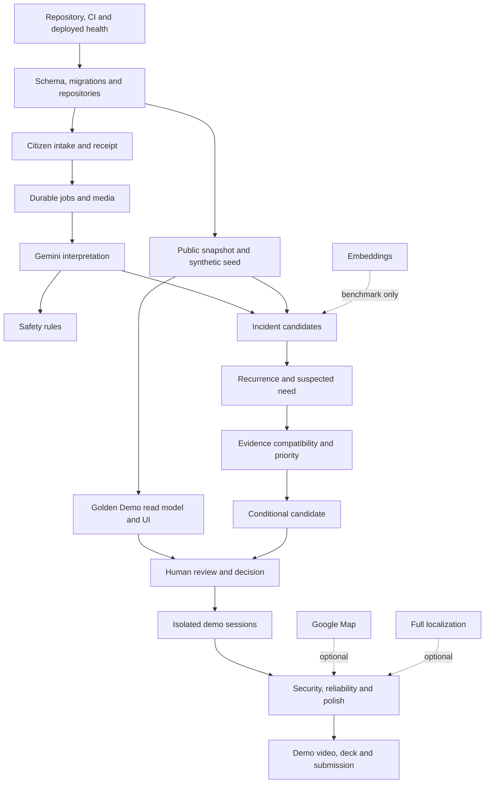

> # ⚠️ ARCHIVED — DO NOT IMPLEMENT FROM THIS DOCUMENT
> Superseded 15 September 2026 by `docs/REBUILD_00` … `REBUILD_05`. Kept as a historical record only.
> **The build order now lives in `REBUILD_05 §10`.** Do not follow the M0–M9 milestones or the `R→D→S→G→I→J→A→C→N→E→P→H→X→Q→U` critical path — both assume the Golden-Demo read path that is being replaced.
> **Keep as process:** §3 Definition of Done and stop-the-line conditions, §16 test matrix, §17 the 26-slice PR granularity model, §19 scope-cut order, §20 release scorecard, §15 submission checklist.
> **Reject:** §2's BWSSB/JICA 110-village and Mahadevapura geography — the target is Bengaluru **South**. §20's "needs/projects — not complaints — are prioritised" is the inversion written as a release criterion.
> See `docs/archive/README.md`.

# CivicLens AI — Stage 5 Build Plan

**Status:** Approved build plan; implementation started on 12 September 2026  
**Date:** 12 September 2026  
**Inputs:** Approved Bengaluru pilot, Stage 2 product design, Stage 3 system design and Stage 4 implementation design  
**Objective:** Convert the accepted design into an incremental, test-gated implementation sequence that produces a reliable 3–5 minute hackathon demonstration without expanding the product scope

> **Stage 6 binding revision:** Preserve this milestone order, acceptance-gate approach and critical path, but apply the scope reductions in [Stage 6 Final Design Review](./STAGE_6_FINAL_DESIGN_REVIEW.md), especially the 60-report corpus, text/voice-only intake, no Maps/embeddings, simplified tables, session overlays and CI-with-manual-deploy approach.

## 1. Executive build strategy

Build CivicLens through an early deployed **walking skeleton**, followed by a deterministic **Golden Demo** assembled from versioned seed data. Then replace each seeded transition with its real implementation in lifecycle order:

```mermaid
flowchart LR
    M0[M0 Scope and risk gates]
    M1[M1 Walking skeleton]
    M2[M2 Data and seed foundation]
    M3[M3 Golden Demo read path]
    M4[M4 Citizen intake and media]
    M5[M5 AI interpretation and safety]
    M6[M6 Relationships, needs and priority]
    M7[M7 Human decision and demo isolation]
    M8[M8 Deployment hardening and polish]
    M9[M9 Submission package]

    M0 --> M1 --> M2 --> M3 --> M4 --> M5 --> M6 --> M7 --> M8 --> M9
```

This order differs intentionally from a conventional “finish the backend, then build the UI” sequence:

1. Deployment and authentication risks are tested before deep feature work.
2. Judges can see the distinctive need-to-project product by Milestone 3, using clearly labelled synthetic records.
3. Citizen intake and Gemini are integrated only after the main decision experience is visible.
4. Deterministic rules are implemented and tested before being allowed to drive the Golden Demo.
5. Maps, embeddings, extra localization and decorative analytics remain outside the critical path.

The release is not considered successful merely because every screen exists. The primary success condition is one trustworthy lifecycle:

**Citizen Report → AI Interpretation → Incident Cluster → Suspected Civic Need → Public Context → Conditional Project Candidate → Recorded Human Decision**

Operational Safety Review remains a separate demonstration lane.

## 2. Fixed scope and governing constraints

### Must preserve

- Citizen reports are claims, not verified facts.
- Incident and recurrence relationships remain reviewable.
- A Civic Need is always labelled **Suspected** in the MVP.
- Operational urgency is separate from planning priority.
- Missing or incompatible evidence causes abstention, not a zero rating.
- Priority uses four transparent 0–3 components, broad bands and sensitivity—not an AI score.
- Project Candidates come only from a constrained catalogue and are conditional.
- Human decisions are append-only and freeze the reviewed evidence version.
- All public and demo data show provenance/classification.
- Bengaluru geography remains the BWSSB/JICA 110-village project area, with the Mahadevapura 23-village project zone as the declared demo slice—not a current ward.
- The primary demonstration cannot depend on a live government-data service or a successful live Gemini call.

### Do not build during the MVP

- Budget estimation, tendering, procurement or work orders.
- Automated project approval or automatic officer decisions.
- Universal cross-service ranking.
- Chatbot, social feed, blockchain, BigQuery, Earth Engine or a data lake.
- Microservices, Kubernetes, Redis, Celery, Kafka, GraphQL or a vector database.
- Citizen accounts, notification infrastructure or real grievance-system integration.
- Invented ward/project-zone joins, current water-reliability claims or authoritative polygons.

### Feature priority

| Class | Meaning | Capabilities |
|---|---|---|
| P0 | Required for a credible submission | Full Golden Demo, report text/location, stored and fresh AI states, safety lane, deterministic lifecycle, provenance, constrained candidate, human decision, deployed URL, demo reset |
| P1 | Add after P0 is stable | Short voice/image, polished responsive UI, essential Kannada/Hindi citizen copy, restricted map, broader browser/accessibility checks |
| P2 | Build only when evidence proves value and time remains | Embeddings, complete interface localization, advanced map interaction, extra charts |
| Excluded | Must not consume hackathon time | Budgets, procurement, chatbot, citizen accounts, live public APIs, enterprise infrastructure |

## 3. Delivery controls

### Branch and review discipline

- Keep the default branch deployable.
- Use small feature branches with one milestone slice or bounded vertical behavior.
- Every pull request states: user outcome, data classification impact, migration impact, tests, screenshots where relevant and rollback method.
- Generated lockfiles, OpenAPI contract and database migrations are reviewed as first-class artifacts.
- Do not merge a migration that passes only on an already-populated developer database.
- Do not merge an AI/rules change without fixture and regression updates.

### Definition of Done for every milestone

A milestone is complete only when:

1. its acceptance criteria pass in CI or the documented target environment;
2. happy, empty, error and permission states exist for the completed path;
3. no known P0 defect is deferred silently;
4. configuration and setup notes are updated;
5. logging contains no report payload, media, precise coordinates or credentials;
6. the previous milestone remains demonstrable; and
7. any new claim shown in the UI has an explicit evidence classification.

### Stop-the-line conditions

Pause feature work and repair the foundation if any of these occur:

- schema migrations cannot recreate a clean database;
- the demo cannot be reset deterministically;
- a report can be lost after a receipt is returned;
- one demo session can read or mutate another;
- AI output directly changes priority, relationships or decisions;
- a safety signal can be silently down-ranked;
- an incompatible public indicator contributes to a local rating;
- officer decisions can be overwritten;
- secrets or sensitive payloads appear in logs; or
- the deployed primary path requires a live third-party/public-data response.

## 4. Dependency and critical-path map

The critical path is **R → D → S → G → I → J → A → C → N → E → P → H → X → Q → U**. Optional features must never delay it.

## 5. Milestone summary

| Milestone | Demonstrable outcome | Priority | Exit artifact |
|---|---|---|---|
| 0 — Scope freeze and risk gates | Team can start without unresolved platform assumptions | P0 | Decision register and verified setup checklist |
| 1 — Walking skeleton | Public preview serves web + API health through one origin | P0 | Deployable empty system with CI |
| 2 — Domain, database and reproducible data | Clean database recreates the CivicLens model and deterministic seed | P0 | Migrations, repositories, snapshot and seed |
| 3 — Golden Demo read path | Judges can inspect a seeded need, evidence, candidate and decision flow | P0 | First visible vertical product story |
| 4 — Citizen intake, receipt and media | A report is safely accepted before AI and can be tracked | P0/P1 media | Real intake-to-job path |
| 5 — AI interpretation and Safety Review | Fresh/stored interpretations work; safety stays separate | P0 | Bounded Gemini adapter and safety workflow |
| 6 — Decision-intelligence engine | Reports produce reviewable incidents, needs, priority and candidates | P0 | Deterministic transformation engine |
| 7 — Human decisions and isolated judge demo | Review decisions are durable and demo users are isolated | P0 | Complete authenticated lifecycle |
| 8 — Deployment hardening and product polish | Public URL survives realistic demo failures | P0 then P1 | Release candidate |
| 9 — Evaluation and submission package | Claims, demo video and deck match the deployed product | P0 | Submitted evidence package |

## 6. Milestone 0 — Scope freeze and risk gates

### Goal

Turn the Stage 2–4 decisions into a short implementation contract and resolve only the assumptions that could invalidate the chosen stack before the repository is scaffolded.

### Likely files/modules affected

- `README.md`
- `docs/DECISIONS.md`
- `docs/DEMO_SCRIPT.md`
- `docs/DATA_CLASSIFICATION.md`
- `docs/THREAT_MODEL.md`
- `.env.example`
- `infra/README.md`

These paths are planned; creating them occurs only after implementation approval.

### Dependencies

- Approved Stage 2 Bengaluru pilot.
- Stage 3 system/data design.
- Stage 4 technology and deployment decisions.

### Work packages

1. Freeze P0/P1/P2 features and the five-minute maximum demonstration narrative.
2. Verify the selected stable Gemini Flash model is available through Vertex AI in the intended project/location; record the actual configured model ID and region.
3. Verify Firebase Hosting can reach the selected Cloud Run region through the planned rewrite.
4. Confirm Cloud SQL billing can be enabled. If it cannot, activate the documented Neon fallback once—do not design for both simultaneously.
5. Confirm Maps billing/key setup or mark the map P1-disabled from the outset.
6. Establish the exact public-data snapshot files, hashes, licence/reuse status and prohibited inferences.
7. Freeze the synthetic Golden Demo stories and ground truth before prompt/rule tuning begins.
8. Record privacy, retention, abuse limits and the no-real-data policy for the public prototype.

### Acceptance criteria

- One decision register names the selected and fallback providers with no unresolved “either/or” in the P0 path.
- The primary demo script fits within five minutes without live AI or map dependency.
- Every demo datum is assigned Real Public, Derived Public, Synthetic Demo or AI Derived.
- The public snapshot licence status and allowed demonstration usage are recorded; uncertain reuse is limited to cited facts/derived records that can be legally and honestly shown.
- The team has a Cloud project/billing route or a single activated database fallback.
- No feature outside P0 can block Milestone 1.

### Testing/verification required

- Read-only provider/region availability checks.
- A paper walkthrough of the demo with timestamps.
- A provenance audit of each real public field planned for the UI.
- Threat-model review of anonymous intake and judge access.

### Risks and responses

| Risk | Response |
|---|---|
| Cloud billing unavailable | Use Neon for PostgreSQL only; keep all other architecture unchanged |
| Gemini model unavailable in intended region | Select the nearest supported Vertex location/global endpoint and disclose the prototype data-location implication |
| Public source cannot be redistributed | Store normalized minimal facts with citations where permitted, or display source-linked metadata without bundling the original file |
| Scope debate continues | Product owner approves P0 list; additions displace another item rather than expand the schedule |

### Exit gate

**Go** only when the stack can be provisioned and the Golden Demo claims are supportable. Otherwise revise Stage 4 before code begins.

## 7. Milestone 1 — Deployed walking skeleton

### Goal

Create the smallest deployable system proving repository structure, locked dependencies, CI, one-origin routing, configuration validation and health observability.

### Likely files/modules affected

- Root: `README.md`, `Makefile`, `.gitignore`, `.env.example`
- Web: `apps/web/package.json`, `apps/web/package-lock.json`, `apps/web/src/app/`, `apps/web/vite.config.ts`
- API: `apps/api/pyproject.toml`, `apps/api/uv.lock`, `apps/api/Dockerfile`
- API bootstrap: `apps/api/src/civiclens/main.py`, `bootstrap/settings.py`, `bootstrap/lifecycle.py`
- Telemetry: `infrastructure/telemetry/`
- Contracts: `contracts/openapi.json`
- Infrastructure: `infra/firebase.json`, `infra/cloudrun/`, `infra/README.md`
- CI: `.github/workflows/ci.yml`, later `deploy-preview.yml`

### Dependencies

- Milestone 0 provider and billing decisions.

### Work packages

1. Scaffold only the Stage 4 monorepo structure actually required by this milestone.
2. Pin Node/Python and dependency lockfiles; enable strict TypeScript, Ruff, Pyright and pytest.
3. Assemble the FastAPI application with configuration validation and safe error responses.
4. Add `/health/live`, `/health/ready` and `/health/version`; readiness initially checks configuration and later database state.
5. Assemble the React router, top-level layouts, accessible error boundary and API client boundary.
6. Generate and check in the initial OpenAPI contract/types.
7. Build a minimal container and deploy it to Cloud Run.
8. Configure Firebase Hosting to serve static assets and rewrite `/api/**` to Cloud Run.
9. Configure keyless CI authentication through Workload Identity Federation and a preview deployment path.
10. Emit privacy-safe JSON request logs with correlation IDs.

### Acceptance criteria

- A clean checkout installs only from committed lockfiles.
- One command runs web/API with documented ports.
- CI runs format, lint, type checks, unit placeholder, contract drift check and production builds.
- The preview URL serves the web shell and `/api/v1/health/*` from one browser origin.
- Startup fails clearly when required configuration is missing.
- No secret or service-account JSON exists in the repository, image or browser bundle.
- A failed API call produces a useful accessible UI error state and correlation ID.

### Testing required

- Configuration unit tests for missing/invalid combinations.
- API smoke tests for health/error contracts.
- Web router and error-boundary component tests.
- Container non-root/read-only assumptions check where feasible.
- Deployment smoke test through Firebase Hosting, not only the direct Cloud Run URL.
- Dependency and secret scanning.

### Risks and responses

| Risk | Response |
|---|---|
| Cloud/IAM setup consumes days | Keep one project/environment, document exact commands, avoid Terraform |
| Cross-origin/auth complexity appears | Use the same-origin Hosting rewrite and same-site API paths |
| Tooling becomes the project | Stop when one reliable pipeline works; defer monorepo orchestrators and developer portals |
| Cold start is already unacceptable | Measure rather than guess; optimize image/startup before considering temporary min instance 1 |

### Exit gate

A public preview must work before domain implementation continues. Local-only success does not complete this milestone.

## 8. Milestone 2 — Domain, database and reproducible data foundation

### Goal

Implement the minimum relational model and versioned configuration needed to recreate the Golden Demo deterministically from an empty PostgreSQL 17 database.

### Likely files/modules affected

- `apps/api/src/civiclens/infrastructure/db/`
- `apps/api/src/civiclens/shared/`
- `apps/api/src/civiclens/modules/{intake,analysis,safety,relationships,needs,evidence,priority,catalogue,decisions,jobs,audit}/`
- `apps/api/migrations/`
- `apps/api/tests/unit/`, `integration/`, `fixtures/`
- `config/rules/`
- `config/catalogue/`
- `config/prompts/`
- `data/public/bengaluru-water-v1/`
- `data/demo/v1/`
- `data/tuning/v1/`
- `data/held-out/v1/`
- `scripts/` for validated import/seed orchestration

### Dependencies

- Milestone 1 application/bootstrap and CI.
- Frozen public snapshot and synthetic ground truth from Milestone 0.

### Work packages

1. Implement UUID/time/version primitives, the injected clock and safe domain errors.
2. Create migrations in dependency order: snapshots/geographies/config versions; reports/media/analysis; incidents/relationships; needs/evidence/priority; catalogue/candidates; decisions/jobs/audit/demo sessions.
3. Implement repository interfaces and SQLAlchemy persistence without leaking ORM models into services.
4. Add database constraints for active versions, link states, job deduplication, append-only decisions/audit and demo-session ownership.
5. Load versioned safety/grouping/priority policies and intervention catalogue with schema validation.
6. Normalize and import the minimal Bengaluru water snapshot with its manifest and prohibited-inference metadata.
7. Create the 120-report synthetic dataset and expected ground-truth relationships/needs/ratings.
8. Add idempotent seed and demo reset logic guarded by environment and demo markers.
9. Provide projection/read-model queries needed by the Golden Demo; avoid premature generic repository abstractions.

### Acceptance criteria

- A fresh PostgreSQL 17 database migrates from zero to head and loads seed v1 deterministically.
- Re-running seed v1 creates no duplicates and produces identical stable logical IDs/counts.
- The planned 120 reports reconcile exactly with the six documented stories.
- All public observations expose publisher, source URL, dates, geography, unit, semantics and inference limits.
- No Census ward data is attached to a project-zone rating.
- The Mahadevapura label is stored as declared project-zone membership, not polygon-derived membership.
- Decisions/audit records cannot be modified through ordinary repositories.
- Tuning and held-out sets are physically/logically separate.

### Testing required

- Migration zero-to-head, upgrade path and safe downgrade tests.
- Repository integration tests against real PostgreSQL, not SQLite.
- Constraint tests for active versions, duplicate jobs, invalid states and cross-session references.
- Seed count/hash/idempotency tests.
- Public-data manifest schema and provenance completeness tests.
- Configuration schema tests for invalid component weights, thresholds and catalogue prerequisites.

### Risks and responses

| Risk | Response |
|---|---|
| Schema models every future government workflow | Implement only records needed by P0 screens and invariants |
| Seed data is tuned to look perfect | Preserve edge cases, conflicts, abstentions and negative examples; freeze held-out data |
| Public values are mislabelled as current/local | Enforce semantics/geography in types and contract tests, not UI copy alone |
| Reset command could damage non-demo data | Require environment/database demo marker and explicit confirmation; never make reset a migration |

### Exit gate

The database must be reproducible and the seed truth independently inspectable before UI work depends on it.

## 9. Milestone 3 — Golden Demo read path

### Goal

Deliver the first product-complete vertical slice using frozen seeded lifecycle records. It must already explain why CivicLens is not another complaint portal.

### Likely files/modules affected

- API: `modules/needs/api.py`, `evidence/`, `priority/`, `catalogue/`, `decisions/`
- Read models: officer overview, incident detail, need workspace, decision preview
- Web features: `officer-overview/`, `incident-review/`, `need-workspace/`, `human-decision/`
- Shared UI: evidence labels, state badges, provenance drawer, component rubric, timeline, responsive layout
- Contract: `contracts/openapi.json`, generated web types
- Tests: API contract, component and Playwright Golden Demo tests

### Dependencies

- Milestone 2 schema, seed and projection queries.

### Work packages

1. Expose read-only officer overview with three distinct sections: Safety Review, Operational Incidents and Planning Needs.
2. Build the Need workspace with hypothesis, supporting incidents, evidence, public context, works overlap, four priority components, sensitivity and abstention state.
3. Render every public/synthetic/AI-derived value with classification, date, geography and source details.
4. Show the constrained candidate and its unknown/required prerequisites.
5. Build the underlying Incident view with proposed/confirmed/rejected relationship reasoning.
6. Provide a read-only decision preview/history for the seed story; actual mutation arrives in Milestone 7.
7. Implement responsive list-first navigation, loading, error, empty and unavailable-map states.
8. Add the key counterexample: 45 pothole reports remain one operational incident while recurring water incidents become a suspected planning need.

### Acceptance criteria

- A reviewer can navigate from overview → need → incidents/reports → evidence → conditional candidate in under two minutes.
- The interface never describes report count as affected population.
- Safety Review cannot appear inside the planning ranking.
- A citywide/context-only observation visibly contributes no local rating.
- Unknown components produce “Not comparable” with named missing evidence.
- Stage V works are shown as overlap/context, not proof that household symptoms are resolved.
- The selected water candidate remains diagnostic/assessment-oriented because root cause is unknown.
- The product remains usable without a map.

### Testing required

- API contract tests for overview/need/incident/evidence responses.
- Component tests for all evidence classifications and unknown/abstention states.
- Accessibility tests for tabs, provenance drawer, component explanation and keyboard navigation.
- Playwright test of the seeded judge path in desktop and mobile viewport.
- Snapshot/visual regression on the few central screens after design freeze.

### Risks and responses

| Risk | Response |
|---|---|
| Dashboard becomes generic charts | Prioritize the causal evidence narrative; allow only timeline and sensitivity visuals |
| Seeded path looks fake | Label it Synthetic Demo continuously and expose provenance/ground truth; never claim live civic data |
| UI hides uncertainty | Treat unknown, incompatible and projected semantics as first-class states |
| Too much information overwhelms judges | Use progressive disclosure: conclusion, reasons, then evidence/provenance |

### Exit gate

Conduct a timed internal demo. If a viewer cannot explain the Report → Need → Candidate difference afterward, revise the product UI before adding AI.

## 10. Milestone 4 — Citizen intake, receipt, durable jobs and media

### Goal

Let an anonymous citizen submit a concise multilingual report and receive a safe receipt before any AI work, with optional bounded media and recoverable asynchronous processing.

### Likely files/modules affected

- API modules: `intake/`, `media/`, `jobs/`, `audit/`
- Infrastructure: `storage/`, `task_dispatch/`, `auth/` receipt capability support
- Web features: `report-intake/`, `report-receipt/`
- API/client contracts for drafts, uploads, report commit and receipt status
- Cloud Storage and Cloud Tasks configuration under `infra/`

### Dependencies

- Milestone 1 deployed routing/configuration.
- Milestone 2 report/media/job schema and repositories.

### Work packages

1. Build the shortest useful citizen flow: explain scope → describe → optionally attach → confirm location → consent/review → submit.
2. Require no citizen login and no mandatory contact information.
3. Commit report, audit event and canonical processing job atomically using an idempotency key.
4. Return a high-entropy receipt capability without waiting for Gemini.
5. Dispatch only the job ID to Cloud Tasks after commit; implement idempotent claim/lease/retry and recovery sweep.
6. Implement direct signed uploads, ownership verification, type/size/decode validation, sanitation and retention metadata.
7. Limit P0 to text + confirmed point/locality; add one short voice and one image as P1 within the same milestone only after text is reliable.
8. Render receipt states without internal analysis, exact coordinates or sensitive data.
9. Add per-client draft/report/receipt rate limits and safe abuse telemetry.

### Acceptance criteria

- A valid text report returns a receipt even when AI is disabled/unavailable.
- Retrying the same commit does not create a second report or job.
- A database failure returns no false receipt.
- A task-dispatch failure leaves a recoverable canonical queued job.
- A guessed, malformed or expired receipt capability exposes nothing.
- Invalid media cannot block a valid text report when the citizen chooses to continue without it.
- Raw uploads are private; accepted files use random object IDs and sanitized derivatives.
- Voice/image limits and consent are clear before upload.
- Refreshing/closing the browser does not store sensitive media or exact location in local storage.

### Testing required

- Transaction and idempotency integration tests.
- Cloud Tasks duplicate/retry/lease-expiry simulations through the dispatcher fake and integration handler.
- Signed-upload ownership, MIME/magic-byte, dimension/duration and abandoned-draft tests.
- Receipt authorization/IDOR/rate-limit tests.
- Component and mobile Playwright tests for submission, retry, invalid media and receipt polling.
- Log-redaction tests for text, coordinates, capabilities and signed URLs.

### Risks and responses

| Risk | Response |
|---|---|
| Media consumes disproportionate time | Ship text/location first; voice and image are independently removable P1 slices |
| Browser/device codecs vary | Support only the frozen formats; bundle a known-good prerecorded demo clip |
| Async job wakes twice | Database dedupe key and idempotent claim are authoritative; Tasks is transport only |
| Anonymous endpoint attracts abuse | Tight byte/call limits, rate limiting, session caps and no arbitrary model prompt |

### Exit gate

Demonstrate accepted-report durability under simulated Gemini outage, duplicate HTTP retry and failed task dispatch.

## 11. Milestone 5 — Gemini interpretation and Operational Safety Review

### Goal

Use Gemini meaningfully to structure messy multilingual/multimodal evidence while ensuring it cannot set policy, merge reports, create projects or make decisions.

### Likely files/modules affected

- API modules: `analysis/`, `safety/`, `jobs/`
- Infrastructure: `ai/google_genai.py`, `ai/fake.py`
- Prompt/schema files: `config/prompts/report-interpretation-v1/`
- Rules: `config/rules/safety-v1.*`
- Web: receipt analysis state, `safety-review/`, interpretation/correction views
- Test fixtures: tuning and held-out structured responses

### Dependencies

- Milestone 4 canonical jobs and accepted reports.
- Milestone 2 prompt/rule versions and test corpus.

### Work packages

1. Implement the narrow `AIInterpreter` port with fixture and Google Gen AI adapters.
2. Send one bounded multimodal request per fresh report with text and sanitized media only; exclude contact and officer notes.
3. Require schema-constrained JSON and independently validate with Pydantic.
4. Record every analysis attempt, model/prompt/schema version, latency, result class and usage metadata without payload logging.
5. Allow one retry for transient failure and one repair for invalid schema; then move safely to `needs_review`.
6. Store a new immutable interpretation version; never overwrite original evidence.
7. Apply deterministic safety rules immediately after valid interpretation.
8. Route dangerous or uncertain controlled signals—such as suspected contaminated water at a hospital—to human Safety Review regardless of count.
9. Expose Stored Sample Analysis for the scripted path and a visibly separate Fresh Analysis path.
10. Add officer/citizen correction as a new interpretation/review version, not a mutation of original evidence.

### Acceptance criteria

- Kannada, Hindi, English and code-switched fixtures produce schema-valid normalized assertions or explicit unknowns.
- Prompt injection inside a report cannot invoke tools, alter rules or escape the allowed schema.
- Gemini failure never loses or rejects an accepted report.
- Unsupported/low-confidence fields remain unknown.
- Suspected/uncertain safety signals enter a separate review queue without a planning score.
- Stored analysis is visibly labelled and never represented as a fresh API result.
- Daily/session call caps prevent uncontrolled spending.
- No test or normal local startup calls Gemini unless explicitly enabled.

### Testing required

- Unit tests for adapter request construction, validation and safe error mapping.
- Frozen response tests for valid, malformed, missing, extra and contradictory fields.
- Prompt-injection and adversarial multilingual fixtures.
- Safety recall-oriented rule tests, including uncertain phrasing.
- Timeout, 429, unavailable model, repair failure and retry-exhaustion tests.
- Held-out extraction metrics with per-field errors; no invented accuracy claims.

### Risks and responses

| Risk | Response |
|---|---|
| Model name/availability changes | Explicit configurable stable ID and fixture fallback; verify before release |
| Multimodal output varies | Narrow one-call schema, low temperature, bounded output, validation and human review |
| AI becomes perceived decision-maker | UI and APIs expose AI Derived assertions separately from deterministic decisions |
| Safety false negative | Conservative taxonomy, uncertainty-to-review and explicit release-blocking safety scenarios |

### Exit gate

The release cannot proceed if the held-out hospital contamination case is missed or if model failure corrupts the report lifecycle.

## 12. Milestone 6 — Relationship, suspected-need and priority engine

### Goal

Replace seeded lifecycle transitions with deterministic, reviewable transformations from interpreted reports to incidents, recurrence, suspected needs, evidence eligibility, priority bands and constrained candidates.

### Likely files/modules affected

- API modules: `relationships/`, `needs/`, `evidence/`, `priority/`, `catalogue/`, `jobs/`, `audit/`
- Versioned rules/catalogue under `config/`
- Officer incident/need screens and relationship review controls
- Evaluation tooling and ground-truth fixtures under `data/tuning/` and `data/held-out/`

### Dependencies

- Milestone 2 data/config foundation.
- Milestone 5 structured interpretations.
- Milestone 3 Golden Demo screens.

### Work packages

1. Keep suspected duplicate, same-incident and recurring-incident relations as distinct types.
2. Generate candidates using hard category, time, location precision and distance/locality gates.
3. Record feature evidence and contradictions for every proposed relationship; uncertainty favors separation.
4. Start with normalized-text/rule comparisons. Run the frozen embedding benchmark only after baseline metrics exist.
5. Permit embeddings only if they materially improve multilingual retrieval without exceeding the false-merge threshold; otherwise retain the simpler baseline.
6. Create a Suspected Need only from distinct, coherent incidents after alternative-hypothesis review.
7. Enforce evidence compatibility by geography, vintage, unit and semantics.
8. Apply eligibility gates before priority; missing required evidence produces named abstention.
9. Calculate the four versioned 0–3 components and three sensitivity profiles deterministically.
10. Generate only catalogue-permitted conditional candidates and prerequisite checks.
11. Recompute only affected report/incident/need graphs and retain the previous version with a recomputing/stale badge until commit.

### Acceptance criteria

- Replaying the same inputs and rule versions produces byte/logically equivalent assessments.
- The 36 Mahadevapura reports resolve to three bounded incidents and one suspected recurring need under reviewed ground truth.
- The 45 pothole reports remain a single operational incident and never become a need solely through volume.
- Similar wording five kilometres away does not merge.
- Same-place water events one month apart remain distinct incidents and may form recurrence.
- Reporter count never becomes affected population.
- Incompatible ward/citywide/projected indicators cannot silently contribute to a local component.
- Unknown root cause produces only the approved diagnostic/assessment candidate.
- Every priority component, band, sensitivity result and candidate cites exact evidence and policy/catalogue versions.
- A reviewer can confirm/reject proposals and trigger versioned recomputation.

### Testing required

- Pure unit tests for hard gates, Haversine distance, time windows, contradictions and relationship bands.
- Property/invariant tests: order independence, no self-links, one active relationship version, unknown ≠ zero.
- Pairwise precision/recall/F1 and false-merge rate on the frozen held-out set.
- Recurrence correct/incorrect/abstained metrics.
- Evidence compatibility matrix tests for geography/date/semantics.
- Golden tests for four components, bands, tie-breaks and sensitivity profiles.
- Candidate prerequisite and overlap outcome tests.
- Integration tests for atomic version replacement and affected-graph recomputation.

### Risks and responses

| Risk | Response |
|---|---|
| Thresholds are presented as government policy | Label them prototype assumptions and show versions |
| False merges inflate systemic evidence | Use hard gates, contradiction rules, review states and false-merge stop criteria |
| Embeddings add complexity without value | Keep them off unless the predeclared benchmark wins |
| Ranking mixes unrelated services | Compare only eligible needs in the same declared scope; demonstrate pothole as operational, not “lower than water” |
| Existing works are treated as resolution | Model overlap separately; reshape the candidate and request verification |

### Exit gate

Run the full held-out suite once after tuning freeze. Any primary-story false merge, missed abstention or non-reproducible score blocks Milestone 7.

## 13. Milestone 7 — Human decision integrity and isolated judge experience

### Goal

Complete the lifecycle with authenticated, attributable, concurrency-safe human decisions and a no-account judge experience that cannot mutate shared records.

### Likely files/modules affected

- API modules: `auth/`, `demo_sessions/`, `decisions/`, `audit/`, relationship and safety decision routes
- Infrastructure: Firebase Admin token verification
- Web: officer authentication boundary, decision confirmation, conflict resolution and demo-session controls
- Database: evidence snapshot, decision/audit and session TTL indexes/cleanup
- Security/contract/Playwright tests

### Dependencies

- Milestone 3 officer UI.
- Milestone 6 computed lifecycle and candidate.

### Work packages

1. Implement Firebase Google sign-in plus backend UID allowlist for team/reviewer users.
2. Implement Firebase anonymous identity for Demo Officer and create a server-side isolated session with expiry.
3. Clone/reference only the small frozen narrative into the session namespace; prevent cross-session queries and mutations at repository/service boundaries.
4. Support relationship, safety and need decisions with role-specific authorization.
5. On refer/defer/reject, atomically freeze an evidence snapshot/digest and append the human decision with reason, next step and expected entity version.
6. Reject stale writes with a clear conflict-and-review flow.
7. Make correction a superseding decision, never an update/delete.
8. Provide one-click guarded demo reset and automatic TTL cleanup.
9. Limit Demo Officer capabilities: no public-data imports, arbitrary media, admin, team records or configuration changes.

### Acceptance criteria

- An unauthenticated user cannot access officer APIs.
- A verified but non-allowlisted Google user receives no team role.
- Demo users enter without shared credentials and see the correct Synthetic Demo notice.
- Two simultaneous demo sessions cannot see or change each other’s decisions.
- A decision references the exact evidence, rule, candidate and entity versions reviewed.
- Replaying the request does not create duplicate decisions.
- A stale expected version cannot overwrite newer evidence.
- Decision history is append-only and shows supersession clearly.
- Demo reset restores the narrative within the defined target and cannot affect team/non-demo records.

### Testing required

- Authentication and role matrix API tests.
- Object-level authorization/IDOR tests for every officer resource.
- Cross-session isolation and expiry tests.
- Concurrent decision/version-conflict integration tests.
- Append-only database/repository tests.
- Playwright path: anonymous demo login → inspect need → refer for feasibility → view immutable record → reset.
- Audit completeness and log-redaction tests.

### Risks and responses

| Risk | Response |
|---|---|
| Judge authentication becomes friction | Anonymous Firebase identity + isolated backend session; no public shared password |
| Session cloning is too complex | Clone only small mutable narrative state; reference immutable snapshot/config versions |
| Authorization exists only in UI | Central backend verification plus service/repository ownership constraints |
| Decision mutation undermines trust | Append-only storage, optimistic concurrency and immutable evidence digest |

### Exit gate

Complete a two-browser adversarial isolation test and stale-decision test before exposing the public demo URL.

## 14. Milestone 8 — Deployment hardening, security, accessibility and polish

### Goal

Turn the complete lifecycle into a release candidate that is fast, understandable and resilient enough for live judging and asynchronous link review.

### Likely files/modules affected

- Infrastructure configs: Cloud Run, Cloud SQL, Cloud Storage, Cloud Tasks, Secret Manager, Firebase Hosting/Auth, budgets/quotas
- CI/CD workflows and migration job
- Telemetry/health/readiness and operational runbooks
- Web design system, responsive layouts and optional map boundary
- Security headers, abuse controls, retention/cleanup jobs
- Full integration, E2E, accessibility and load tests

### Dependencies

- All P0 functional milestones 1–7.

### Work packages

1. Run migrations through the deployment job, deploy a tagged Cloud Run revision, smoke-test, deploy Hosting and verify rollback.
2. Cap Cloud Run instances, SQL pool size, task retries, AI calls, uploads and demo sessions.
3. Configure restricted service accounts, secret references, signed-upload permissions, browser map-key restrictions and exact origins.
4. Configure private media lifecycle and demo-session cleanup; verify deletion behavior.
5. Add one uptime check and alerts for API failures, queued-job age/dead letters, database saturation and AI failure/call volume.
6. Test cold-start and primary screen latency; use temporary min instance 1 only for a known live demonstration window if justified.
7. Finish critical Kannada/Hindi citizen instructions and language attributes.
8. Perform manual keyboard, screen-reader, contrast, zoom, reduced-motion and small-phone review.
9. Add the restricted Google Map only if all P0 gates pass; retain the list fallback and never imply authoritative zone geometry.
10. Apply the removal order to any unfinished P1/P2 feature rather than destabilize the release.

### Acceptance criteria

- The complete primary path passes against the public URL with no live public-data API.
- Stored analysis completes the scripted path even if Gemini is disabled.
- Fresh analysis communicates pending, success, timeout and review states honestly.
- Map failure or disabled billing leaves reporting and decision review functional.
- Backup/restore or export procedure is tested for the submission environment.
- Rollback to the previous Cloud Run revision and Hosting release is documented and rehearsed.
- No critical/high authorization, secret, upload or dependency issue remains.
- No sensitive payload appears in logs or client-visible errors.
- Core flows are keyboard-operable and usable at 200% zoom and a small mobile viewport.
- Health/version identifies application, schema, prompt, rules, catalogue, seed and public-snapshot versions.

### Testing required

- Full CI and production smoke suite.
- Playwright: primary stored path, fresh-AI failure path, demo reset, mobile intake and officer decision.
- Browser matrix before release: Chromium, Firefox and WebKit.
- Manual accessibility pass beyond automated axe checks.
- Focused load test at expected demo concurrency plus an abuse burst, staying within caps.
- Failure drills: Gemini unavailable, Tasks duplicate/delay, map failure, stale decision, database unavailable and Cloud Run cold start.
- Security checklist: CSP/headers, CORS, auth scopes, IDOR, rate limits, upload validation, log redaction, dependency scan and exposed-secret scan.

### Risks and responses

| Risk | Response |
|---|---|
| Last-minute visual work breaks the demo | Freeze behavior first; visual changes after release candidate require E2E rerun |
| Cloud SQL baseline or cold start surprises | Measure on deployed path, keep one environment, warm only when justified |
| Maps creates key/billing failure | Lazy-load and disable remotely; list view is authoritative UX fallback |
| Full localization grows scope | Ship critical citizen copy only; full interface localization remains P2 |

### Exit gate

Declare a release candidate only after three consecutive clean runs of the timed primary demo from the public URL, including a fresh demo-session reset.

## 15. Milestone 9 — Evaluation, demo, deck and submission package

### Goal

Produce a truthful, polished submission in which the prototype, video, deck and technical claims all describe the same system.

### Likely files/modules affected

- `docs/DEMO_SCRIPT.md`
- `docs/EVALUATION_REPORT.md`
- `docs/ARCHITECTURE_SUMMARY.md`
- `docs/DATA_AND_AI_DISCLOSURE.md`
- `docs/OPERATIONS_RUNBOOK.md`
- Final presentation/PDF and video assets
- Root `README.md`

### Dependencies

- Milestone 8 release candidate.

### Work packages

1. Freeze the deployed commit, prompt, rules, catalogue, seed and public snapshot versions.
2. Run and publish the actual held-out evaluation results with denominators and observed failures.
3. Record a concise video with the primary Golden Demo path and one short fresh-AI proof.
4. Build the deck around problem, differentiation, lifecycle, safety/human governance, public-data honesty, architecture, evaluation and scale path.
5. Prepare a fallback recording/screenshots and a one-page live-demo recovery sequence.
6. Verify every source citation, data classification and geography statement in the interface and deck.
7. Verify the public URL in a logged-out/incognito browser and on a second network/device.
8. Freeze optional features; only submission-blocking defects may change after recording.

### Acceptance criteria

- The video demonstrates Report → Incident → Suspected Need → Public Context → Candidate → Human Decision within the organizer’s limit.
- It also states that urgent safety review is separate from planning priority.
- The deck does not claim production readiness, government adoption, current local water reliability or measured citizen impact.
- AI evaluation metrics are real, reproducible and scoped to the synthetic held-out set.
- The public URL works without team credentials and resets safely for each judge.
- Source links, dates, geography and Synthetic Demo labels are legible.
- The submission includes a working URL, demo video and presentation/PDF in the required formats.
- One owner/checklist covers credentials, billing, quotas, expiry and teardown after judging.

### Testing/verification required

- Timed rehearsal with a person unfamiliar with CivicLens; ask them to state the differentiation afterward.
- Incognito/public-access check and mobile smoke test.
- Link and citation check for all external sources.
- Video/deck factual consistency review against the deployed build.
- Final security/privacy and licence disclosure review.
- Backup demo rehearsal using stored analysis and map-disabled mode.

### Risks and responses

| Risk | Response |
|---|---|
| Video spends time on complaint submission | Keep intake short; spend most time on transformation, evidence and human decision |
| Claims exceed evidence | Use “suspected,” “projected,” “synthetic” and “conditional” consistently |
| Live Gemini fails during judging | Stored analysis is the scripted path; fresh analysis is an honest optional proof |
| Submission breaks after a final change | Freeze commit/config and redeploy only for a submission-blocking defect |

### Exit gate

Submit only the frozen, rehearsed release candidate. Preserve hashes/version identifiers for the build demonstrated in the video.

## 16. Cross-milestone test matrix

| Invariant | First proven | Rechecked |
|---|---|---|
| One-origin web/API deployment | M1 | M8–M9 |
| Clean migration and deterministic seed | M2 | Every protected CI/deploy |
| Public-data provenance and geography honesty | M2 | M3, M6, M9 |
| Product differentiation visible | M3 | M8–M9 |
| Receipt before AI and idempotent report commit | M4 | M8 |
| Job recovery without duplicate analysis | M4 | M5, M8 |
| AI cannot make policy decisions | M5 | M6, final review |
| Safety separate from planning priority | M5 | M6, M9 |
| False merges favor separation/review | M6 | Held-out and M8 |
| Unknown evidence causes abstention | M6 | M8–M9 |
| Candidate constrained by catalogue | M6 | M7–M9 |
| Human decision freezes evidence and is append-only | M7 | M8–M9 |
| Demo sessions are isolated | M7 | M8–M9 |
| Primary demo survives Gemini/map failure | M8 | M9 rehearsal |

## 17. Pull-request slice plan

Milestones should be delivered through reviewable slices rather than one large branch. A practical sequence is:

1. Repository/toolchain/CI.
2. Health/configuration/telemetry.
3. Cloud preview and same-origin rewrite.
4. Database/session/migration foundation.
5. Public snapshot/config loaders.
6. Synthetic seed and reset.
7. Officer overview read model and screen.
8. Need workspace/evidence/provenance.
9. Incident/candidate/decision-history read path.
10. Text report intake and receipt.
11. Canonical jobs, Cloud Tasks and recovery.
12. Media draft/upload/sanitation—only after text intake.
13. AI fixture adapter and interpretation persistence.
14. Vertex Gemini adapter and fresh-analysis states.
15. Safety rules and review screen.
16. Relationship hard gates and reviewer decisions.
17. Recurrence and Suspected Need generation.
18. Evidence compatibility/abstention.
19. Priority components/sensitivity.
20. Candidate catalogue/works overlap.
21. Human disposition/evidence snapshot/concurrency.
22. Firebase team auth.
23. Anonymous isolated demo sessions/reset.
24. Security/accessibility/performance hardening.
25. Optional map and extra localization only if P0 is green.
26. Release freeze, evaluation and submission assets.

Each slice should add or update its own tests and contract. Do not create all empty modules in slice 1.

## 18. Parallel work guidance

Parallel implementation is safe only across clear contracts:

- After Milestone 1, one stream may build database/domain foundations while another develops UI components against checked-in API fixtures.
- Public-data normalization and synthetic asset preparation can run alongside schema work after the manifest/schema contract is fixed.
- AI prompt evaluation can run against frozen files while intake is built, but it must not define business rules.
- Deck narrative can start after the Milestone 3 timed demo, but screenshots and claims must wait for the release candidate.

Do not parallelize:

- competing versions of the core data model;
- scoring logic before evidence compatibility is frozen;
- frontend/backend contracts without one committed OpenAPI owner;
- demo data changes while prompt/rule evaluation is underway; or
- deployment/IAM changes by multiple people without a single owner.

## 19. Scope-cut and recovery order

If progress falls behind, cut in this order:

1. Embeddings.
2. Advanced map interaction; then the map entirely.
3. Complete Kannada/Hindi UI localization while retaining critical citizen instructions and multilingual report content.
4. Nonessential charts/animations.
5. Fresh image interpretation; retain bundled voice or text fresh analysis.
6. Citizen correction endpoint if the officer-side correction/version path is present.

Do not cut:

- the Golden Demo transformation;
- visible provenance and data classification;
- operational safety separation;
- reviewable relationships;
- abstention/unknown states;
- constrained candidate wording;
- immutable human decision;
- demo-session isolation; or
- stored-analysis/offline public-data fallbacks.

If the schedule becomes severely constrained, ship text + confirmed location + stored interpretation plus one separate fresh text Gemini example. This still proves the core system more credibly than partially working multimodal/map features.

## 20. Release scorecard

The following must all be green before the demo is frozen:

| Area | Required evidence |
|---|---|
| Product | An unfamiliar reviewer understands that needs/projects—not complaints—are prioritized |
| Lifecycle | One complete report-to-human-decision path succeeds |
| Safety | Dangerous/uncertain hospital water case reaches Safety Review outside ranking |
| AI | Structured multilingual interpretation demonstrated; failures/unknowns handled honestly |
| Determinism | Relationships, gates, ratings, sensitivity and candidates are reproducible/versioned |
| Data | Public/context/synthetic/AI classifications and provenance are visible |
| Geography | No ward/project-zone fabrication or citywide-to-local inference |
| Security | Auth, IDOR, receipt, upload, session isolation, secret/log checks pass |
| Reliability | Three consecutive public-URL demo rehearsals pass; stored fallback verified |
| Accessibility | Keyboard, labels, focus, contrast, zoom and mobile path reviewed |
| Operations | Migrations, health, alerts, quotas, rollback, reset and teardown documented |
| Submission | URL, video, deck/PDF and citations match the frozen build |

## 21. Decisions deferred to implementation evidence

These are controlled experiments, not unresolved architecture choices:

1. **Embeddings:** default off. Enable only if the frozen baseline/embedding comparison improves multilingual candidate recall without an unacceptable false-merge increase.
2. **Google Map:** default non-blocking. Include only when billing/key restrictions and fallback behavior are verified.
3. **Cloud Run minimum instance:** normally zero. Temporarily use one only if measured cold-start behavior threatens a scheduled live demo.
4. **Voice versus image fresh path:** both are planned P1 inputs, but retain the one that is more reliable after device/browser testing if time forces a cut.
5. **Vertex region:** select the nearest region supporting the frozen stable model; document use of a global endpoint if necessary.

None of these decisions may alter data honesty, AI authority boundaries or the human-decision requirement.

## 22. Stage 5 acceptance criteria

Stage 5 is complete because this plan:

1. defines an incremental sequence from empty repository to submission;
2. puts deployment and data risks before deep feature work;
3. produces an early seeded Golden Demo of CivicLens’s differentiated value;
4. identifies likely files/modules without prematurely creating them;
5. states dependencies, acceptance criteria, tests, risks and exit gates for every milestone;
6. maintains a single critical path and explicit scope-cut order;
7. preserves every accepted independent-review decision;
8. separates P0, P1, P2 and excluded capabilities;
9. includes security, accessibility, observability, evaluation and submission work;
10. defines release-blocking invariants and a measurable final scorecard; and
11. remains planning-only—no application scaffold, dependency installation or cloud mutation has occurred.

## 23. Next gate

The next and final planning stage is **Stage 6 — Final Design Review**.

Stage 6 must attack this architecture from the perspective of a Principal Engineer, security reviewer, hackathon judge and small AI-assisted implementation team. It must identify unnecessary complexity, fragile demo dependencies, security gaps, hallucination risks, low-value features and deployment pain, then publish **FINAL RECOMMENDED DESIGN v1** and a concise list of **DECISIONS REQUIRING SUHAS'S APPROVAL**.

After Stage 6, all work must stop. Application implementation may begin only after the user sends the exact phrase:

**PLANNING APPROVED — START IMPLEMENTATION**
